class:inverse, middle

background-image: url(https://tableros.yvera.tur.ar/recursos/logos_institucionales/sec_turismo_blanco.png)
background-position: 95% 95%
background-size: 30%

#### Feria Internacional de Turismo, 1 de octubre de 2024

<br>
<br>
<br>
  

## Entendiendo el turismo a través de los datos: un recorrido por el SINTA

<br>
<br>
<br>
<br>


#### Dirección Nacional de Mercados y Estadística<br>Subsecretaría de Turismo


```{r echo=FALSE, message=FALSE, warning=FALSE, paged.print=FALSE}
library(xaringanExtra)

# LOGO COLOR EN PAGs INTERNAS
xaringanExtra::use_logo(image_url = "https://tableros.yvera.tur.ar/recursos/logos_institucionales/sec_turismo_azul.png", 
                        position = css_position(top = "1em", right = "1em"), 
                        height = "15%", width = "15%")

# BARRA DE PROGRESO DE PRESENTACION
xaringanExtra::use_progress_bar(color = "#252C4F")
# LAPIZ 
xaringanExtra::use_scribble()
# EXPLORADOR DE SLIDES
xaringanExtra::use_tile_view()
# HABILITAR WEBCAM
xaringanExtra::use_webcam()


```


```{r dnmye_theme, include=FALSE, warning=FALSE, eval=TRUE}
library(xaringanthemer) #EVAL FALSE
library(comunicacion)
style_mono_light(outfile = "dnmye_theme.css", # CSS FILE
                 # FONTS
                  header_font_google = google_font('Lora'),
                  text_font_google   = google_font('Montserrat'),
                  code_font_google   = google_font('IBM Plex Mono'),
                 text_font_size = '25px',
                 # COLORES 
                 base_color = "#252C4F",
                 code_inline_color = dnmye_colores("rosa"), 
                 inverse_link_color = "#3B4449",
                 background_color = "#FFFFFF",
                 title_slide_background_image = "sec_turismo_blanco.png", 
                 title_slide_background_position = "95% 5%", 
                 title_slide_background_size = "200px", footnote_color = "#3B4449", link_color = "3B4449",text_slide_number_font_size = "16px"
                  
                 )
```


```{r setup, include=FALSE}
options(htmltools.dir.version = FALSE)
knitr::opts_chunk$set(
  fig.width=9, fig.height=3.5, fig.retina=3,
  out.width = "100%",
  cache = FALSE,
  echo = TRUE,
  message = FALSE, 
  warning = FALSE,
  fig.show = TRUE,
  hiline = TRUE
)
```


---
layout: true

<div class="my-footer"><span>DIRECCIÓN NACIONAL DE MERCADOS Y ESTADÍSTICA <a href="https://yvera.tur.ar/sinta"> - <b>www.yvera.tur.ar/sinta</a></b></span></div> 

---


---


---


---


---


---


---
class: inverse center middle


```{r , echo = FALSE, out.width='40%'}
knitr::include_graphics("https://tableros.yvera.tur.ar//recursos/logos_institucionales/sinta_blanco.png")
```


---

<br>
.footnote[<span style="background-color: #37bbed">https://www.yvera.tur.ar/sinta/informe</span>]
---
###INFORME: https://www.yvera.tur.ar/sinta/informe

---
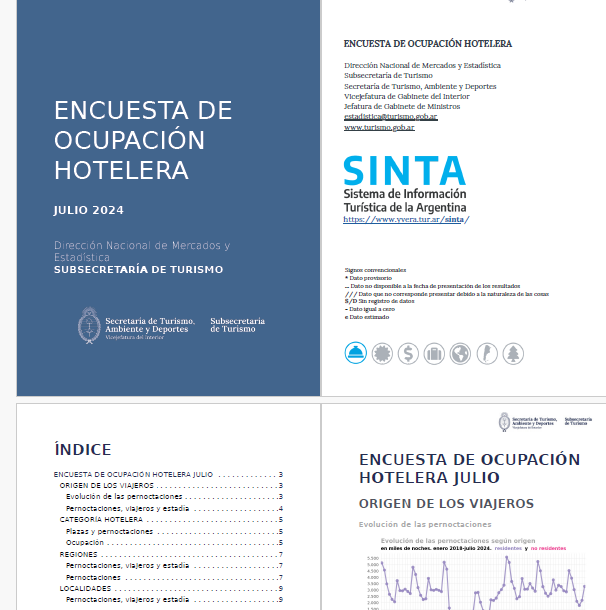
---

<br>
.footnote[<span style="background-color:#37bbed">https://www.yvera.tur.ar/sinta/informe/info/cuenta-satelite-de-turismo</span>]
---
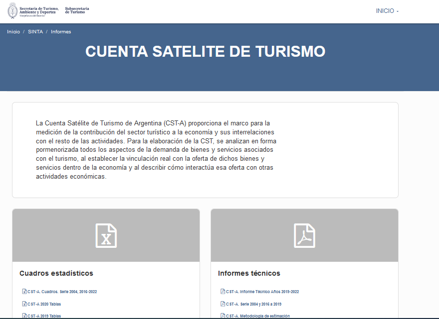
---

<br>
.footnote[<span style="background-color: #37bbed">https://armonizacion.yvera.tur.ar/</span>]
---
###ARMONIZACIÓN: https://armonizacion.yvera.tur.ar/

---
###ARMONIZACIÓN: https://armonizacion.yvera.tur.ar/

---
### <dataTUR>

---

<br>
.footnote[<span style="background-color: #37bbed">https://datos.yvera.gob.ar/</span>]
---
###DATOS ABIERTOS: https://datos.yvera.gob.ar/

---
###DATOS ABIERTOS: https://datos.yvera.gob.ar/

---

<br>
.footnote[<span style="background-color: #37bbed">https://tableros.yvera.tur.ar/</span>]
---
###TABLEROS: https://tableros.yvera.tur.ar/

---
###https://tableros.yvera.tur.ar/empleo.html

---
###TABLEROS: https://tableros.yvera.tur.ar/

---
###TABLEROS: https://tableros.yvera.tur.ar/turismo_internacional/

---
###TABLEROS: https://tableros.yvera.tur.ar/puna/

---
###TABLEROS: https://tableros.yvera.tur.ar/mapeAr/

---

<br>
.footnote[<span style="background-color: #37bbed">https://biblioteca.yvera.tur.ar/</span>]
---
###BIBLIOTECA: https://biblioteca.yvera.tur.ar/
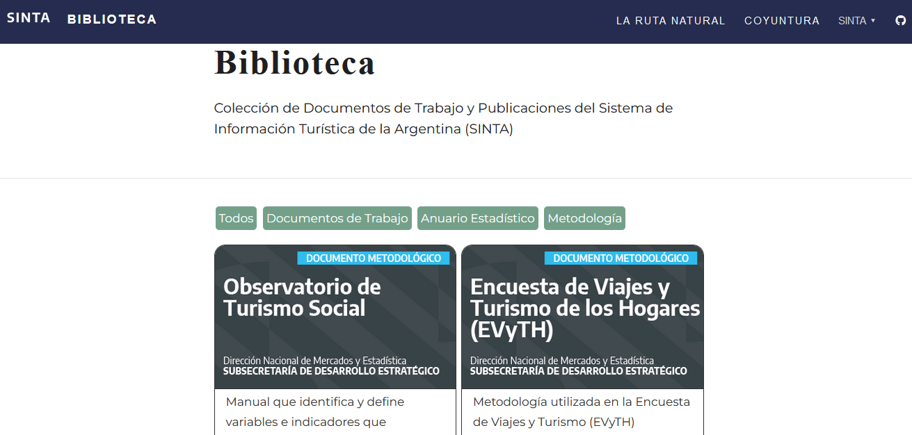
---

<br>
.footnote[<span style="background-color: #37bbed">https://bitacora.yvera.tur.ar/</span>]
---
###BITÁCORA: https://bitacora.yvera.tur.ar/

---

<br>
.footnote[<span style="background-color: #37bbed">https://calendario.yvera.tur.ar/</span>]


---
###CALENDARIO: https://calendario.yvera.tur.ar/

---

---

---

---

class: middle

### Algunas aplicaciones prácticas del **SINTA**


---

### Aplicaciones prácticas

<br>

-   ¿Cuánto `empleo` genera la actividad turística en nuestro país?

-   ¿Qué actividad es la principal en cuanto a generación de `puestos de trabajo`? 


-   ¿Qué porcentaje de `trabajo no registrado` hay en la actividad turística?


-   ¿El `impacto económico del turismo` en nuestro país lo genera principalmente el turismo interno o los turistas extranjeros? 


-   ¿Cuál es la participación de las `mujeres` en el empleo del sector? 

---

<br>

**CUENTA SATELITE DE TURISMO:** https://www.yvera.tur.ar/sinta/informe/info/cuenta-satelite-de-turismo


```{r echo=FALSE, out.width='45%'}
knitr::include_graphics("imgs/SINTA_cst.png")
```

---


```{r echo=FALSE, out.width='80%'}
knitr::include_graphics("imgs/CST_site.png")
```


---

```{r echo=FALSE, out.width='100%'}
knitr::include_graphics("imgs/empleo_cst.png")
```

-   El sector turístico generó, en 2022, `1,2 millones` de puestos de trabajo

-   La actividad de `restaurantes` es la principial generadora de empleo

---

**TABLEROS Y REPORTES: empleo registrado en turismo** https://tableros.yvera.tur.ar/empleo.html

.pull-left[

```{r echo=FALSE, out.width='100%'}
knitr::include_graphics("imgs/puestos_genero.png")
```
]


.pull-right[

```{r echo=FALSE, out.width='100%'}
knitr::include_graphics("imgs/puestos_rct.png")
```
]

-   En los últimos años, la `participación de las mujeres` en el empleo turístico se incrementó significativamente: superó el 42% en el último año

-   Existen diferencias entre las `distintas ramas turísticas`


---


class: middle

### Más aplicaciones prácticas


---

### Aplicaciones prácticas

<br>

-   ¿Cómo se distribuyen los `alojamientos turísticos` en la Argentina?


-   ¿Cuál es la `categoría` de alojamiento con mayor cantidad de plazas? 

-   ¿En la provincia de Corrientes, qué localidad es la que concentra la mayor cantidad de `establecimientos`?

-   ¿Qué `porcentaje de ocupación` tienen los hoteles de la ciudad de Corrientes? ¿Y durante los fines de semana? 


-   ¿Cuál es el promedio de `ingreso por habitación disponible (revpar)`? ¿Y por `habitación ocupada (ADR)`?

---

**Tablero PUNA:** https://www.tableros.yvera.tur.ar/puna

```{r echo=FALSE, out.width='100%'}
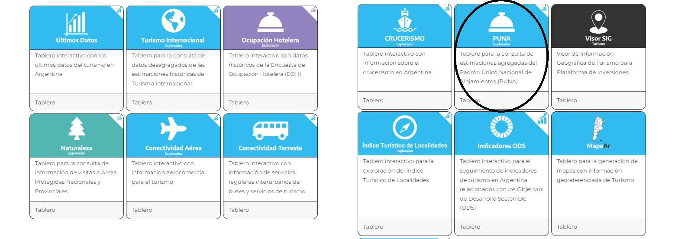
```

---

**Tablero PUNA:** https://www.tableros.yvera.tur.ar/puna


```{r echo=FALSE, out.width='100%'}
knitr::include_graphics("imgs/tablero_puna.png")
```

---

**Tablero PUNA:** https://www.tableros.yvera.tur.ar/puna


```{r echo=FALSE, out.width='100%'}
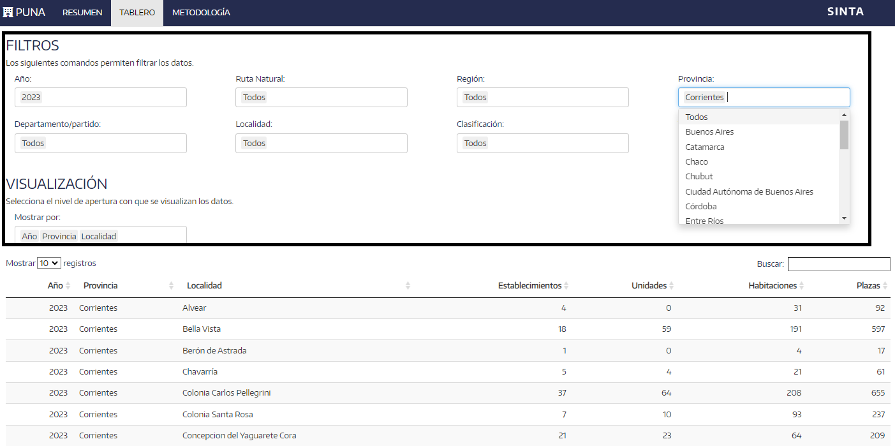
```

---

**Tablero PUNA:** https://www.tableros.yvera.tur.ar/puna

```{r echo=FALSE, out.width='100%'}
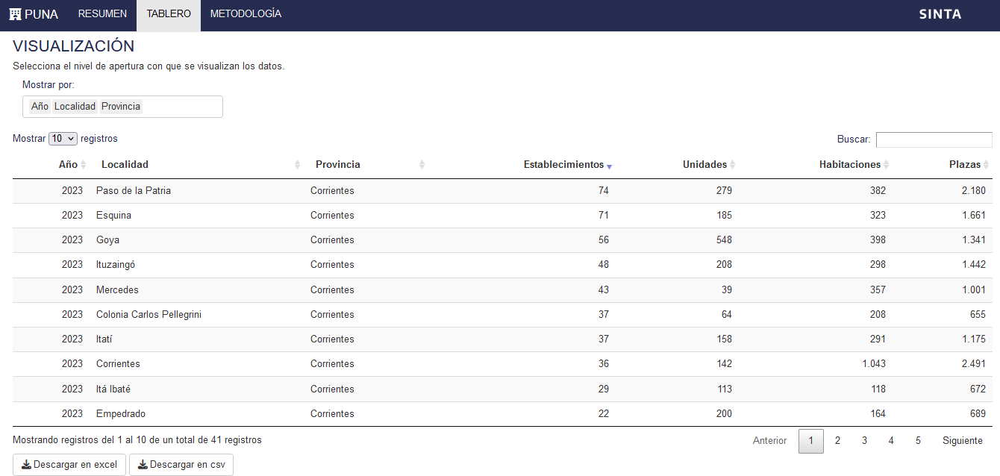
```

---

**Tablero Encuesta de Ocupación Hotelera (EOH):** https://www.tableros.yvera.tur.ar/tablero_eoh

```{r echo=FALSE, out.width='100%'}
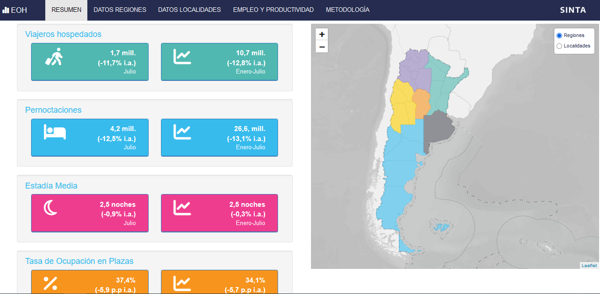
```

---

**Tablero Encuesta de Ocupación Hotelera (EOH):** https://www.tableros.yvera.tur.ar/tablero_eoh

```{r echo=FALSE, out.width='100%'}
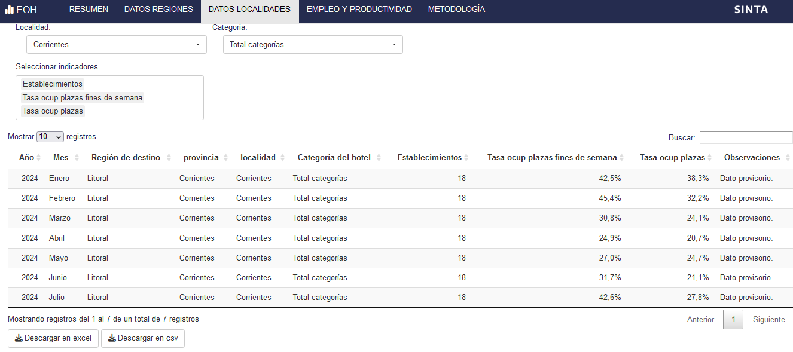
```

---


class: middle

### Y más aplicaciones prácticas!


---

### Aplicaciones prácticas

<br>

-   ¿Cuál es el flujo de `transporte aéreo y terrestre` en nuestro país?

- ¿Cuáles son las `principales aerolíneas` utilizadas por los brasileños para venir a Argentina?


-   ¿Cuáles son los `principales destinos` según el transporte terrestre (ómnibus)?

-   ¿Qué características tiene el `turismo de cruceros` en nuestro país?

-   ¿Qué `área protegida` recibe mayor cantidad de visitantes?

---


**Tablero de conectividad aérea:** https://www.tableros.yvera.tur.ar/conectividad


```{r echo=FALSE, out.width='100%'}
knitr::include_graphics("imgs/tablero_conectividad.png")
```

---


**Tablero de conectividad aérea:** https://www.tableros.yvera.tur.ar/conectividad


```{r echo=FALSE, out.width='100%'}
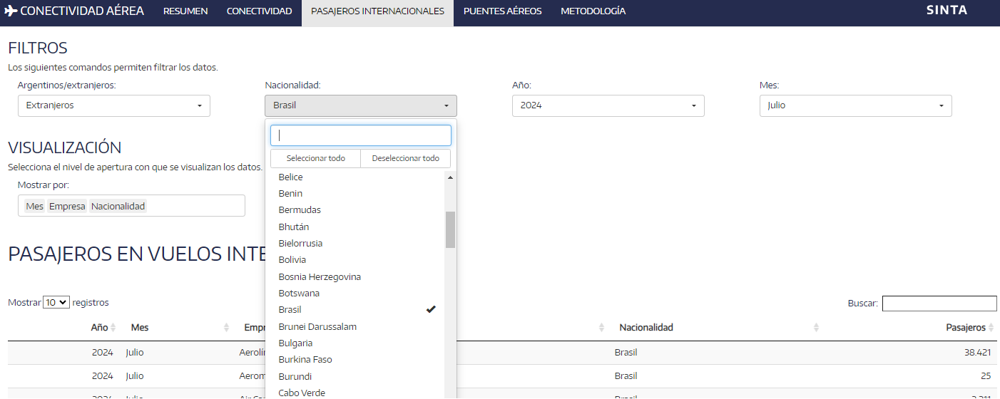
```

---

**Tablero de conectividad aérea:** https://www.tableros.yvera.tur.ar/conectividad


```{r echo=FALSE, out.width='100%'}
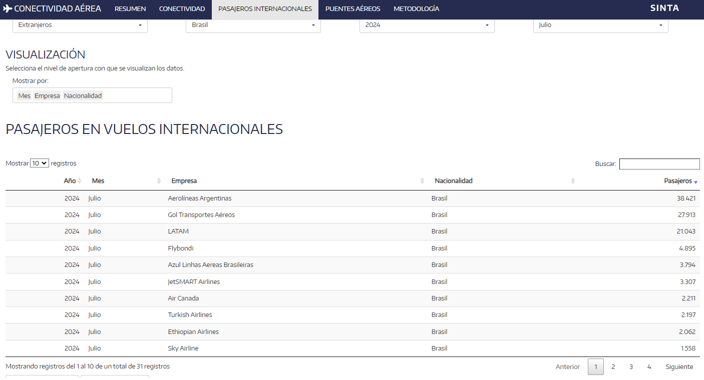
```

---

**Tablero de conectividad terrestre:** https://www.tableros.yvera.tur.ar/conectividad_terrestre


```{r echo=FALSE, out.width='100%'}
knitr::include_graphics("imgs/tablero_conectividad_terrestre.png")
```
---

**Tablero de conectividad terrestre:** https://www.tableros.yvera.tur.ar/conectividad_terrestre

```{r echo=FALSE, out.width='100%'}
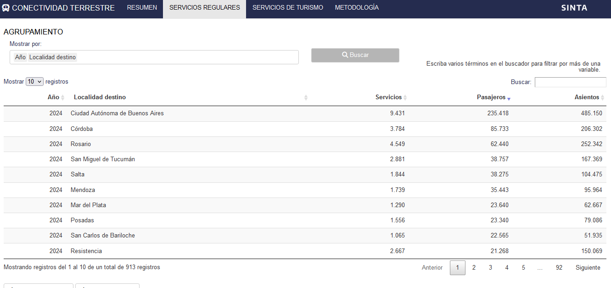
```

---

**Tablero de crucerismo marítimo:** https://www.tableros.yvera.tur.ar/crucerismo


```{r echo=FALSE, out.width='100%'}
knitr::include_graphics("imgs/tablero_crucerismo.png")
```
---


**Tablero de áreas naturales protegidas:** https://www.tableros.yvera.tur.ar/ablero_areas_protegidas/


```{r echo=FALSE, out.width='100%'}
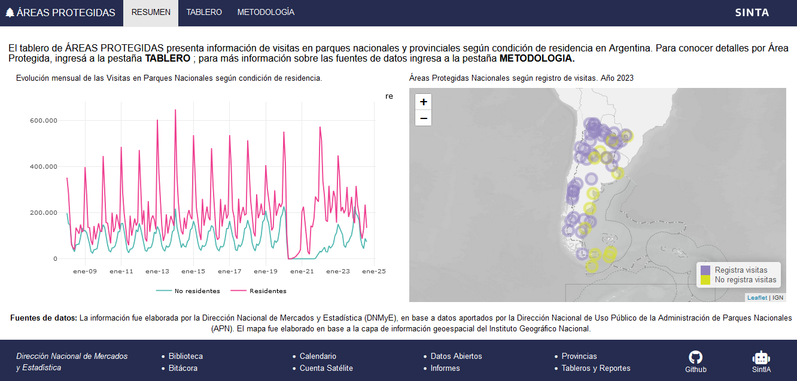
```

---

**Tablero de áreas naturales protegidas:** https://www.tableros.yvera.tur.ar/ablero_areas_protegidas/


```{r echo=FALSE, out.width='100%'}
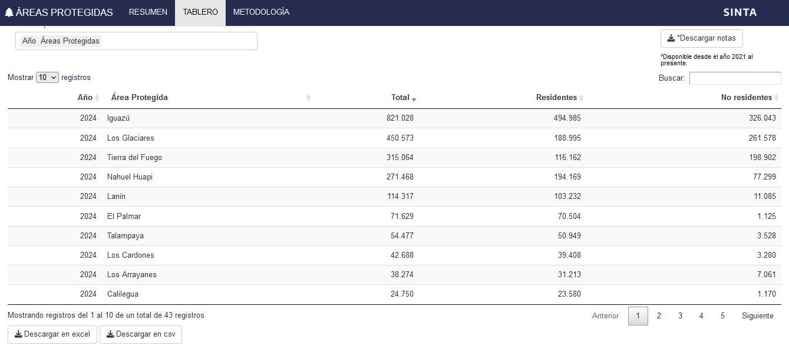
```

---

class: middle


```{r echo=FALSE, out.width='20%'}
knitr::include_graphics("imgs/sinta_logo_negro.png")
```

**INFORME:** https://www.yvera.tur.ar/sinta/informe

**CUENTA SATELITE DE TURISMO:** https://www.yvera.tur.ar/sinta/informe/info/cuenta-satelite-de-turismo

**ARMONIZACIÓN:** https://armonizacion.yvera.tur.ar/

**DATOS ABIERTOS:** https://datos.yvera.gob.ar/

**TABLEROS Y REPORTES:** https://tableros.yvera.tur.ar/

**BIBLIOTECA:** https://biblioteca.yvera.tur.ar/

**BITÁCORA:** https://bitacora.yvera.tur.ar/

**CALENDARIO:** https://calendario.yvera.tur.ar/


### 🌐 [yvera.tur.ar/_SINTA_](www.yvera.tur.ar/sinta)


---

## El SINTA en números


- 8 secciones

- 13 tableros interactivos

- Más de 40 documentos de trabajo y manuales metodológicos

- 16 datasets y 154 recursos en datos abiertos

- Más de 1600 series accesibles via API

- Más de 60 entradas en bitácora

- 1 repositorio público de código abierto

---

## Visitantes del SINTA

Septiembre 2024 - Tableros y reportes

```{r echo=FALSE, out.width='60%'}
knitr::include_graphics("imgs/sinta_users.png")
```

---

## Visitantes del SINTA

```{r echo=FALSE, out.width='90%'}
knitr::include_graphics("imgs/sinta_users_origen.png")
```

---

## El SINTA en el G20

```{r echo=FALSE, out.width='80%'}
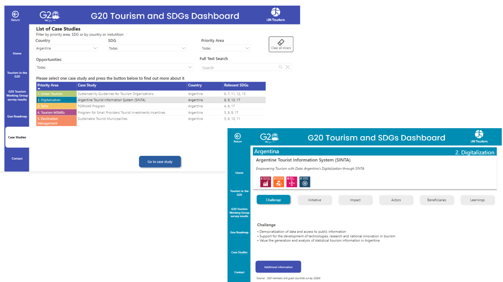
```

---

class: inverse center middle


<br>
<br>


## ¡Muchas gracias!

<br>
<br>

Contacto: estadistica@turismo.gob.ar

---

class: inverse center middle

```{r echo = FALSE , out.width='50%'}


```


