class:inverse, middle

background-image: url(https://tableros.yvera.tur.ar/recursos/logos_institucionales/escudo_mdtyd_blanco.png)
background-position: 95% 95%
background-size: 30%

# Fuentes de datos e indicadores en turismo

## Sistema de Información Turística de la Argentina

<br>
<br>
<br>
<br>
<br>
<br>
<br>
<br>
<br>

### Dirección Nacional de Mercados y Estadística<br>Subsecretaría de Desarrollo Estratégico


```{r, echo=FALSE}
library(xaringanExtra)
# LOGO COLOR EN PAGs INTERNAS
xaringanExtra::use_logo(image_url = "https://tableros.yvera.tur.ar/recursos/logos_institucionales/escudo_mdtyd_color.png", 
                        position = css_position(top = "1em", right = "1em"), 
                        height = "20%", width = "20%")
# BARRA DE PROGRESO DE PRESENTACION
xaringanExtra::use_progress_bar(color = comunicacion::dnmye_colores("cian"))
# LAPIZ 
xaringanExtra::use_scribble()
# EXPLORADOR DE SLIDES
xaringanExtra::use_tile_view()
# HABILITAR WEBCAM
xaringanExtra::use_webcam()
```


```{r dnmye_theme, include=FALSE, warning=FALSE, eval=TRUE}
library(xaringanthemer) #EVAL FALSE
library(comunicacion)
style_mono_light(outfile = "dnmye_theme.css", # CSS FILE
                 # FONTS
                  header_font_google = google_font('Encode Sans'),
                  text_font_google   = google_font('Roboto'),
                  code_font_google   = google_font('IBM Plex Mono'),
                 # COLORES 
                 base_color = dnmye_colores("cian"),
                 code_inline_color = dnmye_colores("rosa"), 
                 inverse_link_color = "#3B4449",
                 background_color = "#FFFFFF",
                 title_slide_background_image = "escudo_mintur_blanco.png", 
                 title_slide_background_position = "95% 5%", 
                 title_slide_background_size = "200px", footnote_color = "#3B4449", link_color = "3B4449",text_slide_number_font_size = "16px"
                  
                 )
```


```{r setup, include=FALSE}
options(htmltools.dir.version = FALSE)
knitr::opts_chunk$set(
  fig.width=9, fig.height=3.5, fig.retina=3,
  out.width = "100%",
  cache = FALSE,
  echo = FALSE,
  message = FALSE, 
  warning = FALSE,
  fig.show = TRUE,
  hiline = TRUE
)
```


```{css, echo=FALSE}
div.my-footer {
    background-color: white;
    position: absolute;
    bottom: 0px;
    left: 0px;
    height: 40px;
    width: 100%;
}
div.my-footer span {
    font-size: 16px;
    color: #3B4449;
    position: absolute;
    left: 15px;
    bottom: 6px;
}


```


---

layout: true

<div class="my-footer"><span>DIRECCIÓN NACIONAL DE MERCADOS Y ESTADÍSTICA <a href="https://yvera.tur.ar/sinta"> - <b>www.yvera.tur.ar/sinta</a></b></span></div> 

---


---


---


---

# Fuentes de datos

- Operativos estadísticos


- Registros administrativos


- Otras fuentes alternativas

---

class: inverse center middle

# TURISMO INTERNO
---

# EVyTH

.pull-left[

- **Fuente**: Encuesta de Viajes y Turismo de los Hogares (EVyTH).

- **Resumen**: evolución de los viajes realizados por los hogares argentinos, características de los viajes y de los turistas. Encuesta en grandes aglomerados urbanos.

- **Indicadores**: acceso al turismo, turistas y excursionistas, gasto turístico, motivo del viaje, pernoctes y estadía, origen y destino, alojamiento, transporte, organización del viaje, actividades realizadas, entre otros.

- **Disponible**: datos abiertos (microdatos + recursos), informe, reporte.
]

.pull-right[
```{r echo=FALSE}
knitr::include_graphics("imgs/datos2.png")
```

]
---

### EVyTH
#### Visitantes por trimestre y provincia de destino

```{r fig.align='center'}
# library(tidyverse)
# library(glue)
# library(ggbump)
# library(colorspace)
# library(ggtext)
# library(ggforce)
# library(ggthemes)
# library(comunicacion)
# 
# ### Descargo base del portal
# url <- "http://datos.yvera.gob.ar/dataset/b5819e9b-5edf-4aad-bd39-a81158a2b3f3/resource/8c663c32-fee2-4a57-a918-7ab0f3819624/download/evythmicrodatos.txt"
# 
# evyth <- read.table(file = url, sep = ",", header = T)
# 
# 
# ### Descargo diccionario de registro
# url <- "http://datos.yvera.gob.ar/dataset/b5819e9b-5edf-4aad-bd39-a81158a2b3f3/resource/20e2c018-a2ee-4d97-9c67-a4303f669255/download/evyth_diccionario_registro.txt"
# 
# diccionario <- read.table(file = url, sep = ",", header = T)
# 
# 
# ### Armo diccionario de aglomerados
# diccionario <- diccionario %>% 
#   filter(variable %in% c("aglomerado_origen", "provincia_destino") & !is.na(opcion))
# 
# 
# ### Pego etiqueta de aglomerados en base de microdatos
# evyth <- evyth %>% 
#   left_join(diccionario %>% 
#               filter(variable == "aglomerado_origen") %>% 
#               select("aglomerado_cod" = opcion, "aglomerado_etiq" = descripcion), 
#             by = c("aglomerado_origen" = "aglomerado_cod")) %>% 
#   left_join(diccionario %>% 
#               filter(variable == "provincia_destino") %>% 
#               select("provincia_dest_cod" = opcion, "provincia_dest_etiq" = descripcion),
#             by = c("provincia_destino" = "provincia_dest_cod"))
# 
# 
# # Defino el trimestre como el último disponible del último año disponible
# ano <- max(evyth$anio)
# trim <- 4
# 
# # Defino paleta de colores
# categorias_cant <- length(unique(evyth$provincia_dest_etiq))
# armo_paleta <- colorRampPalette(unname(dnmye_colores()))
# 
# theme_titulos <- function() {
#   theme(plot.title = element_text(size = 20, color = "grey", face = "bold"),
#         plot.subtitle = element_text(size = 16, face = "bold"),
#         plot.caption = element_text(size = 12))
# }
# 
# # Armo tabla de datos
# tabla_rank_prov_destino <- evyth %>%
#   filter(anio %in% c(2019, 2020, 2021, 2022) & trimestre == trim) %>% 
#   group_by(provincia_dest_etiq, anio) %>% 
#   summarise(personas = sum(pondera)) %>% 
#   arrange(-personas, .by_group = T) %>% ungroup() %>% 
#   group_by(anio) %>% 
#   mutate(rank = rank(-personas, ties.method = "random"),
#          anio = as.numeric(anio)) %>% 
#   ungroup()
# 
# # Armo visualización
# ggplot(data = tabla_rank_prov_destino, aes(anio, rank, color = provincia_dest_etiq)) +
#   geom_point(size = 5) +
#   geom_text(data = tabla_rank_prov_destino %>% filter(anio == min(anio)),
#             aes(x = anio - .1,  label = paste0(provincia_dest_etiq, " (", format(personas, big.mark = ".", decimal.mark = ",", digits = 1), ")")),
#             size = 3.4, hjust = 1) +
#   geom_text(data = tabla_rank_prov_destino %>% filter(anio == max(anio)),
#             aes(x = anio + .1,  label = paste0(provincia_dest_etiq, " (",  format(personas, big.mark = ".", decimal.mark = ",", digits = 1), ")")),
#             size = 3.4, hjust = 0) +
#   geom_bump(size = 1, smooth = 4, alpha = 0.9) +
#   scale_x_continuous(limits = c(2017.4, 2023.7),
#                      breaks = seq(2019,2022)) +
#   scale_y_reverse(breaks = seq(0, max(tabla_rank_prov_destino$rank), by = 1)) +
#   labs(
#     #title = "RANKING PROVINCIAL",
#     subtitle = glue::glue("Trimestre {trim}, años 2019 a 2022"),
#     y = "",
#     x = NULL,
#     caption = "Fuente: Encuesta de Viajes y Turismo de los Hogares - DNMyE") +
#   scale_color_manual(values = darken(armo_paleta(categorias_cant), amount = 0.1, space = "combined")) +
#   theme_minimal() +
#   theme_titulos() +
#   theme(legend.position = "none",
#         panel.grid = element_blank(),
#         axis.text.x = element_text(size = 12, vjust = 5),
#         axis.text.y = element_blank())
# 
# ggsave("imgs/clases_unlp/evyth_destinos_bump.png", width = 12, height = 5)

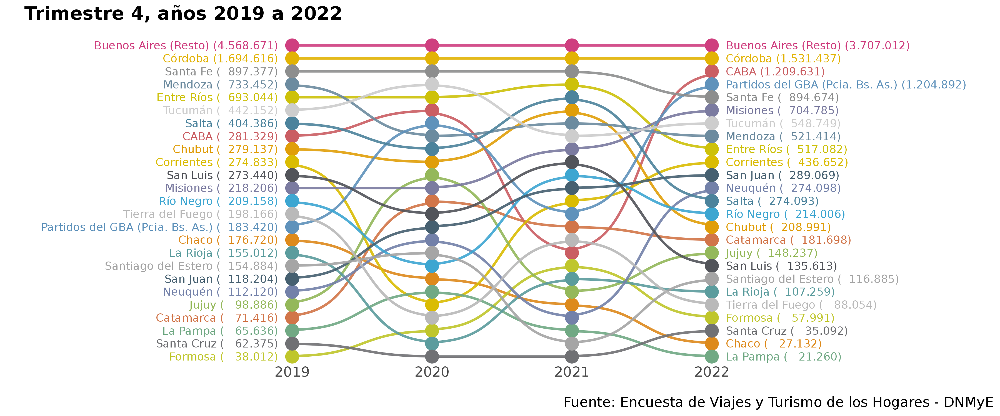
```

---
### EVyTH
#### Participación según quintil de ingreso
```{r out.width='60%', fig.align='center'}
# quintil <- evyth %>%
#   filter(anio %in% c(seq(2019,2022))) %>%
#   mutate(categorias = case_when(quintil_pcf_visitante == 1 ~ "Quintil 1",
#                              quintil_pcf_visitante == 2 ~ "Quintil 2",
#                              quintil_pcf_visitante == 3 ~ "Quintil 3",
#                              quintil_pcf_visitante == 4 ~ "Quintil 4",
#                              quintil_pcf_visitante == 5 ~ "Quintil 5")) %>% 
#   mutate(categorias = fct_relevel(categorias, "Quintil 1","Quintil 2", "Quintil 3", "Quintil 4", "Quintil 5")) %>% 
#   group_by(anio,categorias) %>%
#   summarise(n = sum(pondera)) %>%
#   ungroup() %>% 
#   group_by(anio) %>% 
#   mutate(participacion = n/sum(n)) %>%
#   ungroup() %>% 
#   mutate(anio = as.character(anio))
# 
# ggplot(data = quintil) +
#   geom_col(aes(categorias, participacion, fill= anio, group = anio), 
#            position = position_dodge()) +
#   scale_fill_dnmye() +
#   hrbrthemes::scale_y_percent(limits = c(0, 0.5)) +
#   labs(x = "", y = "Participación %", fill = "Año") +
#   theme_minimal() +
#   theme(legend.position = "bottom")
# 
# ggsave("imgs/clases_unlp/evyth_quintil.png", height = 5)

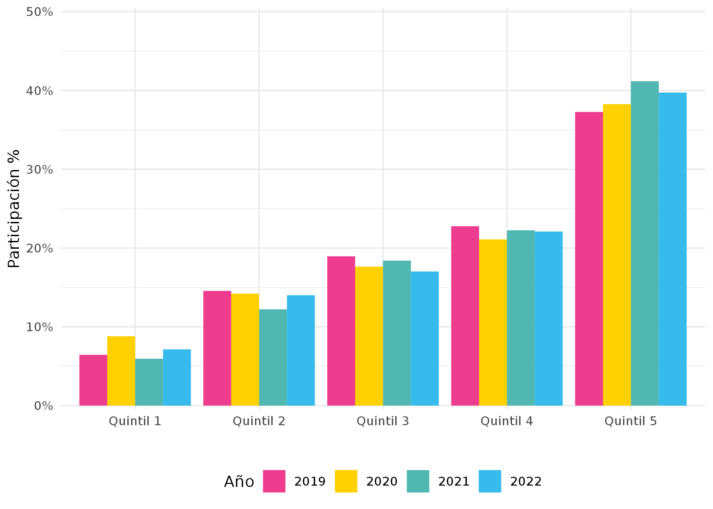

```

---

### EVyTH

#### Análisis de tipologías de turismo

.pull-left[
Según la EVyTH, se consideran las siguientes actividades de naturaleza:

- Visitaron espacios rurales como estancias, granjas, etc.
- Visitaron parques nacionales o provinciales, reservas, etc.
- Hicieron esquí, snowboard, u otro deporte de nieve.
- Realizaron deportes de aventura como mountain bike, montañismo, rafting, travesías, ala delta, etc.
- Otras actividades en espacios abiertos y naturales.

[Informe de turismo naturaleza](https://tableros.yvera.tur.ar/recursos/biblioteca/perfil_naturaleza.pdf)
]

.pull-right[

```{r}
knitr::include_graphics("imgs/clases_unlp/evyth_naturaleza.png")
```

]

---
# Previaje

- **Fuente**: Previaje.

- **Resumen**: datos correspondientes a los registros del programa Previaje.

- **Indicadores**: prestadores inscriptos y comprobantes por sector, viajes realizados (provincia de origen y destino), perfil de beneficiarios, gasto del crédito, para cada edición.

- **Disponible**: datos abiertos.

---

### Previaje
<br>

.pull-left[

]

.pull-right[

]

---

# CUHC

- **Fuente**: Certificado Único Habilitante para Circulación (CUHC).

- **Resumen**: certificados emitidos para ir de vacaciones durante la pandemia.

- **Indicadores**: cantidad de certificados y personas, por fecha, origen y destino, duración del viaje.

- **Disponible**: datos abiertos.


```{r out.width='60%', fig.align='right'}
# library(tidyverse)
# certificados <- read_csv("http://datos.yvera.gob.ar/dataset/fdd18127-d54c-45bc-946d-5ceb445a2f32/resource/ed645552-8ba6-4d3c-914d-e4e89f0757af/download/certificados-personas-por-fecha-ingreso.csv")
# 
# options(scipen = 9)
# 
# ggplot(data = certificados, aes(fecha_ingreso, cantidad_personas)) +
#   geom_line(color = comunicacion::dnmye_colores("purpura"), linewidth =1.2) +
#   geom_point(color = comunicacion::dnmye_colores("purpura"), size = 2.4) +
#   scale_x_date(date_breaks = "7 days",
#                date_labels = "%d-%b-%Y") +
#   labs(title = "Personas por fecha de ingreso", y = "", x = "") +
#     theme_minimal() +
#   theme(axis.text.x = element_text(angle = 90))
# 
# ggsave("imgs/clases_unlp/serie_verano.png", width = 10, height = 5)
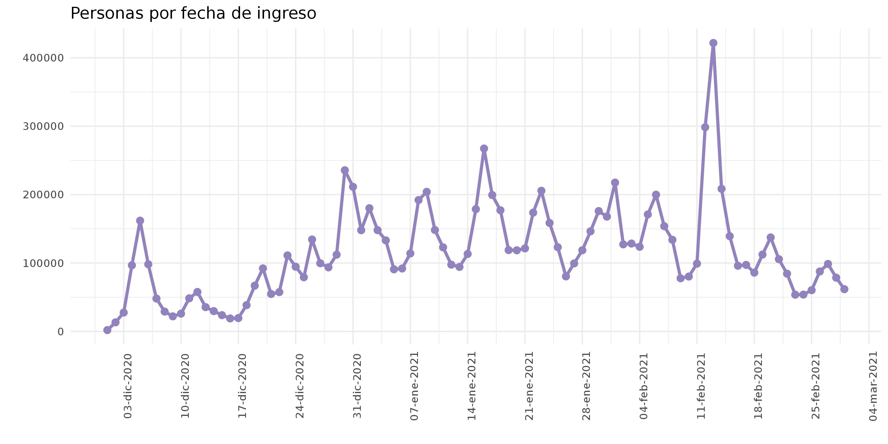
```

---

# Turismo Social

- **Fuente**: Observatorio de Turismo Social (OTS).

- **Resumen**: registros de las Unidades Turísticas (UT) de Chapadmalal y Embalse.

- **Indicadores**: solicitudes y pernoctes por provincia de origen, tipo de plan y UT.

- **Disponible**: datos abiertos.


```{r out.width='70%', fig.align='right'}
# library(tidyverse)
# 
# chapadmalal <- read_csv("http://datos.yvera.gob.ar/dataset/453b2446-f93b-440e-9f51-f6471c57259a/resource/fa9c82f3-ee51-4f62-bce7-cb9c399b3369/download/pernoctes_solicitudes_chapadmalal.csv") %>% 
#   mutate(ut = "Chapadmalal")
# embalse <- read_csv("http://datos.yvera.gob.ar/dataset/453b2446-f93b-440e-9f51-f6471c57259a/resource/6b7b7d1c-bc9e-4f00-9012-7e5a44ac88c1/download/pernoctes_solicitudes_embalse.csv") %>% 
#   mutate(ut = "Embalse")
# 
# data <- rbind(chapadmalal, embalse) %>% 
#   group_by(indice_tiempo, ut) %>% 
#   summarise(cantidad_pernoctes = sum(cantidad_pernoctes),
#             cantidad_solicitudes = sum(cantidad_solicitudes)) %>% 
#   ungroup()
# 
# options(scipen = 99)
# 
# data %>% 
#   ggplot() +
#   geom_line(aes(indice_tiempo, cantidad_pernoctes, color = ut), linewidth = 1.2) +
#   geom_point(aes(indice_tiempo, cantidad_pernoctes, color = ut), size = 2.4) +
#   comunicacion::scale_color_dnmye() +
#   scale_x_continuous(n.breaks = 13) +
#   theme_minimal() +
#   labs(y= "Pernoctes", x = "Año", color = "Unidad Turística")
# 
# ggsave("imgs/clases_unlp/serie_social.png", width = 12, height = 5, bg ="white")

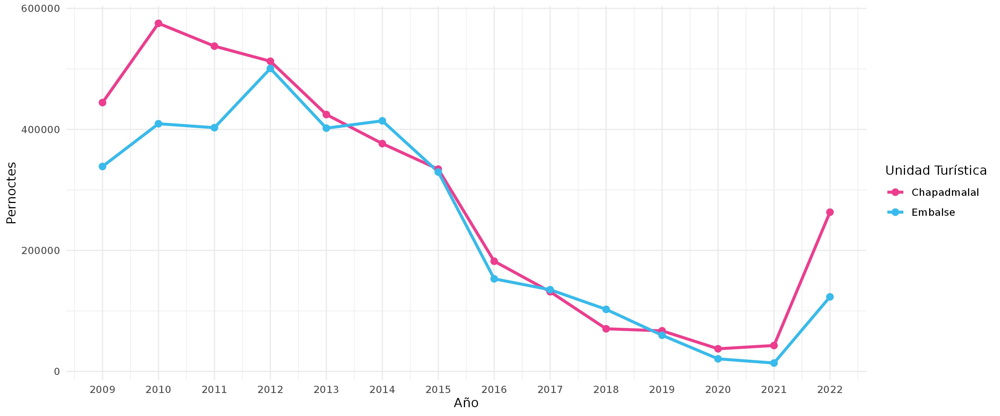
```

---

class: inverse center middle

# TURISMO INTERNACIONAL
---

# Turismo Internacional

- **Fuente**: Encuesta de Turismo Internacional (ETI).

- **Resumen**: caracterización del turismo receptivo y emisivo. Se realiza en 6 puntos de ingreso/egreso del país.

- **Indicadores**: turistas y excursionistas, pernoctes, estadía, motivo de viaje, duración, destino/s, tipo de alojamiento, lugar de residencia, grupo familiar, gasto, entre otros.

- **Disponible**: datos abiertos, informe, tablero y reporte.

---

### ETI

.pull-left[
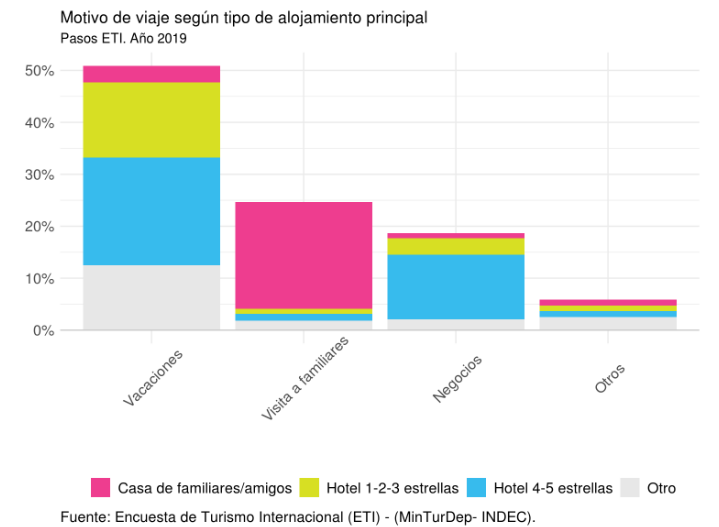
]

.pull-right[
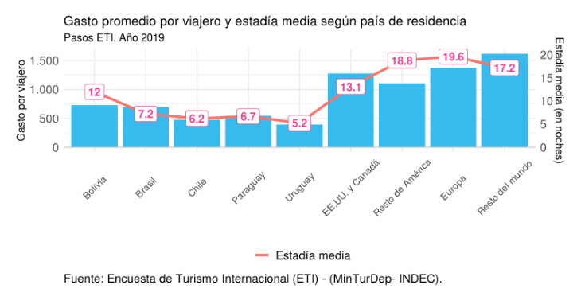
]
---

### ETI

#### Análisis de tipologías de turismo

.pull-left[

Según la ETI, se pueden consideran las siguientes actividades:

- Turismo aventura.
- Actividades de baja dificultad en medios naturales.
- Visita a parques nacionales.
- Actividades en la nieve.

[Informe de turismo naturaleza](https://tableros.yvera.tur.ar/recursos/biblioteca/perfil_naturaleza.pdf)
]

.pull-right[
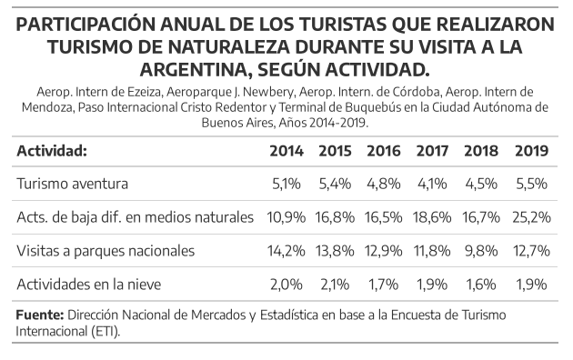
]

---

### Turismo Internacional

- **Fuente**: Dirección Nacional de Migraciones (DNM).

- **Resumen**: registros migratorios de pasos fronterizos en todo el país.

- **Indicadores**: visitantes (a partir de pasajeros), paso, medio de transporte, género, edad y nacionalidad.

- **Disponible**: datos abiertos, informe, tablero y reporte.

```{r}
# library(tidyverse)
# library(herramientas)
# library(lubridate)
# library(ggtext) 
# library(glue) 
# 
# turismo_internacional_vias <- read_file_srv("/srv/DataDNMYE/imet/serie_ti_vias.csv")
# 
# data_grafico_2 <- turismo_internacional_vias %>%
#   filter(year >=2019 ) %>% 
#   pivot_longer(cols = c(3:length(.)), names_to = "indicador", values_to = "n")  %>%
#   filter(str_detect(string = indicador, pattern = "total", negate = T)) %>%
#   mutate(direccion = case_when(str_detect(indicador, "emisivo") ~ "emisivo", T ~ "receptivo"), 
#          month = str_pad(month, 2, "left", 0), 
#          period = ymd(as.character(glue::glue("{year}/{month}/01")))) %>% 
#   select(- c(year, month, indicador)) %>% 
#   group_by(direccion, period) %>% 
#   summarise(n = sum(n), .groups = "drop") %>%
#   pivot_wider(names_from = "direccion", 
#               values_from = "n") %>% 
#   mutate(balanza = receptivo - emisivo, 
#          balanza_color = case_when(balanza > 0 ~ "superavit", TRUE ~ "deficit"),
#          across(where(is.numeric), .fns = ~ ./1000))  # MILES
# 
# cols_arg <- "#37BBED" # Celeste Institucional
# 
# # Secundarios
# cols_arg2 <- c("#EE3D8F", # "ROJO"
#                "#50B8B1", # "VERDE"
#                "#F7941E","#FFD100","#D7DF23", "#9283BE")
# # GRAFICO
#  ggplot(data_grafico_2)  +
#   geom_hline(yintercept = 0, color = "grey", alpha =0.7, size = 0.5) +
#   geom_line(aes(period, emisivo),
#             size = 1, color = cols_arg2[6], alpha = .5) +
#   geom_point(aes(period, emisivo),
#              size = 1.1, color = cols_arg2[6]) +
#   geom_line(aes(period, receptivo),
#             size = 1, color = cols_arg, alpha = .5) +
#   geom_point(aes(period, receptivo),
#              size = 1.1, color = cols_arg) +
#   geom_col(aes(period, balanza, fill = balanza_color)) +
#   scale_fill_manual(values = c("deficit" = cols_arg2[1],
#                                "superavit" = cols_arg2[2])) +
#   scale_x_date(date_breaks = "1 months", 
#                date_labels = "%b%y", 
#                expand = c(0,10)) +
#   scale_y_continuous(breaks = seq(-1200, 2000, by = 400), 
#                      labels = scales::number_format(big.mark = ".",decimal.mark = ",")) +
#   theme_minimal() +
#   theme(legend.position = "none",
#     plot.title =  element_markdown(size = 14, face = "bold"),
#     plot.subtitle = element_markdown(size = 12, face = "bold"),
#     plot.caption = element_markdown(size = 10),
#     axis.text.x = element_text(size = 10, angle = 90),
#     axis.text.y = element_text(size = 10),
#     panel.grid.major = element_line(colour="grey90",size = rel(0.5)),         
#     panel.grid.minor = element_blank())+
#   labs(title = "EVOLUCIÓN MENSUAL DEL TURISMO INTERNACIONAL",
#        x="",y="",
#        subtitle = glue("enero 2019-mayo 2023.<span style='color:#37BBED'>receptivo</span>, <span style='color:#9283BE'>emisivo</span> y balanza, en miles de viajes de turistas (<span style='color:#EE3D8F'>déficit</span>/<span style='color:#50B8B1'>superávit</span>)"),
#        caption = "**Fuente:** DNMyE en base a Dirección Nacional de Migraciones y Encuesta de Turismo Internacional (INDEC y DNMyE)")
#  
# ggsave("imgs/clases_unlp/tur_internacional.png", width = 12, height = 6)
```

---

### Turismo Internacional

```{r out.width='90%'}
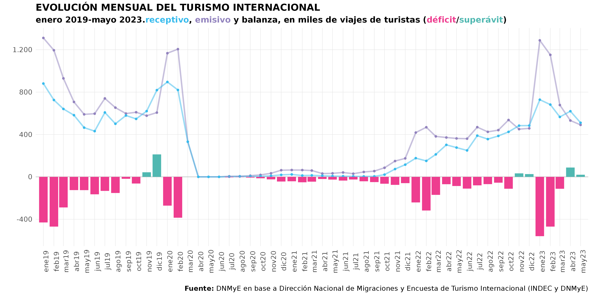
```

---

### Turismo Internacional

```{r out.width='80%'}
knitr::include_graphics("imgs/clases_unlp/dnm_transporte.png")
```

---
class: inverse center middle

# SECTOR HOTELERO
---

### EOH

- **Fuente**: Encuesta de Ocupación Hotelera (EOH).

- **Resumen**: medición del impacto del turismo internacional e interno en los establecimientos hoteleros y para-hoteleros del país. 49 localidades turísticas relevadas.

- **Indicadores**: viajeros hospedados, pernoctes, estadía promedio, tasa de ocupación, facturación, tarifas, ingresos, puestos de trabajo.

- **Disponible**: datos abiertos, informe y reporte.

---

### EOH
```{r}
# library(tidyverse)
# library(directlabels)
# pernoc_eoh <- read_csv("http://datos.yvera.gob.ar/dataset/93db331e-6970-4d74-8589-c1223ac9c282/resource/86098160-840e-4191-a0fc-b3923bf2b0b0/download/pernoctes-residentes-y-no-residentes.csv") %>% 
#   #filter(origen_viajeros == "Residentes") %>% 
#   mutate(anio = substr(indice_tiempo,1,4)) 
# pernoc_mes <- pernoc_eoh %>%
#   group_by(indice_tiempo,anio) %>% 
#   summarise(pernoctes = sum(pernoctes)) %>% 
#   group_by(anio) %>% 
#   mutate(part = pernoctes/sum(pernoctes)) %>% 
#   ungroup() %>% 
#   filter(!anio %in% c(2020,2021)) %>% 
#   mutate(mes = as.Date(glue("2020-{substr(indice_tiempo,6,7)}-01")))
# stats_eoh <- pernoc_mes %>%
#   group_by(mes) %>% 
#   filter(anio <= 2019) %>% 
#   mutate(max = max(pernoctes),
#          min=min(pernoctes),
#          avg = mean(pernoctes))
# grafico_estacionalidad_eoh <- pernoc_mes %>% 
#   filter(anio == 2021) %>% 
#   ggplot(., aes(x=mes,y=pernoctes,group=as.factor(anio),color=as.factor(anio)))+
#   geom_ribbon(data= stats_eoh,aes(x = mes, ymax = max, ymin = min),color="lightgrey",alpha = 0.05,fill = "grey")+
#   geom_line(size=3)+
#   geom_point(size=3)+
#   scale_color_manual(values=c(comunicacion::dnmye_colores(5),
#                               comunicacion::dnmye_colores(3)))+
#   #geom_point()+
#   geom_line(data= stats_eoh,aes(x=mes,y=avg),color=comunicacion::dnmye_colores(1))+
#   geom_point(data= stats_eoh,aes(x=mes,y=avg),color=comunicacion::dnmye_colores(1))+
#   scale_y_continuous(labels = scales::number_format(scale = 1/1e+6,suffix = "M"))+
#   geom_dl(aes(label = anio), method = list(dl.combine( "last.points")), cex = 0.8)+ 
#   #scale_x_continuous(labels = scales::date_format(format = "%b"))+
#   labs(x="",y="",title="Pernoctaciones en hoteles y parahoteles por mes",
#        subtitle = "",
#        caption="Fuente: DNMyE en base a Encuesta de Ocupación Hotelera")+
#   annotate("curve", x = as.Date("2020-04-01"), xend=as.Date("2020-05-01"),yend=pull(unique(stats_eoh[stats_eoh$mes == as.Date("2020-05-01"),"max"]))*1.67,
#            y =pull(unique(stats_eoh[stats_eoh$mes == as.Date("2020-04-01"),"max"]))*.95 , 
#            curvature = -.3,
#            color = "grey",size=1) +
#   annotate(geom = "text",  
#            x = as.Date("2020-05-01"),
#            y = pull(unique(stats_eoh[stats_eoh$mes == as.Date("2020-05-01"),"max"]))*1.67,
#            label = "Rango 2007-2019" ,
#            hjust = "left", size = 4,
#            color = "darkgrey")+
#   annotate("curve", x = as.Date("2020-02-01"), xend=as.Date("2020-03-01"),yend=pull(unique(stats_eoh[stats_eoh$mes == as.Date("2020-02-01"),"avg"]))*1.15,
#            y =pull(unique(stats_eoh[stats_eoh$mes == as.Date("2020-02-01"),"avg"])) , 
#            curvature = -.3,
#            color = comunicacion::dnmye_colores(1),
#            size=1) +
#   annotate(geom = "text",  
#            x = as.Date("2020-03-01"),
#            y = pull(unique(stats_eoh[stats_eoh$mes == as.Date("2020-02-01"),"avg"]))*1.15,
#            label = "Promedio 2007-2019" ,
#            hjust = "left", 
#            color = comunicacion::dnmye_colores(1),
#            size=4)+
#   scale_x_date(date_breaks = "1 month",
#                date_labels = "%b"#,
#                #expand = c(0,2)
#   )+
#   theme_minimal()+
#   coord_cartesian(clip = "off")+
#   theme(legend.position = "none",
#         plot.title = element_markdown(face="bold"),
#         plot.subtitle  = element_markdown(),
#         axis.text.x   = element_text(size = 12),
#         axis.text.y   = element_text(size = 12),
#         text = element_text(family = "Encode Sans"),
#         panel.grid.minor = element_blank()
#   )
# grafico_estacionalidad_eoh
# 
# ggsave("imgs/clases_unlp/eoh_estacionalidad.png", width = 12, height = 6)
```


```{r out.width='80%', fig.align='center'}
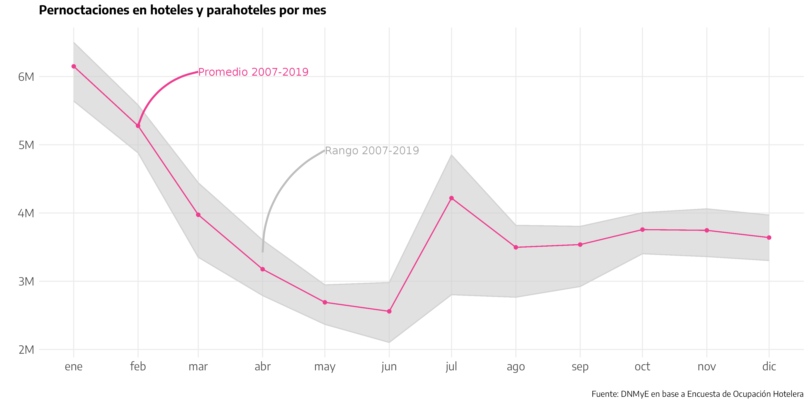
```
---

### EOH

```{r out.width='80%', fig.align='center'}
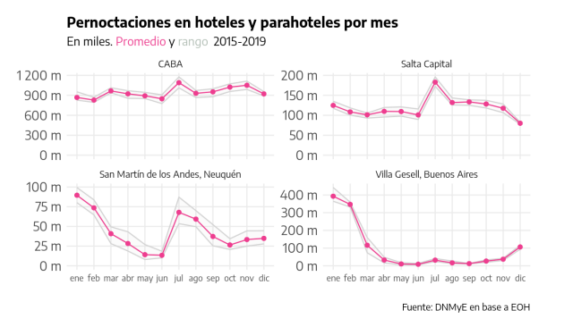
```

[Informe de estacionalidad](https://tableros.yvera.tur.ar/recursos/biblioteca/estacionalidad_turismo.pdf)

---

### EOH

```{r out.width='80%', fig.align='center'}
knitr::include_graphics("imgs/clases_unlp/eoh_origen.png")
```

---

### PUNA

- **Fuente**: Padrón Único Nacional de Alojamiento (PUNA).

- **Resumen**: alojamientos turísticos registrados en todo el país (hoteleros, parahoteleros y otros colectivos).

- **Indicadores**: establecimientos, plazas, unidades y habitaciones, ubicación, cadena hotelera, categoría, clasificación y tipo.

- **Disponible**: datos abiertos y tablero.


```{r}
# library(tidyverse)
# library(gt)
# 
# puna <- herramientas::read_file_srv("puna/serie_puna.csv") %>% 
#   filter(anio == 2021) %>% 
#   mutate(region = case_when(region == "Cordoba" ~ "Córdoba",
#                             str_detect(region, "Ciudad") ~ "Ciudad Autónoma de Buenos Aires",
#                             TRUE ~ region)) %>% 
#   herramientas::etiquetar_provincia(provincia) %>% 
#   mutate(provincia_nombre = case_when(
#     str_detect(provincia_nombre, "Tierra") ~ "Tierra del Fuego",
#                                       TRUE ~ provincia_nombre)
#     )
# 
# plazas2021 <- sum(puna$plazas)
#   
# ranking_loc <- puna %>% 
#   group_by(provincia_nombre, localidad) %>% 
#   summarise(plazas = sum(plazas)) %>% 
#   ungroup() %>% 
#   slice_max(plazas, n = 20) %>% 
#   mutate(rank = rank(-plazas),
#          participacion = plazas/plazas2021,
#          localidad = str_replace(localidad, "Ciudad Autonoma de Buenos Aires",
#                                  "Ciudad Autónoma de Buenos Aires")) %>% 
#   select(-provincia_nombre)
# 
# tabla <- ranking_loc %>% 
#   select(rank, localidad, plazas, participacion) %>% 
#   gt() %>% 
#    cols_label(
#     rank = md("**Ranking**"),
#     localidad = md("**Localidad**"),
#     plazas = md("**Plazas**"),
#     participacion  = md("**Participación %**") 
#   ) %>% 
#   fmt_number(columns = 3, decimals = 0,  dec_mark = ",", sep_mark = ".") %>% 
#   fmt_percent(columns = 4, decimals = 1, dec_mark = ",", sep_mark = ".") %>% 
#   cols_align(
#     align = "center",
#     columns = c(rank, plazas, participacion))  %>% 
#   opt_table_font(
#     font = "Encode Sans"
#   ) %>%
#   tab_source_note(
#     source_note = md(
#       "**Fuente**: DNMyE en base a datos del PUNA")
#   ) %>% 
#    tab_options(table.font.size = 11,
#                data_row.padding = px(2))
# 
# gtsave(tabla, "imgs/clases_unlp/tabla_puna_loc.png")
```

---

### PUNA

```{r out.width='40%', fig.align='center'}
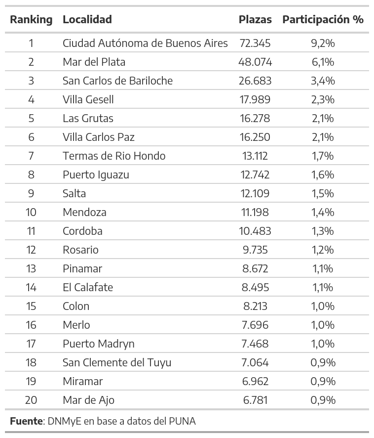
```

---

### PUNA

```{r out.width='65%', fig.align='center'}
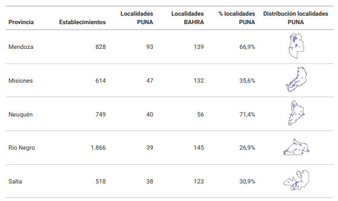
```

[Documento de trabajo PUNA](https://tableros.yvera.tur.ar/recursos/biblioteca/dt10_puna.pdf)

---
class: inverse center middle

# ÁREAS PROTEGIDAS
---

### APN

- **Fuente**: Administración de Parques Nacionales (APN).

- **Resumen**: registros de ingresos a 37 parques de todo el país.

- **Indicadores**: visitantes por parque, residencia.

- **Disponible**: datos abiertos, informe y reporte.

```{r}
# library(tidyverse)
# library(ggtext)
# library(herramientas)
# library(lubridate)
# library(glue)
# 
# parques_nacionales <- read_file_srv("/srv/DataDNMYE/areas_protegidas/areas_protegidas_nacionales/pivot_pn.xlsx", sheet= 2) %>%
#   select(1:7) %>% 
#   filter(parque_nacional != "nahuel huapi") %>% 
#   mutate(Mes = str_to_title(Mes),
#          parque_nacional = ifelse(parque_nacional == "nahuel huapi 3p", "nahuel huapi", parque_nacional)) %>% 
#   left_join(., data.frame(Mes = c("Enero","Febrero","Marzo","Abril","Mayo","Junio","Julio","Agosto","Septiembre","Octubre","Noviembre","Diciembre"), month = c(1:12)))
# 
# datos_grafico1 <- parques_nacionales %>% 
#   filter(anio >= 2019 & anio < 2023) %>%
#   mutate(fecha = ym(glue::glue("{anio}-{month}"))) %>% 
#   group_by(residencia,fecha) %>% 
#   summarise(visitantes = sum(visitantes,na.rm = T)) %>% ungroup() %>% 
#   mutate(visitantes = round(visitantes/1000, 0))
# 
# #Calculo totales para agreagar al gráfico
# totales <- datos_grafico1 %>% group_by(fecha) %>%
#   summarise(total = sum(visitantes)) %>% ungroup()
# 
# cols_arg2 <- c("#EE3D8F", # "ROJO"
#                "#50B8B1", # "VERDE"
#                "#F7941E","#FFD100","#D7DF23", "#9283BE")
# 
# #Gráfico 1 - evolución de visitas según residencia
# datos_grafico1 %>% 
#   mutate(residencia = factor(residencia, levels = c("residentes","no residentes"))) %>% 
#   ggplot() +
#   geom_hline(yintercept = 0, color = "grey", size = 0.8) +
#   geom_area(aes(fecha, visitantes, fill = residencia), position = position_dodge(1), alpha = 0.8) +
#   geom_line(data = totales, mapping = aes(fecha, total), size = 1, linetype = 1, colour = cols_arg2[2]) +
#   geom_point(data = totales, mapping = aes(fecha, total), size = 3, colour = cols_arg2[2]) +
#   geom_text(data = totales, aes(x = fecha, y = total, label = total), 
#             vjust = -1.6, size=2.5) +
#   scale_fill_manual(values = c("residentes" = cols_arg2[6], "no residentes" = cols_arg2[1])) +
#   scale_x_date(date_breaks = "1 months",
#                date_labels = "%b%y",
#                expand = c(.01,.01)) +
#   scale_y_continuous(limits = c(0,900)) +
#   theme_minimal() +
#   #theme_imet() +
#   theme(legend.position = "none",
#         text = element_text(family = "Encode Sans Normal"),
#     plot.title    = element_markdown(size = 12),
#     plot.subtitle = element_markdown(size = 11),
#     plot.caption  = element_text(size = 8, hjust = 0),
#     axis.title.y = element_blank(),
#     axis.text.y = element_markdown(size = 7),
#     axis.text.x = element_markdown(size = 8, angle = 45, hjust = 1),
#     panel.grid.minor.x = element_blank(),
#     strip.placement = "outside"
#    ) +
#   labs(title = toupper("Evolución mensual de las visitas a parques nacionales según origen"),
#        subtitle = tolower(glue("**en miles. enero 2019-diciembre 2022.** <span style='color:{cols_arg2[6]}'>**residentes**</span>**,** <span style='color:{cols_arg2[1]}'>**no residentes**</span> **y** <span style='color:{cols_arg2[2]}'>**total**</span> ")),
#                        x="", fill = "",
#        caption = "Fuente: Dirección Nacional de Mercados y Estadística, Ministerio de Turismo y Deportes, en base a datos suministrados \npor la Dirección de Mercadeo de la Dirección Nacional de Uso Público de la Administración de Parques Nacionales.")
# 
# 
# ggsave("imgs/clases_unlp/parques_nacionales.png", width = 12, height = 5)
```

---

### APN

```{r fig.align='center'}
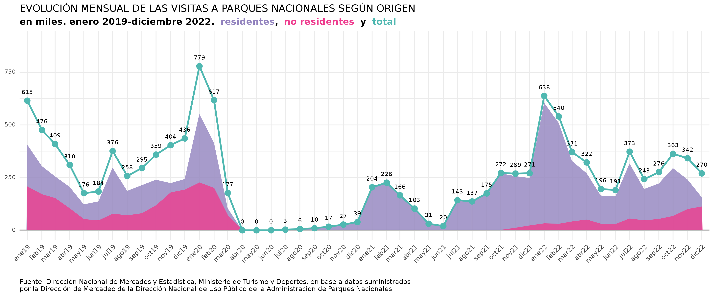
```

---
class: inverse center middle

# AGENCIAS DE VIAJES
---

### Agencias de viajes

- **Fuente**: Dirección Nacional de Agencias de Viajes (DNAV).

- **Resumen**: registros de agencias habilitadas.

- **Indicadores**: cantidad de agencias, mercados, tipo de turismo, estudiantil.

- **Disponible**: tablero.

```{r out.width='50%', fig.align='right'}
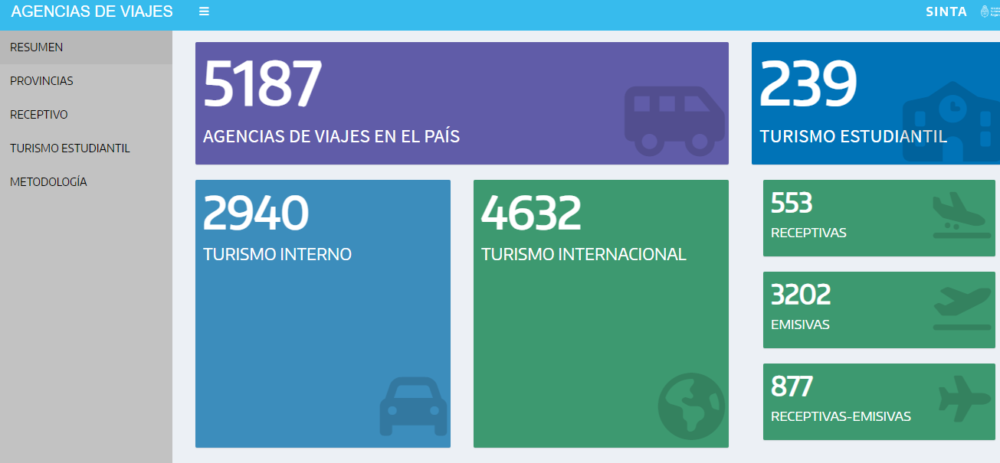
```
---
class: inverse center middle

# MOVILIDAD

---

### Conectividad aérea

- **Fuente**: Administración Nacional de Aviación Civil (ANAC).

- **Resumen**: registros de movimientos aéreos en aeropuertos de todo el país a nivel diario.

- **Indicadores**: vuelos, asientos, pasajeros, clasificación del vuelo, ruta, empresa.

- **Disponible**: datos abiertos, reporte y tablero.

---

### Conectividad aérea

```{r out.width='55%', fig.align='center'}
knitr::include_graphics("imgs/clases_unlp/serie_anac.png")
```

---

### Conectividad aérea

```{r out.width='45%', fig.align='center'}
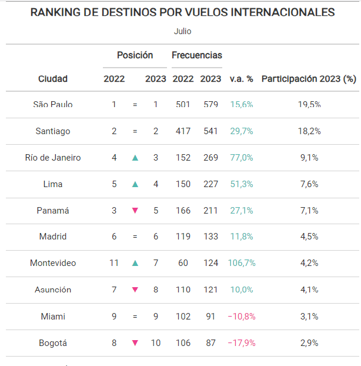
```

---

### Crucerismo

- **Fuente**: DNM.

- **Resumen**: registros de los puestos de Buenos Aires, Madryn y Ushuaia.

- **Indicadores**: cruceristas por temporada, tipo de embarcación, puerto, grupo etario, género, residencia. Cantidad de cruceros por tipo, tempoarada y puerto.

- **Disponible**: informe y tablero.

---

### Crucerismo

.pull-left[
```{r}
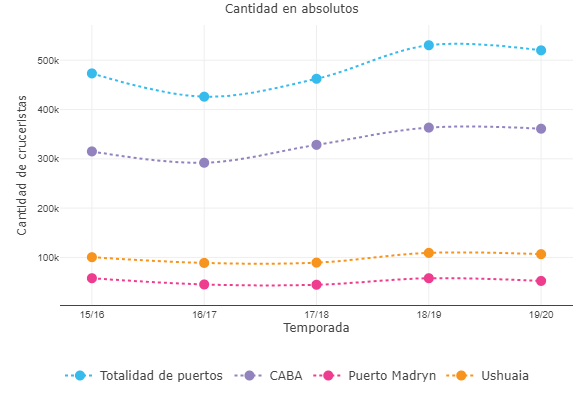
```
]

.pull-right[
```{r}
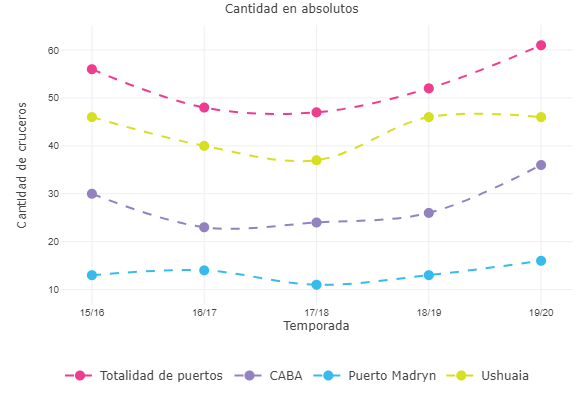
```
]

---

### Crucerismo

```{r out.width='45%', fig.align='center'}
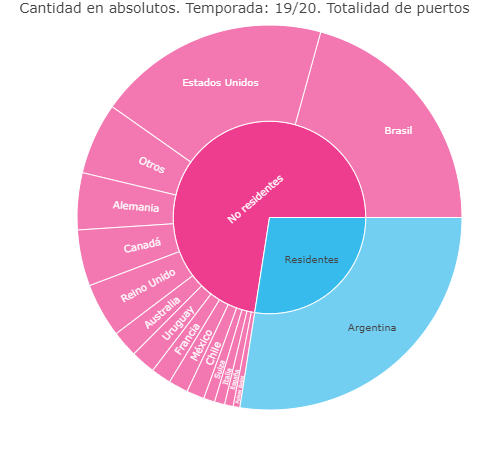
```

---

class: inverse center middle

# ECONOMÍA

---

### CST

- **Fuente**: Cuenta Satélite de Turismo (CST).

- **Resumen**: medición de la contribución del sector turístico a la economía y sus interrelaciones con el resto de las actividades.

- **Indicadores**: PBIDT, VABDT, VABIT, puestos de trabajo, participación en las exportaciones.

- **Disponible**: informe y tablas.

---

### CST

```{r}
knitr::include_graphics("imgs/CST-A-a.png")
```

---

### Empleo

- **Fuente**: Centro de Estudios para la Producción (CEP XXI).

- **Resumen**: medición del empleo en ramas turísticas.

- **Indicadores**: puestos de trabajo registrados, empleo por género y empresas.

- **Disponible**: reporte.

---

### Empleo

```{r, out.width='70%'}
knitr::include_graphics("imgs/clases_unlp/empleo.png")
```

---

### Empleo

.pull-left[
```{r}
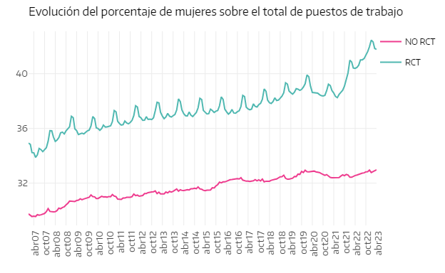
```
]

.pull-right[
```{r}
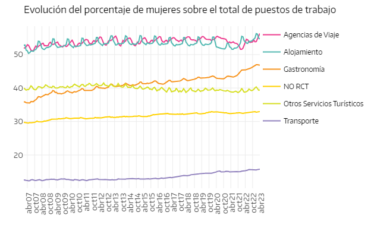
```
]

---

### Divisas

- **Fuente**: Mercado Único y Libre de Cambios.

- **Resumen**: transacciones de divisas.

- **Indicadores**: ingresos y egresos, rubros.

- **Disponible**: reporte.

---

### Divisas
```{r, out.width='70%'}
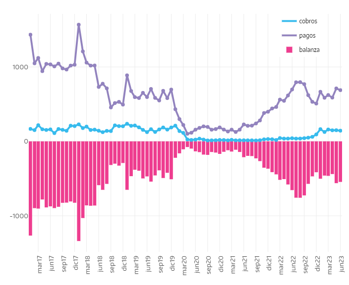
```

---

### Divisas

.pull-left[
```{r}
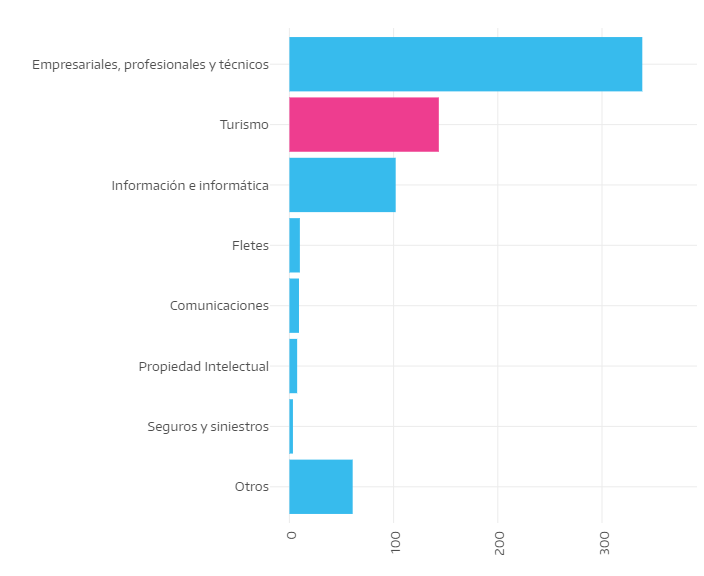
```
]

.pull-right[
```{r}
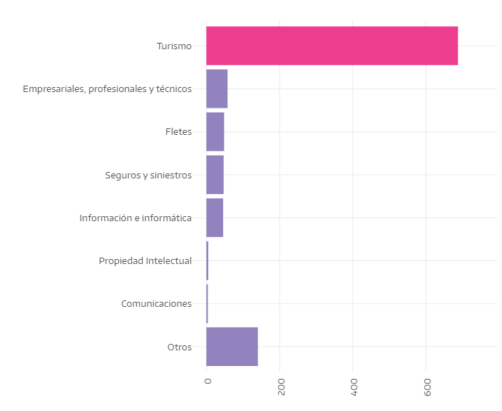
```
]

---
class: inverse center middle

# OTROS RECURSOS

---

### Otros recursos

### Datos abiertos

- [Inversiones turísticas](https://datos.yvera.gob.ar/dataset?groups=inversiones-turisticas)

- [Calidad turística](https://datos.yvera.gob.ar/dataset?groups=calidad-turistica)

### [Monitor de provincias](https://provincias.yvera.tur.ar/)

### [Documentos técnicos armonización](https://armonizacion.yvera.tur.ar/)

---

class: inverse center middle

# CONCLUSIONES

---

### ¿Por qué usar datos?

- Complementar un análisis con el enfoque cuantitativo

- Dar contexto a la problemática

- Responder una pregunta

- Construir indicadores

- Tomar decisiones

---
class: inverse center middle

## Muchas gracias
## estadisticas@turismo.gob.ar
## DNMyE
<br>
### [`r shiny::icon("linkedin")`](https://www.linkedin.com/in/eli%C3%A1n-soutullo) [Elián Soutullo](https://www.linkedin.com/in/eli%C3%A1n-soutullo)
