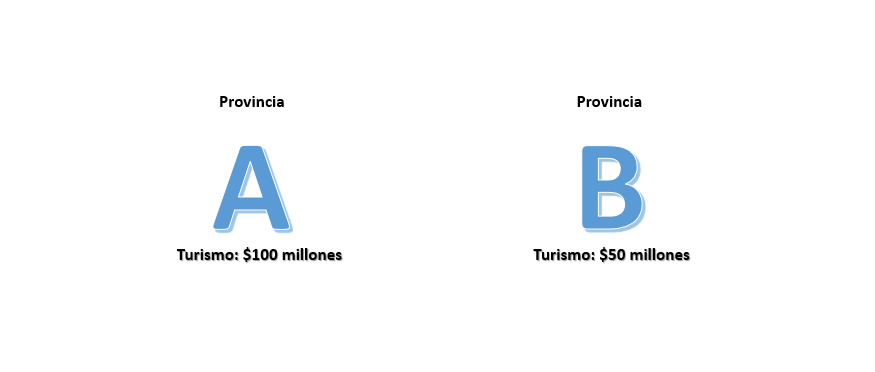
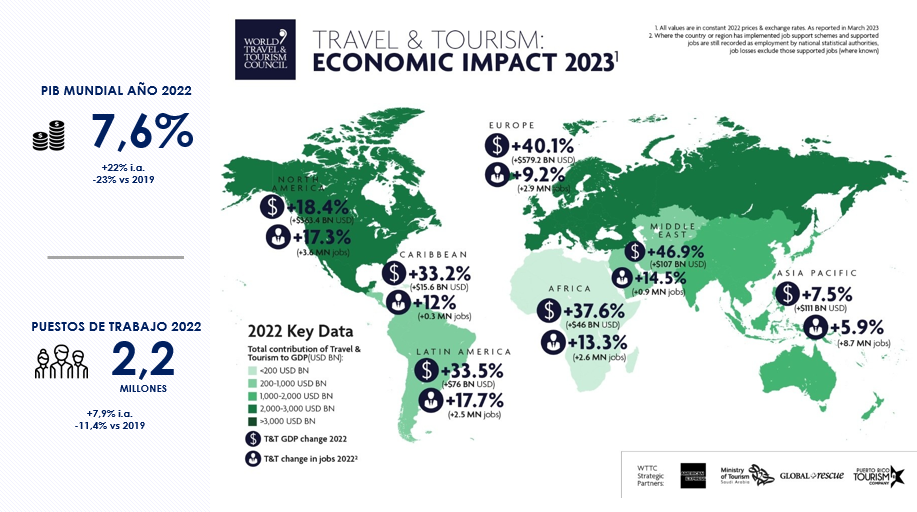
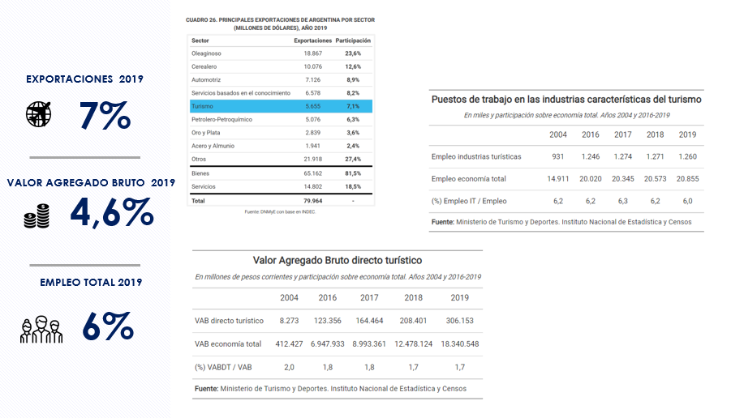
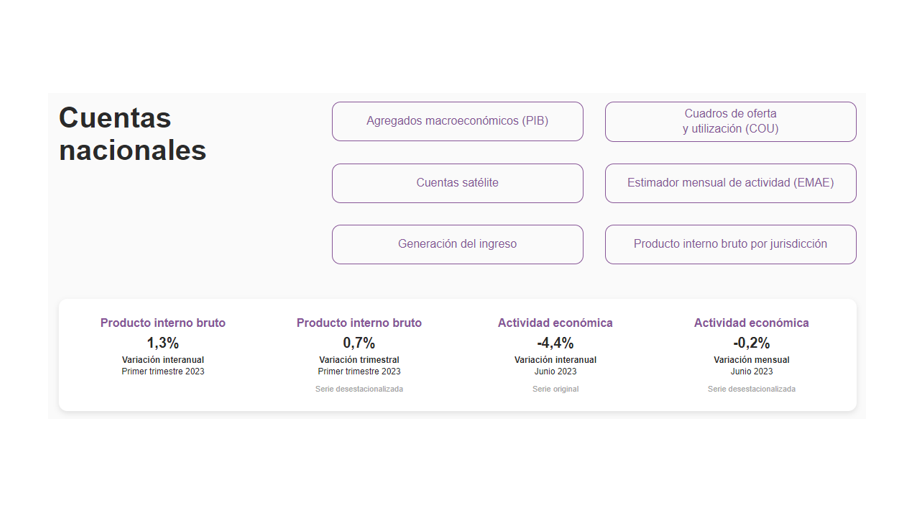
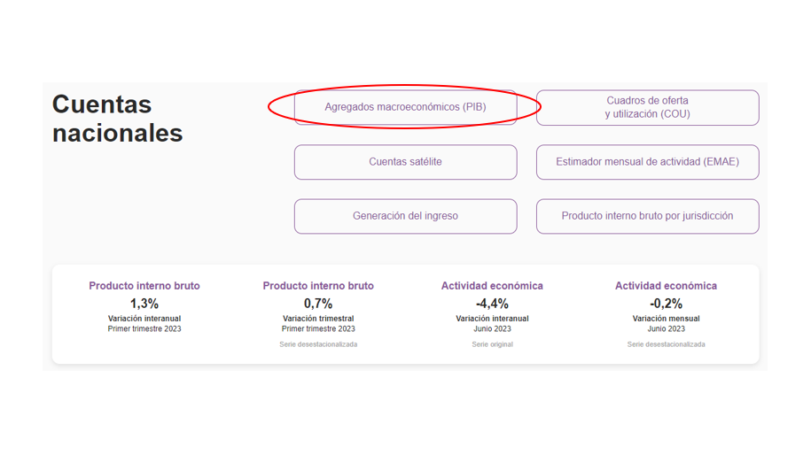
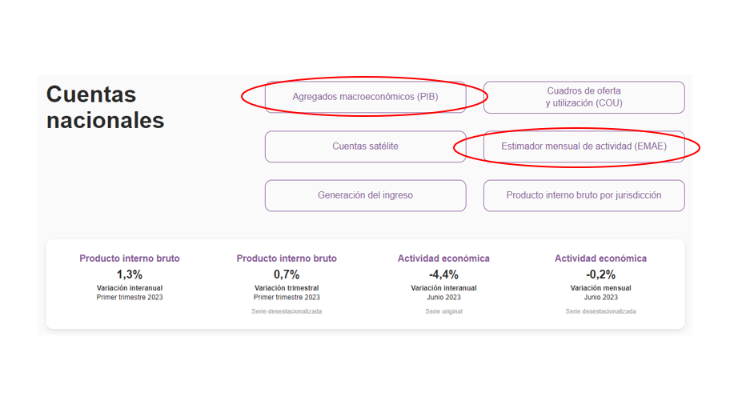
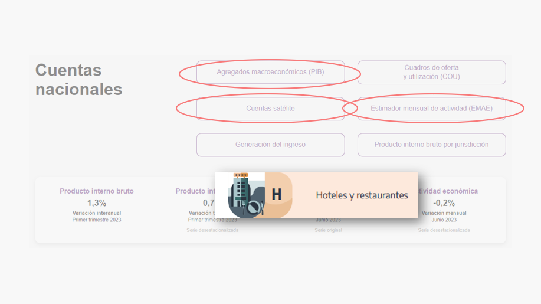
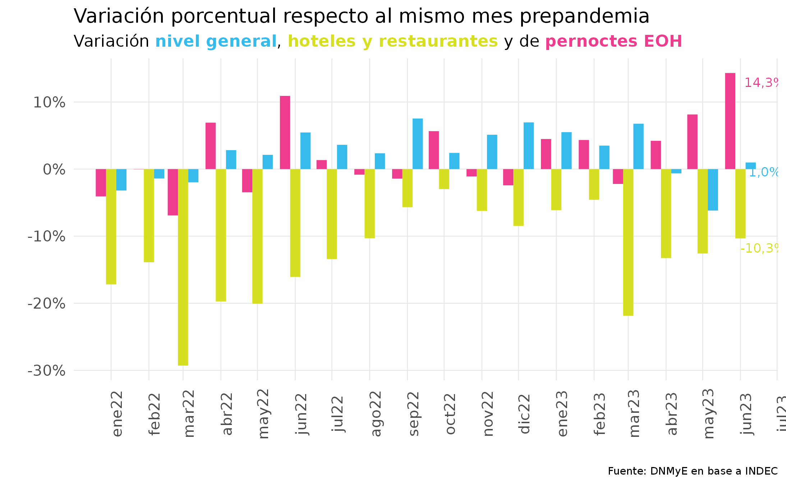
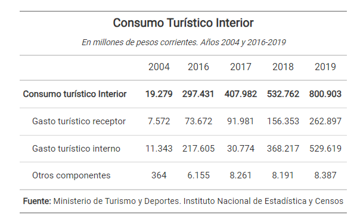
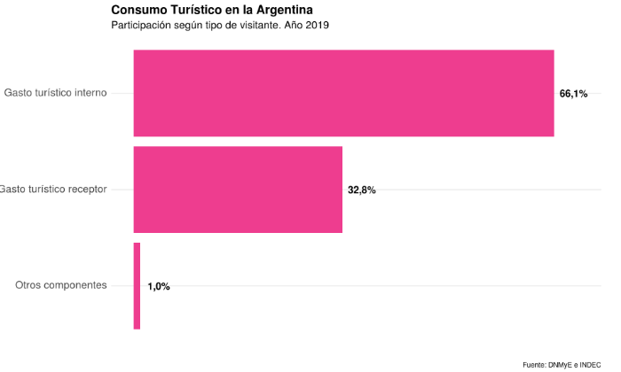

class:inverse, middle

background-image: url(imgs/escudo_mintur_blanco.png)
background-position: 95% 95%
background-size: 30%

.pull-left[
####  Universidad Nacional de La Plata
29 de agosto 2023
<br>
<br>
<br>
]
<br>
<br>
<br>
<br>
<br>
<br>
<br>
<br>
<br>

# Contribución ecónomica del turismo al PIB

## Sistema de Información Turística de la Argentina

<br>
<br>
<br>
<br>


#### Dirección Nacional de Mercados y Estadística<br>Subsecretaría de Desarrollo Estratégico


```{r echo=FALSE, message=FALSE, warning=FALSE, paged.print=FALSE}
library(xaringanExtra)

# LOGO COLOR EN PAGs INTERNAS
xaringanExtra::use_logo(image_url = "imgs/escudo_mintur_color.png", 
                        position = css_position(top = "1em", right = "1em"), 
                        height = "20%", width = "20%")

# BARRA DE PROGRESO DE PRESENTACION
xaringanExtra::use_progress_bar(color = comunicacion::dnmye_colores("cian"))

# LAPIZ 
xaringanExtra::use_scribble()

# EXPLORADOR DE SLIDES
xaringanExtra::use_tile_view()

# HABILITAR WEBCAM
xaringanExtra::use_webcam()


```


```{r dnmye_theme, eval=FALSE, warning=FALSE, include=FALSE}

library(xaringanthemer)
library(comunicacion)


style_mono_light(outfile = "dnmye_theme.css", # CSS FILE
                 # FONTS
                  header_font_google = google_font('Encode Sans'),
                  text_font_google   = google_font('Roboto'),
                  code_font_google   = google_font('IBM Plex Mono'),
                 # COLORES 
                 base_color = dnmye_colores("cian"),
                 code_inline_color = dnmye_colores("rosa"), 
                 inverse_link_color = "#3B4449",
                 background_color = "#FFFFFF",
                 title_slide_background_image = "imgs/escudo_mintur_blanco.png", 
                 title_slide_background_position = "95% 5%", 
                 title_slide_background_size = "200px", footnote_color = "#3B4449", link_color = "3B4449",text_slide_number_font_size = "16px"
                  
                 )


```


```{r setup, include=FALSE}
options(htmltools.dir.version = FALSE)
knitr::opts_chunk$set(
  fig.width=9, fig.height=3.5, fig.retina=3,
  out.width = "100%",
  cache = FALSE,
  echo = TRUE,
  message = FALSE, 
  warning = FALSE,
  fig.show = TRUE,
  hiline = TRUE
)
```

---
layout: true

<div class="my-footer"><span>DIRECCIÓN NACIONAL DE MERCADOS Y ESTADÍSTICA <a href="https://yvera.tur.ar/sinta"> - <b>www.yvera.tur.ar/sinta</a></b></span></div> 

---


---
class: inverse center middle


```{r , echo = FALSE, out.width='40%'}
knitr::include_graphics("https://tableros.yvera.tur.ar//recursos/logos_institucionales/sinta_blanco.png")
```


---

<br>
.footnote[<span style="background-color: #37bbed">https://www.yvera.tur.ar/sinta/informe</span>]
---

---

class: inverse center middle

# ¿En qué provincia el turismo es más importante? 

---

```{r , echo = FALSE}

```

---

```{r , echo = FALSE}
knitr::include_graphics("imgs/clases_unlp/provincias_2.png")
```
---

class: inverse center middle

# ¿Qué preguntas/cuestiones relevantes pueden surgir del ejemplo?


---
<br>
<br>
<br>
- ¿**Cómo** medimos al turismo? 
<br>
<br>
<br>
<br>
- ¿Cuál es el **gasto** de los turistas? ¿Cuál es la **producción** de las empresas? ¿Qué **empresas** son **“turísticas”**?
<br>
<br>
<br>
<br>
- ¿Tenemos que tener una medición del **resto de las actividades**? ¿Cómo? 
<br>
<br>
<br>
<br>
- ¿Es **necesario** hacerlo una vez por mes, por trimestre, por año? ¿Sirve una estimación **poco frecuente**? 
<br>
<br>
<br>
<br>
- ¿¿¿Otras ideas???
<br>
<br>
<br>
<br>
---
class: inverse center middle

#MUNDO
---
<br>
<br>

```{r , echo = FALSE, out.width='100%', fig.align='left'}

```

---
class: inverse center middle

#ARGENTINA
---


```{r , echo = FALSE, out.width='100%'}

```
---

class: inverse center middle

# ¿Cómo conocemos el aporte del turismo a la economía argentina? 

---
<br>
<br>
<br>
<br>
```{r , echo = FALSE}
knitr::include_graphics("imgs/clases_unlp/indec.png")
```

---

```{r , echo = FALSE}

```

---

```{r , echo = FALSE}

```

---

```{r , echo = FALSE, out.width='100%'}

```

---

```{r , echo = FALSE, out.width='100%'}
knitr::include_graphics("imgs/clases_unlp/indec3.png")
```

---

```{r , echo = FALSE}

```


---
class: inverse center middle

# El turismo en el EMAE

---

.pull-left[
```{r,  echo = FALSE, out.width='100%'}
knitr::include_graphics("imgs/clases_unlp/emae_junio.png")
```
]

.pull-right[
```{r,  echo = FALSE,  out.width='100%'}
knitr::include_graphics("imgs/clases_unlp/emae_meses.png")
```
]

---
<br>
<br>
<br>
<br>
```{r,  echo = FALSE,  out.width='80%'}

```

---

class: inverse center middle


```{r , echo = FALSE, out.width='40%'}
knitr::include_graphics("https://tableros.yvera.tur.ar//recursos/logos_institucionales/csta_blanco.png")
```

---


---


---


---


---


---


---


---


---


---


---


---

## CUENTA SATÉLITE DE TURISMO


_Es la herramienta recomendada por la Organización Mundial del Turismo, y reconocida por la comunidad internacional, para evaluar la importancia económica del turismo, conocer las industrias que se benefician de la llegada de visitantes, cuantificar el valor agregado directo que se genera al satisfacer la demanda turística y la generación de empleo, entre otros._


--

.pull-left[

 *  **PBIdt**

  
 *  **VABdt**


 *  **VBPdt**

]

--

.pull-right[

 *  **FBKF**


 *  **Empleo**


 *  **Consumo Colectivo**

]

---

---

---

---

---

---

class: inverse center middle
# PRINCIPALES RESULTADOS
---

### PRINCIPALES RESULTADOS SERIE 2004, 2016 A 2019
#### CONSUMO TURÍSTICO INTERIOR 


.pull-left[
```{r,  echo = FALSE, out.width='100%'}

```
]

.pull-right[
```{r,  echo = FALSE,  out.width='100%'}

```
]


---

### PRINCIPALES RESULTADOS SERIE 2004, 2016 A 2019
#### PARTICIPACIÓN DEL TURISMO EN LA ECONOMÍA. PBI Directo turístico


---
### PRINCIPALES RESULTADOS SERIE 2004, 2016 A 2019
#### VALOR AGREGADO BRUTO DIRECTO TURÍSTICO
<br>

---
### PRINCIPALES RESULTADOS SERIE 2004, 2016 A 2019
#### EMPLEO EN LA INDUSTRIA TURÍSTICA
<br>

---
class: middle


```{r echo=FALSE, out.width='20%'}
knitr::include_graphics("imgs/sinta_logo_negro.png")
```

**BITACORA**

* Publicación de las CST-A  **https://bitacora.yvera.tur.ar/posts/2022-02-01-cuenta-satelite/**
 
* Recorrido por las Tablas de la Cuenta Satélite de Turismo de Argentina (CST -A) **https://bitacora.yvera.tur.ar/posts/2022-05-11-cst-parte2/**

**INFORMES**

* Cuadros **https://www.yvera.tur.ar/sinta/informe/info/cuenta-satelite-de-turismo/cuadros-estadisticos**
 
* Metodología **https://www.yvera.tur.ar/sinta/informe/info/cuenta-satelite-de-turismo/informes-tecnicos**


### 🌐 [yvera.tur.ar/_SINTA_](www.yvera.tur.ar/sinta)

---

class: inverse center middle

# CONCLUSIONES


<br>
```{r echo = FALSE , out.width='30%'}


```

---
class: inverse center middle

## ¡Muchas gracias!
## estadisticas@turismo.gob.ar
## DNMyE
<br>
### [`r shiny::icon("linkedin")`](https://www.linkedin.com/in/eli%C3%A1n-soutullo) [Micaela A. Spinelli](https://www.linkedin.com/in/micaela-abigail-spinelli-143386120/)
<br>
```{r echo = FALSE , out.width='30%'}
knitr::include_graphics("imgs/escudo_mintur_blanco.png")

```

