class:inverse, middle

background-image: url(imgs/escudo_mintur_blanco.png)
background-position: 95% 95%
background-size: 30%

.pull-left[
####  Universidad Nacional de La Plata
15 de agosto 2023
<br>
<br>
<br>
]
<br>
<br>
<br>
<br>
<br>
<br>
<br>
<br>
<br>

# Objetivos de Desarrollo Sostenible y turismo

## Sistema de Información Turística de la Argentina

<br>
<br>
<br>
<br>


#### Dirección Nacional de Mercados y Estadística<br>Subsecretaría de Desarrollo Estratégico


```{r echo=FALSE, message=FALSE, warning=FALSE, paged.print=FALSE}
library(xaringanExtra)

# LOGO COLOR EN PAGs INTERNAS
xaringanExtra::use_logo(image_url = "imgs/escudo_mintur_color.png", 
                        position = css_position(top = "1em", right = "1em"), 
                        height = "20%", width = "20%")

# BARRA DE PROGRESO DE PRESENTACION
xaringanExtra::use_progress_bar(color = comunicacion::dnmye_colores("cian"))

# LAPIZ 
xaringanExtra::use_scribble()

# EXPLORADOR DE SLIDES
xaringanExtra::use_tile_view()

# HABILITAR WEBCAM
xaringanExtra::use_webcam()


```


```{r dnmye_theme, eval=FALSE, warning=FALSE, include=FALSE}

library(xaringanthemer)
library(comunicacion)


style_mono_light(outfile = "dnmye_theme.css", # CSS FILE
                 # FONTS
                  header_font_google = google_font('Encode Sans'),
                  text_font_google   = google_font('Roboto'),
                  code_font_google   = google_font('IBM Plex Mono'),
                 # COLORES 
                 base_color = dnmye_colores("cian"),
                 code_inline_color = dnmye_colores("rosa"), 
                 inverse_link_color = "#3B4449",
                 background_color = "#FFFFFF",
                 title_slide_background_image = "imgs/escudo_mintur_blanco.png", 
                 title_slide_background_position = "95% 5%", 
                 title_slide_background_size = "200px", footnote_color = "#3B4449", link_color = "3B4449",text_slide_number_font_size = "16px"
                  
                 )


```


```{r setup, include=FALSE}
options(htmltools.dir.version = FALSE)
knitr::opts_chunk$set(
  fig.width=9, fig.height=3.5, fig.retina=3,
  out.width = "100%",
  cache = FALSE,
  echo = TRUE,
  message = FALSE, 
  warning = FALSE,
  fig.show = TRUE,
  hiline = TRUE
)
```

---
layout: true

<div class="my-footer"><span>DIRECCIÓN NACIONAL DE MERCADOS Y ESTADÍSTICA <a href="https://yvera.tur.ar/sinta"> - <b>www.yvera.tur.ar/sinta</a></b></span></div> 

---


---
class: inverse center middle


```{r , echo = FALSE, out.width='40%'}
knitr::include_graphics("https://tableros.yvera.tur.ar//recursos/logos_institucionales/sinta_blanco.png")
```


---

<br>
.footnote[<span style="background-color: #37bbed">https://www.yvera.tur.ar/sinta/informe</span>]
---

---

class: inverse center middle

# ODS en la Agenda 2030 de la ONU 

---
<br>
<br>
<br>

En 2015 los Estados Miembros de las Naciones Unidas (ONU) aprobaron **17 Objetivos (ODS)** como parte de la Agenda 2030 para el Desarrollo Sostenible, la cual establece un plan para alcanzar dichos objetivos en 15 años.


```{r , echo = FALSE,  out.width='70%', fig.align='center' }
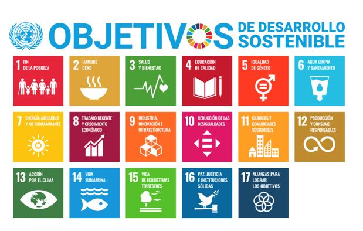
```

---

class: inverse center middle

# El turismo en los ODS: metas específicas


---
<br>
<br>
<br>
```{r , echo = FALSE}
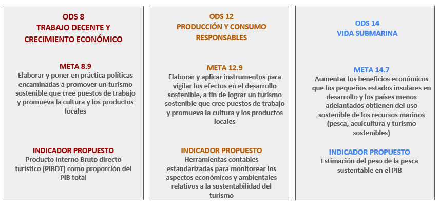
```
---
class: inverse center middle

#El turismo en los ODS: recursos OMT (I)
---
<br>
<br>

.pull-left[
```{r , echo = FALSE}
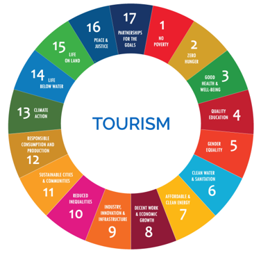
```
]

.pull-right[

```{r , echo = FALSE}
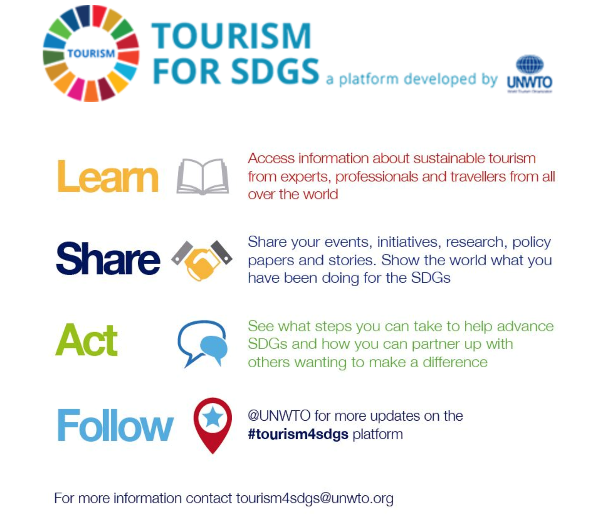
```
]

---
class: inverse center middle

#El turismo en los ODS: recursos OMT (II)
---
<br>
<br>
<br>
```{r , echo = FALSE, out.width='80%', fig.align='center'}
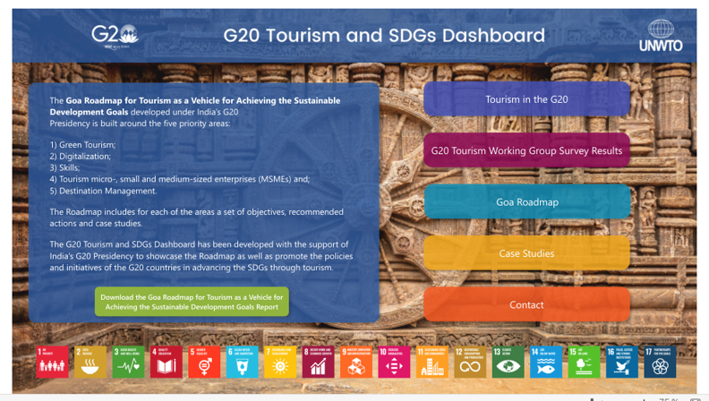
```


---

class: inverse center middle

# Recursos de la DNMyE: informe sobre turismo en los ODS 

---
<br>
<br>
<br>

.pull-left[
```{r , echo = FALSE, out.width='100%'}
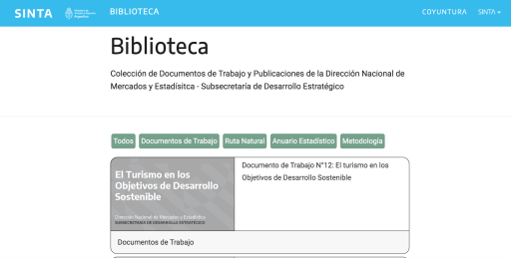
```
]


.pull-right[
```{r , echo = FALSE, out.width='100%'}
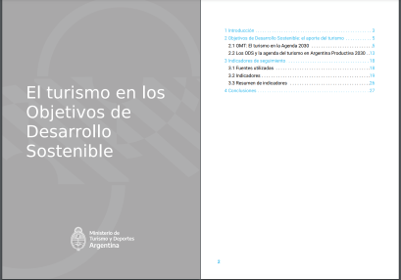
```
]
---

class: inverse center middle

# Recursos de la DNMyE: tablero interactivo de indicadores ODS
---
<br>
<br>
<br>

.pull-left[
```{r , echo = FALSE, out.width='50%'}
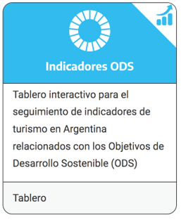
```
]


.pull-right[
```{r , echo = FALSE, out.width='100%'}
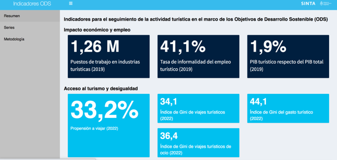
```
]
---
<br>
<br>
<br>
<br>
```{r , echo = FALSE}
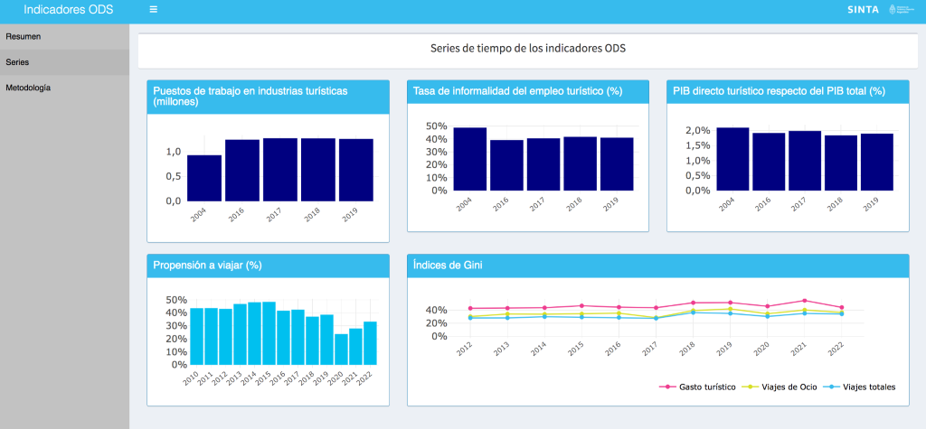
```

---
<br>
<br>
<br>

```{r , echo = FALSE}
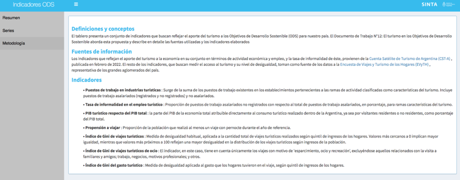
```


---
class: inverse center middle

# Indicadores de seguimiento

---
<br>
<br>
<br>

**TIPO DE INDICADOR**
<br>
- Impacto económico y empleo

- Acceso al turismo y desigualdad
<br>
<br>
<br>

**FUENTES UTILIZADAS**
<br>
- Cuenta Satélite de Turismo de Argentina (CST-A)

- Encuesta de Viajes y Turismo de los Hogares (EVyTH)

---

class: inverse center middle
# Indicadores de seguimiento - Fuentes: CST
---
<br>
<br>
<br>
<br>
La Cuenta Satélite de Turismo (CST) es la herramienta que propone la Organización Mundial del Turismo (OMT) para la medición de la contribución económica del turismo en los países, indicando qué industrias producen para la demanda de visitantes, el valor agregado que generan y el empleo que demandan, entre otros indicadores.
<br>
<br>
<br>

**Variables utilizadas en el cálculo de los indicadores**
<br>

- Producto interno bruto directo turístico (PIBDT)
- Empleo de la industria del turismo


---

class: inverse center middle
# Indicadores de seguimiento - Fuentes: EVyTH
---

<br>
<br>
<br>
Mide la evolución de los viajes que realizan los residentes en grandes aglomerados urbanos del país. Además de la cantidad de visitantes, se releva información que permite caracterizar estos viajes (lugares visitados, forma de alojamiento, estadías, actividades realizadas, utilización de paquete turístico, medios de transporte, etc.) asi como algunas características sociodemográficas de los hogares y el gasto realizado.

<br>
<br>
<br>

**Variables utilizadas en el cálculo de los indicadores**
<br>

- Acceso al turismo

- Gasto turístico

---
class: inverse center middle
# Indicadores de seguimiento seleccionados
---

# Impacto económico y empleo
- Cantidad de puestos de trabajo en la industria turística.
- Tasa de informalidad del empleo asalariado en la industria turística. 
- PIB directo turístico en porcentaje sobre el PIB total. 

# Acceso al turismo y desigualdad
- Propensión neta a viajar
- Índice de Gini de cantidad de viajes turísticos totales. 
- Índice de Gini de cantidad de viajes turísticos por ocio.
- Índice de Gini del gasto turístico.


---

class: inverse center middle
# Resultados

---

# Cantidad de puestos de trabajo en la industria turística

Cantidad de puestos de trabajo en **ramas de actividad características del turismo.**
Abiertos en tres categorías: **asalariados registrados, asalariados no registrados y no asalariados.**


```{r , echo = FALSE,  out.width='50%', fig.align='center'}
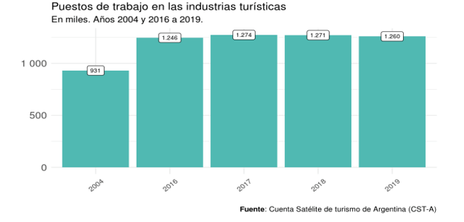
```

---
# Tasa de informalidad del empleo asalariado en la industria turística

- Proporción del **empleo asalariado que no está registrado** (PTANR) respecto del total del **empleo asalariado** (PTAR)


```{r , echo = FALSE,  out.width='50%', fig.align='center'}
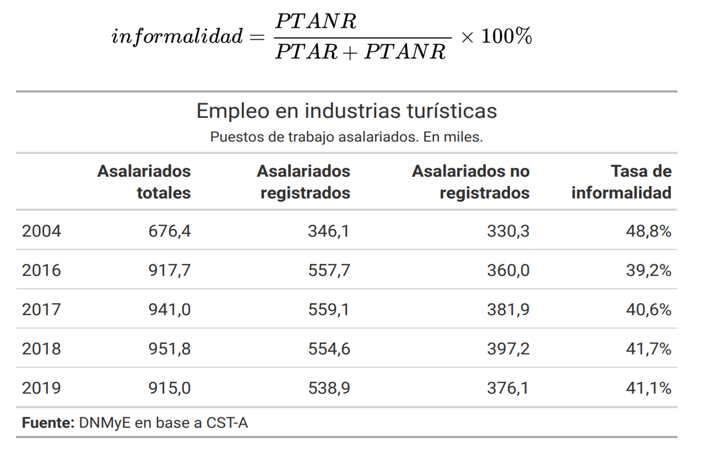
```
---
<br>
# PIB directo turístico en porcentaje sobre el PIB total

- Producto interno bruto directo turístico (PIBDT): delimita la **producción de la economía que sirve para satisfacer la demanda de visitantes.**

- **Todas las ramas de actividad están incluídas**, no se restringe a las industrias características.

- Surge de contrastar el **consumo total de los visitantes (turístico interno y receptor) con la producción** del país.


```{r , echo = FALSE,  out.width='50%', fig.align='center'}
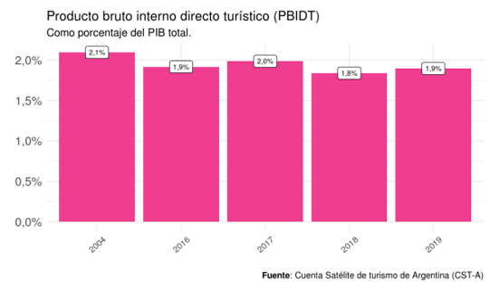
```
---
# Propensión neta a viajar

- Porcentaje de personas de un año o más de edad que realizaron **al menos un viaje turístico con pernocte** (alojandose en el lugar de destino) durante un año calendario.


```{r , echo = FALSE,  out.width='70%', fig.align='center'}
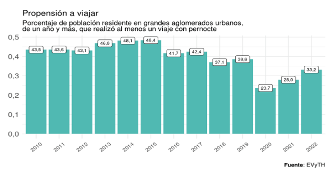
```

---
# Índice de Gini de cantidad de viajes turísticos totales

- Permite analizar la distribución de la cantidad de viajes de acuerdo al quintil de ingreso al que pertenecen los hogares. 
- Es una medida posible de la desigualdad en la demanda turística.


```{r , echo = FALSE,  out.width='50%', fig.align='center'}
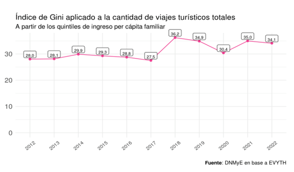
```


---
<br>
# Índice de Gini de cantidad de viajes turísticos de ocio


```{r , echo = FALSE,  out.width='70%', fig.align='center'}
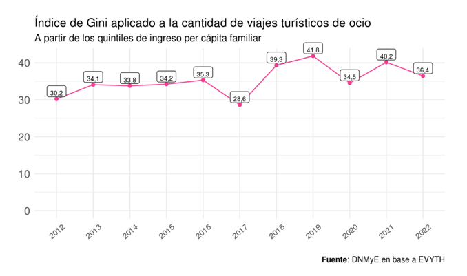
```
---

<br>
# Índice de Gini del gasto turístico 

```{r , echo = FALSE,  out.width='70%', fig.align='center'}
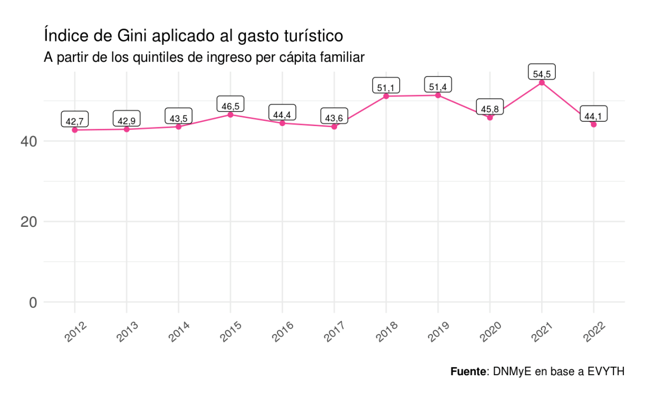
```

---
class: middle

```{r echo=FALSE, out.width='20%'}
knitr::include_graphics("imgs/sinta_logo_negro.png")
```

**BITACORA**

* El turismo en los Objetivos de Desarrollo Sostenible: https://bitacora.yvera.tur.ar/posts/2023-08-17-ods-turismo/
  


**BIBLIOTECA**


* Documento de Trabajo N°12: El turismo en los Objetivos de Desarrollo Sostenible: https://tableros.yvera.tur.ar/recursos/biblioteca/dt_turismo_ods.pdf


### 🌐 [yvera.tur.ar/_SINTA_](www.yvera.tur.ar/sinta)

---

class: inverse center middle

# CONCLUSIONES

---
class: inverse center middle

## ¡Muchas gracias!
## estadisticas@turismo.gob.ar
## DNMyE
<br>
### [`r shiny::icon("linkedin")`](https://www.linkedin.com/in/eli%C3%A1n-soutullo) [Elián Soutullo](https://www.linkedin.com/in/eli%C3%A1n-soutullo)
<br>
### [`r shiny::icon("linkedin")`](https://www.linkedin.com/in/eli%C3%A1n-soutullo) [Micaela A. Spinelli](https://www.linkedin.com/in/micaela-abigail-spinelli-143386120/)
<br>
```{r echo = FALSE , out.width='30%'}
knitr::include_graphics("imgs/escudo_mintur_blanco.png")

```

