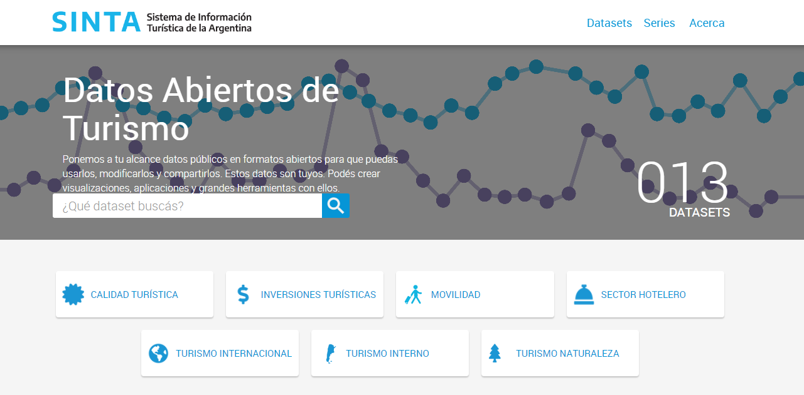
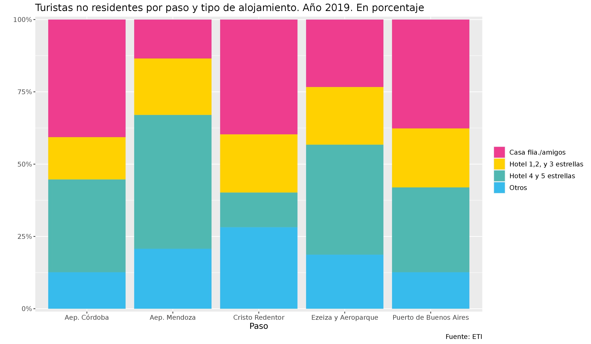

class:inverse, middle

background-image: url(imgs/escudo_mintur_blanco.png)
background-position: 95% 95%
background-size: 30%


## Datos Abiertos y Estadística Pública: El Sistema de Información Turística de la Argentina (SINTA)

<br>
<br>
<br>
<br>


#### Dirección Nacional de Mercados y Estadística<br>Subsecretaría de Desarrollo Estratégico


```{r echo=FALSE, message=FALSE, warning=FALSE, paged.print=FALSE}
library(xaringanExtra)

# LOGO COLOR EN PAGs INTERNAS
xaringanExtra::use_logo(image_url = "imgs/escudo_mintur_color.png", 
                        position = css_position(top = "1em", right = "1em"), 
                        height = "20%", width = "20%")

# BARRA DE PROGRESO DE PRESENTACION
xaringanExtra::use_progress_bar(color = comunicacion::dnmye_colores("cian"))

# LAPIZ 
xaringanExtra::use_scribble()

# EXPLORADOR DE SLIDES
xaringanExtra::use_tile_view()

# HABILITAR WEBCAM
xaringanExtra::use_webcam()


```

```{r dnmye_theme, eval=FALSE, warning=FALSE, include=FALSE}

library(xaringanthemer)
library(comunicacion)


style_mono_light(outfile = "dnmye_theme.css", # CSS FILE
                 # FONTS
                  header_font_google = google_font('Encode Sans'),
                  text_font_google   = google_font('Roboto'),
                  code_font_google   = google_font('IBM Plex Mono'),
                 # COLORES 
                 base_color = dnmye_colores("cian"),
                 code_inline_color = dnmye_colores("rosa"), 
                 inverse_link_color = "#3B4449",
                 background_color = "#FFFFFF",
                 title_slide_background_image = "imgs/escudo_mintur_blanco.png", 
                 title_slide_background_position = "95% 5%", 
                 title_slide_background_size = "200px", footnote_color = "#3B4449", link_color = "3B4449",text_slide_number_font_size = "16px"
                  
                 )
```

```{r setup, include=FALSE}
options(htmltools.dir.version = FALSE)
knitr::opts_chunk$set(
  fig.width=9, fig.height=3.5, fig.retina=3,
  out.width = "100%",
  cache = FALSE,
  echo = TRUE,
  message = FALSE, 
  warning = FALSE,
  fig.show = TRUE,
  hiline = TRUE
)
```

---
layout: true

<div class="my-footer"><span>DIRECCIÓN NACIONAL DE MERCADOS Y ESTADÍSTICA <a href="https://yvera.tur.ar/sinta"> - <b>www.yvera.tur.ar/sinta</a></b></span></div> 

---
class:inverse, middle

background-image: url(imgs/escudo_mintur_blanco.png)
background-position: 95% 80%
background-size: 25%

##  ¿Qué es la DNMyE?

---


---


---


---


---


---


---
class: inverse center middle


```{r , echo = FALSE, out.width='40%'}
knitr::include_graphics("https://tableros.yvera.tur.ar//recursos/logos_institucionales/sinta_blanco.png")
```

---


---
### Portal de Datos Abiertos - DNMyE

```{r echo=FALSE, out.width='90%'}

```

---

### Portal de Datos Abiertos - DNMyE

- 13 datasets

- 132 recursos

- Más de 1000 series de tiempo

- Recursos en formato *csv* con diferentes niveles de desagregación

- Fichas metodológicas

---

class: inverse center middle

# ALGUNOS EJEMPLOS
---

class: inverse center middle

# TURISMO INTERNO
---

# EVyTH

.pull-left[

- **Fuente**: Encuesta de Viajes y Turismo de los Hogares (EVyTH).

- **Resumen**: evolución de los viajes realizados por los hogares argentinos, características de los viajes y de los turistas. Encuesta en los 31 aglomerados urbanos.

- **Indicadores**: acceso al turismo, turistas y excursionistas, gasto turístico, motivo del viaje, pernoctes y estadía, origen y destino, alojamiento, transporte, organización del viaje, actividades realizadas, entre otros.

- **Disponible**: recursos + **microdatos**.
]

.pull-right[
```{r echo=FALSE}
knitr::include_graphics("imgs/datos2.png")
```

]
---

### EVyTH
#### Visitantes por trimestre y provincia de destino

```{r echo = FALSE,fig.align='center'}
knitr::include_graphics("imgs/clases_unlp/evyth_destinos_bump.png")
```

---
### EVyTH
#### Participación según quintil de ingreso
```{r echo = FALSE,out.width='60%', fig.align='center'}
knitr::include_graphics("imgs/clases_unlp/evyth_quintil.png")

```

---
# Previaje

- **Fuente**: Previaje.

- **Resumen**: datos correspondientes a los registros del programa Previaje.

- **Indicadores**: prestadores inscriptos y comprobantes por sector, viajes realizados (provincia de origen y destino), perfil de beneficiarios, gasto del crédito, para cada edición.

---

### Previaje
<br>

.pull-left[

]

.pull-right[

]

---

# CUHC

- **Fuente**: Certificado Único Habilitante para Circulación (CUHC).

- **Resumen**: certificados emitidos para ir de vacaciones durante la pandemia.

- **Indicadores**: cantidad de certificados y personas, por fecha, origen y destino, duración del viaje.


```{r echo = FALSE,out.width='60%', fig.align='right'}
knitr::include_graphics("imgs/clases_unlp/serie_verano.png")
```

---

# Turismo Social

- **Fuente**: Observatorio de Turismo Social (OTS).

- **Resumen**: registros de las Unidades Turísticas (UT) de Chapadmalal y Embalse.

- **Indicadores**: solicitudes y pernoctes por provincia de origen, tipo de plan y UT.


```{r echo = FALSE,out.width='70%', fig.align='right'}
knitr::include_graphics("imgs/clases_unlp/serie_social.png")
```

---

class: inverse center middle

# TURISMO INTERNACIONAL
---

# Turismo Internacional

- **Fuente**: Encuesta de Turismo Internacional (ETI).

- **Resumen**: caracterización del turismo receptivo y emisivo. Se realiza en 6 puntos de ingreso/egreso del país.

- **Indicadores**: turistas y excursionistas, pernoctes, estadía, motivo de viaje, duración, destino/s, tipo de alojamiento, lugar de residencia, grupo familiar, gasto, entre otros.

---

### ETI

```{r echo = FALSE, out.width='80%'}
# library(tidyverse)
# library(lubridate)
# library(comunicacion)
# 
# data <- read_csv("http://datos.yvera.gob.ar/dataset/78b880c1-50d5-4a0c-9c87-7350e70548c2/resource/eba3bb00-e0d6-4d5f-bc87-364a3e0569dd/download/turistas_no_residentes_por_tipo_de_alojamiento_segun_paso_trimestral.csv")
# 
# data <- data %>% 
#   filter(year(indice_tiempo) == 2019) %>% 
#   group_by(paso, alojamiento) %>% 
#   summarise(turistas = sum(turistas_no_residentes, na.rm = T)) %>% 
#   ungroup() %>% 
#   group_by(paso) %>% 
#   mutate(part = turistas/sum(turistas)) %>% 
#   ungroup()
# 
# data %>%
#   ggplot() +
#   geom_col(aes(paso, part, fill = alojamiento)) +
#   hrbrthemes::scale_y_percent() +
#   scale_fill_dnmye() +
#   labs(x = "Paso",y="", title = "Turistas no residentes por paso y tipo de alojamiento. Año 2019. En porcentaje",
#        caption = "Fuente: ETI", fill = "") +
#   theme(text = element_text(size = 12))
# 
# ggsave("imgs/eti_motivo_viaje.png", width = 12)


```

---

### Turismo Internacional

- **Fuente**: Dirección Nacional de Migraciones (DNM).

- **Resumen**: registros migratorios de pasos fronterizos en todo el país.

- **Indicadores**: visitantes, paso, medio de transporte, género, edad y nacionalidad.

---

### Turismo Internacional

```{r echo = FALSE, out.width= '80%'}
knitr::include_graphics("imgs/clases_unlp/tur_internacional.png")
```

---
class: inverse center middle

# SECTOR HOTELERO
---

### EOH

- **Fuente**: Encuesta de Ocupación Hotelera (EOH).

- **Resumen**: medición del impacto del turismo internacional e interno en los establecimientos hoteleros y para-hoteleros del país. 49 localidades turísticas relevadas.

- **Indicadores**: viajeros hospedados, pernoctes, estadía promedio, tasa de ocupación, facturación, tarifas, ingresos, puestos de trabajo.

---
### EOH

```{r  echo = FALSE, out.width='80%', fig.align='center'}
knitr::include_graphics("imgs/clases_unlp/eoh_estacionalidad.png")
```

---
### EOH
```{r echo = FALSE,out.width='80%', fig.align='center'}
knitr::include_graphics("imgs/clases_unlp/eoh_origen.png")
```

---
class:inverse, middle

background-image: url(imgs/escudo_mintur_blanco.png)
background-position: 95% 80%
background-size: 25%

## ¡Muchas gracias! 

https://www.yvera.tur.ar/sinta/

https://github.com/dnme-minturdep

estadisticas@turismo.gob.ar
