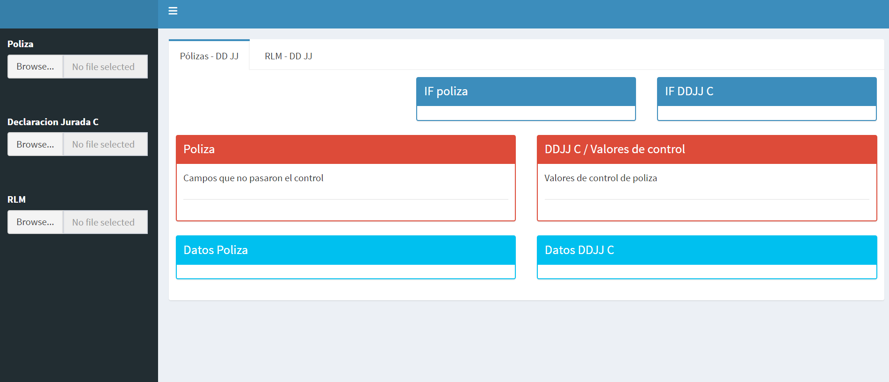
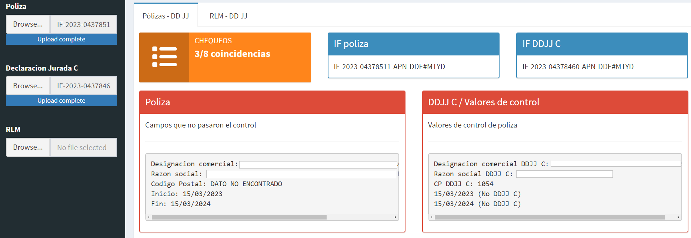
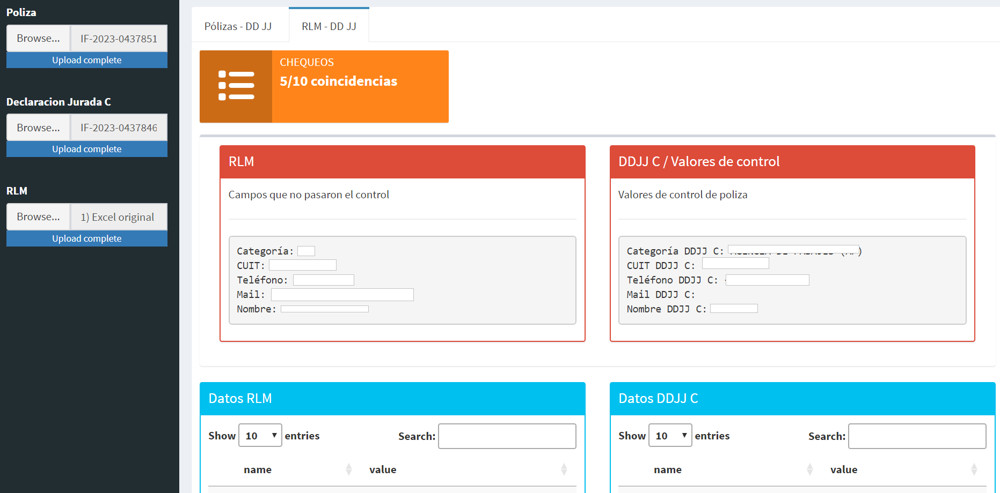
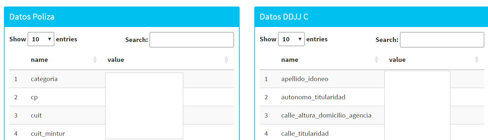

class:inverse, middle

background-image: url(imgs/escudo_mintur_blanco.png)
background-position: 95% 95%
background-size: 30%

.pull-left[
##  LatinR 2023
<br>
<br>
<br>
]
<br>
<br>
<br>
<br>
<br>
<br>
<br>
<br>
<br>


### Shiny para useRs que no usan R

<br>
<br>
<br>
<br>


#### Dirección Nacional de Mercados y Estadística<br>Subsecretaría de Desarrollo Estratégico


```{r echo=FALSE, message=FALSE, warning=FALSE, paged.print=FALSE}
library(xaringanExtra)

# LOGO COLOR EN PAGs INTERNAS
xaringanExtra::use_logo(image_url = "imgs/escudo_mintur_color.png", 
                        position = css_position(top = "1em", right = "1em"), 
                        height = "20%", width = "20%")

# BARRA DE PROGRESO DE PRESENTACION
xaringanExtra::use_progress_bar(color = comunicacion::dnmye_colores("cian"))

# LAPIZ 
xaringanExtra::use_scribble()

# EXPLORADOR DE SLIDES
xaringanExtra::use_tile_view()

# HABILITAR WEBCAM
xaringanExtra::use_webcam()


```

```{r dnmye_theme, eval=FALSE, warning=FALSE, include=FALSE}

library(xaringanthemer)
library(comunicacion)


style_mono_light(outfile = "dnmye_theme.css", # CSS FILE
                 # FONTS
                  header_font_google = google_font('Encode Sans'),
                  text_font_google   = google_font('Roboto'),
                  code_font_google   = google_font('IBM Plex Mono'),
                 # COLORES 
                 base_color = dnmye_colores("cian"),
                 code_inline_color = dnmye_colores("rosa"), 
                 inverse_link_color = "#3B4449",
                 background_color = "#FFFFFF",
                 title_slide_background_image = "imgs/escudo_mintur_blanco.png", 
                 title_slide_background_position = "95% 5%", 
                 title_slide_background_size = "200px", footnote_color = "#3B4449", link_color = "3B4449",text_slide_number_font_size = "16px"
                  
                 )
```

```{r setup, include=FALSE}
options(htmltools.dir.version = FALSE)
knitr::opts_chunk$set(
  fig.width=9, fig.height=3.5, fig.retina=3,
  out.width = "100%",
  cache = FALSE,
  echo = TRUE,
  message = FALSE, 
  warning = FALSE,
  fig.show = TRUE,
  hiline = TRUE
)
```

---
layout: true

<div class="my-footer"><span>DIRECCIÓN NACIONAL DE MERCADOS Y ESTADÍSTICA <a href="https://yvera.tur.ar/sinta"> - <b>www.yvera.tur.ar/sinta</a></b></span></div> 

---


---
### 🔗 [Conociendo a las estrellas del universo R](https://ropensci.org/es/blog/2022/11/23/r-universe-stars-1-es/)

 

---
## App

### Problemática

- La Dirección Nacional de Agencias de Viajes tiene como función principal registrar y controlar la actividad de las agencias de viajes. El trabajo manual genera demoras excesivas haciendo ineficiente el seguimiento y administración de los trámites.

--

### Propuesta

- Diseñar una `Shiny App` que baje el costo de procesamiento de la documentación y acelere la gestión de control necesaria.

- Utilizable por users sin conocimiento de `R`.

- *Software* basado en código abierto, libre y gratuito aplicado a la gestión pública.

---
## Funcionamiento

<br>

- Carga de archivos `.pdf` y `.xlsx`: póliza, declaración jurada y registro interno

- Identificación de campos claves

- Comparación de campos

- Notificación al user

- Exploración de los campos

---

## Interfaz



---

class:inverse, middle

#` Shiny App`: Módulos

---

## Póliza

<br>

1) Levantar el PDF

```
fileInput(inputId = ns("poliza"), label = "Poliza", accept = ".pdf")
```
--

2) Identificar la aseguradora

 - Existen múltiples aseguradoras con distintos formatos de registro por lo que se realizaron módulos específicos para las más importantes.
 
--

3) Ejecutar el módulo *ad hoc*

```
file <- input$poliza

check <- pdftools::pdf_text(file) %>% limpieza()

      if (str_detect(check, "Aseguradora1")) {

        source("modules/poliza_aseguradora1.R", encoding = "UTF-8")

        poliza_df <- poliza_aseguradora1(file$datapath)

      } else if (...){
        ...
      }
    
```
---

## Módulo póliza

<br>

4) Extraer campos de control: `regex`

- Ejemplo:

```
  ### datos
  datos_asegurado <- str_extract(poliza, "(?<=asegura a:).*(?=obligado a efectuarle:)")

  ### nombre
  nombre_asegurado <- str_extract(datos_asegurado, ".*(?=CUIT)")
  
  ### codigo postal
  patron_cp <- "(?<=CP\\().{4,8}(?=\\))"
  cp <- str_extract(datos_asegurado, patron_cp)
  
```
---

## Módulo póliza

<br>

5) Armar tabla de salida

- 14 campos

```
df_poliza <- tibble(legajo, cuit, designacion_comercial, 
razon_social, categoria, domicilio, 
cp, suma_num, fecha_inicio_corta, 
fecha_fin_corta, if_poliza, nombre_asegurado, 
cuit_mintur, domicilio_mintur)

return(df_poliza)

```
---

## Declaración Jurada

<br>

1) Levantar el PDF

```
fileInput(inputId = ns("djc"), label = "Declaracion Jurada C", accept = ".pdf")
```
--

2) Ejecutar único módulo

 - Identificar local virtual vs físico
 - Identificar persona jurídica vs física

--

3) Extraer campos de control: `regex`

--

4) Armar tabla de salida (+30 campos)

---

## RLM

*RLM: Registro Legajo Multipropósito

1) Levantar excel de registro

```
fileInput(inputId = ns("rlm"), label = "RLM", accept = c(".xlsx",".xls"))
```
--

2) Filtrar agencia y seleccionar campos

--

3) Armar tabla de salida
```
rlm_df <- reactive({

      rlm <- read_excel(file$datapath) %>%
        janitor::clean_names() %>%
        filter(legajo == Legajo) %>%
        select(legajo, categoria, designacion_comercial 
               razon_social, cuit, apellido, nombre,
               matricula, prefijo, telefono, mail)

    })

    return(list(data_rlm = reactive(rlm_df())))
    
```

---

## Chequeos

<br>

### Pestaña **Pólizas - DD JJ**

- Póliza vs Declaración Jurada


### Pestaña **RLM - DD JJ**

- RLM vs Declaración Jurada


```
#Ejemplo de chequeo
check_legajo <- df_poliza()$legajo == df_djc()$legajo
```

---

## Póliza vs Declaración Jurada



---
## RLM vs Declaración Jurada


---

<br>

Además de los chequeos se ofrecen tablas interactivas para explorar los campos

<br>



---

class:inverse, middle

#¡La app funciona!

#...

--

#Pero, ¿cómo la disponibilizamos?

---

## De shiny a escritorio

<br>

### Obstáculos

- Users sin conocimiento de R

--

- Escalabilidad: múltiples users

--

- Servidor limitado

---

## De shiny a escritorio

<br>

### Características

#### Encapsulamiento: [`DesktopDeployR`](https://github.com/wleepang/DesktopDeployR)

 ##### - No requiere instalaciones (`R` portable)

 ##### - Se comparte un archivo `.zip`

--

#### Acceso directo

 ##### - El user descomprime el archivo y solo hace doble *click* en el ejecutable

--

####  Funciona (solo) en *Windows*

---
class:inverse, middle

## La app resultó en un proceso mucho más eficiente que el flujo de trabajo manual, reduciendo en tres meses el período de procesamiento!!!

---

class:inverse, middle

background-image: url(imgs/escudo_mintur_blanco.png)
background-position: 95% 80%
background-size: 25%

## Gracias! 

https://www.yvera.tur.ar/sinta/

https://github.com/dnme-minturdep
