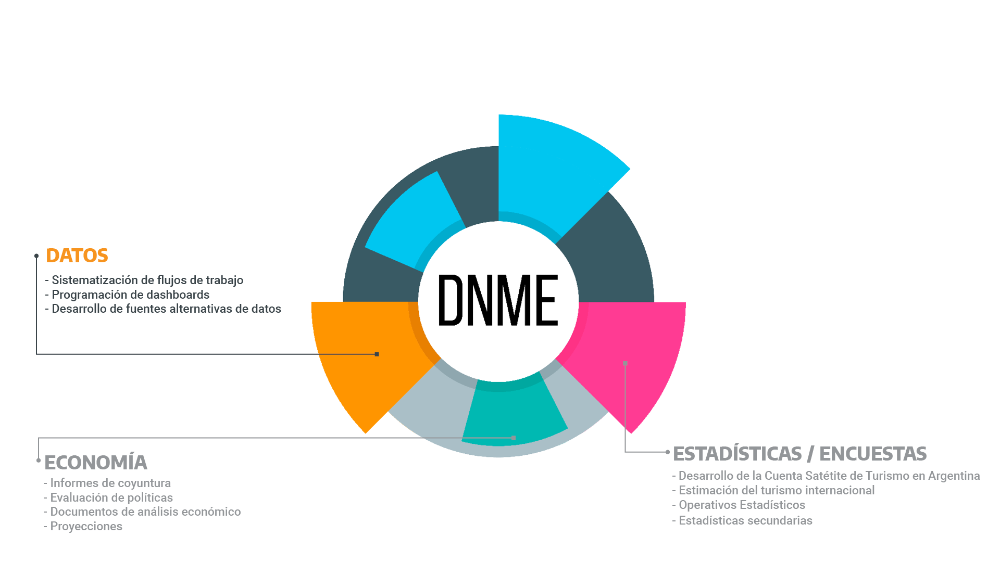
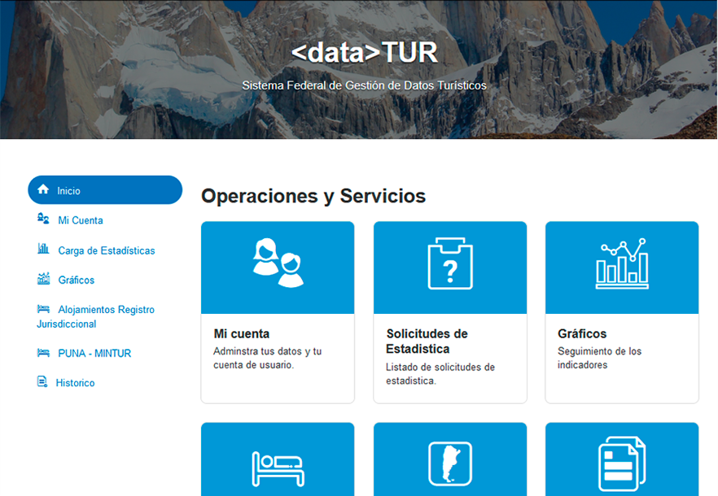
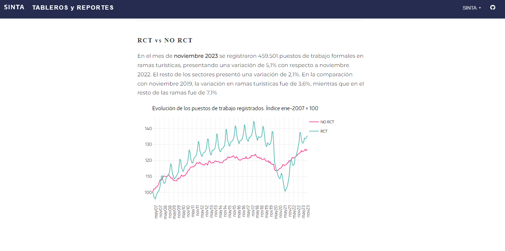
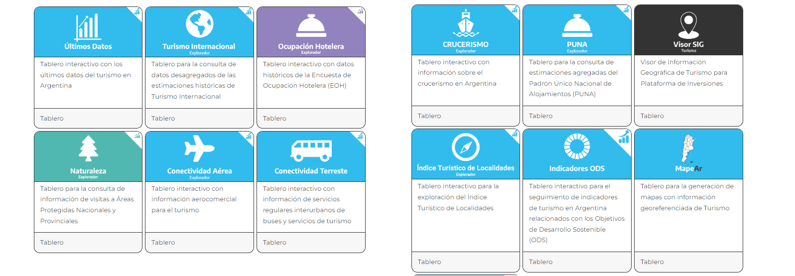
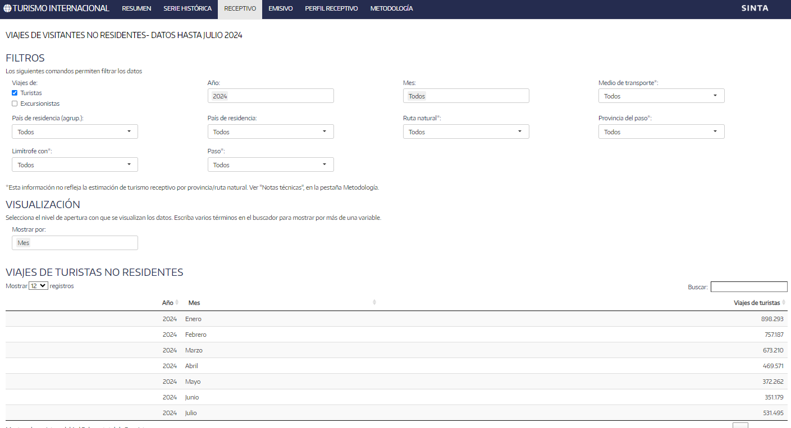
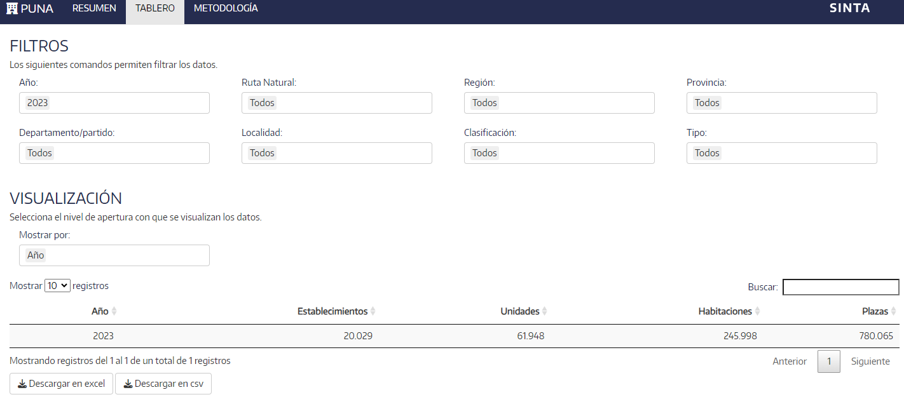
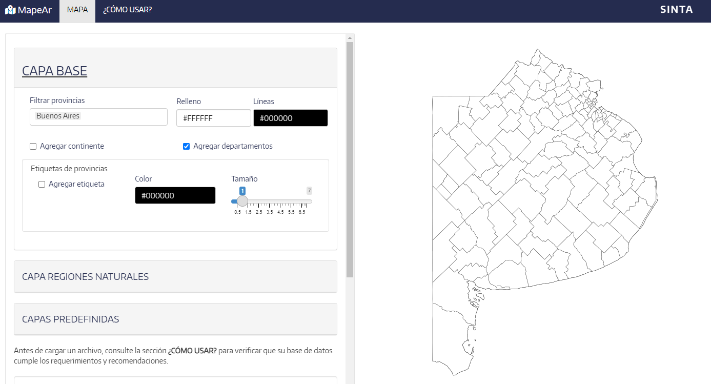

class:inverse, middle

background-image: url(imgs/escudo_mintur_blanco.png)
background-position: 95% 95%
background-size: 30%

.pull-left[
#### Simposio Internacional ANET - CONDET 

*Mar del Plata, 29 de septiembre de 2022*
<br>
<br>
<br>
]
<br>
<br>
<br>
<br>
<br>
<br>
<br>
<br>
<br>


## Sistema de Información Turística de la Argentina

<br>
<br>
<br>
<br>


#### Dirección Nacional de Mercados y Estadística<br>Subsecretaría de Desarrollo Estratégico


```{r echo=FALSE, message=FALSE, warning=FALSE, paged.print=FALSE}
library(xaringanExtra)

# LOGO COLOR EN PAGs INTERNAS
xaringanExtra::use_logo(image_url = "imgs/escudo_mintur_color.png", 
                        position = css_position(top = "1em", right = "1em"), 
                        height = "20%", width = "20%")

# BARRA DE PROGRESO DE PRESENTACION
xaringanExtra::use_progress_bar(color = comunicacion::dnmye_colores("cian"))

# LAPIZ 
xaringanExtra::use_scribble()

# EXPLORADOR DE SLIDES
xaringanExtra::use_tile_view()

# HABILITAR WEBCAM
xaringanExtra::use_webcam()


```


```{r dnmye_theme, eval=FALSE, warning=FALSE, include=FALSE}

library(xaringanthemer)
library(comunicacion)


style_mono_light(outfile = "dnmye_theme.css", # CSS FILE
                 # FONTS
                  header_font_google = google_font('Encode Sans'),
                  text_font_google   = google_font('Roboto'),
                  code_font_google   = google_font('IBM Plex Mono'),
                 # COLORES 
                 base_color = dnmye_colores("cian"),
                 code_inline_color = dnmye_colores("rosa"), 
                 inverse_link_color = "#3B4449",
                 background_color = "#FFFFFF",
                 title_slide_background_image = "imgs/escudo_mintur_blanco.png", 
                 title_slide_background_position = "95% 5%", 
                 title_slide_background_size = "200px", footnote_color = "#3B4449", link_color = "3B4449",text_slide_number_font_size = "16px"
                  
                 )


```


```{r setup, include=FALSE}
options(htmltools.dir.version = FALSE)
knitr::opts_chunk$set(
  fig.width=9, fig.height=3.5, fig.retina=3,
  out.width = "100%",
  cache = FALSE,
  echo = TRUE,
  message = FALSE, 
  warning = FALSE,
  fig.show = TRUE,
  hiline = TRUE
)
```

---
layout: true

<div class="my-footer"><span>DIRECCIÓN NACIONAL DE MERCADOS Y ESTADÍSTICA <a href="https://yvera.tur.ar/sinta"> - <b>www.yvera.tur.ar/sinta</a></b></span></div> 

---


---


---


---



---


---


---
class: inverse center middle


```{r , echo = FALSE, out.width='40%'}
knitr::include_graphics("https://tableros.yvera.tur.ar//recursos/logos_institucionales/sinta_blanco.png")
```


---

<br>
.footnote[<span style="background-color: #37bbed">https://www.yvera.tur.ar/sinta/informe</span>]
---
###INFORME: https://www.yvera.tur.ar/sinta/informe

---

---

<br>
.footnote[<span style="background-color:#37bbed">https://www.yvera.tur.ar/sinta/informe/info/cuenta-satelite-de-turismo</span>]
---

---

<br>
.footnote[<span style="background-color: #37bbed">https://armonizacion.yvera.tur.ar/</span>]
---
###ARMONIZACIÓN: https://armonizacion.yvera.tur.ar/

---
###ARMONIZACIÓN: https://armonizacion.yvera.tur.ar/

---
### <dataTUR>

---

<br>
.footnote[<span style="background-color: #37bbed">https://datos.yvera.gob.ar/</span>]
---
###DATOS ABIERTOS: https://datos.yvera.gob.ar/

---
###DATOS ABIERTOS: https://datos.yvera.gob.ar/

---

<br>
.footnote[<span style="background-color: #37bbed">https://tableros.yvera.tur.ar/</span>]
---
###TABLEROS: https://tableros.yvera.tur.ar/

---
###https://tableros.yvera.tur.ar/empleo.html

---
###TABLEROS: https://tableros.yvera.tur.ar/

---
###TABLEROS: https://tableros.yvera.tur.ar/turismo_internacional/

---
###TABLEROS: https://tableros.yvera.tur.ar/puna/

---
###TABLEROS: https://tableros.yvera.tur.ar/mapeAr/

---

<br>
.footnote[<span style="background-color: #37bbed">https://biblioteca.yvera.tur.ar/</span>]
---
###BIBLIOTECA: https://biblioteca.yvera.tur.ar/

---

<br>
.footnote[<span style="background-color: #37bbed">https://bitacora.yvera.tur.ar/</span>]
---
###BITÁCORA: https://bitacora.yvera.tur.ar/

---

<br>
.footnote[<span style="background-color: #37bbed">https://calendario.yvera.tur.ar/</span>]


---
###CALENDARIO: https://calendario.yvera.tur.ar/

---

---

---

---

---

class: middle


```{r echo=FALSE, out.width='20%'}
knitr::include_graphics("imgs/sinta_logo_negro.png")
```

**INFORME:** https://www.yvera.tur.ar/sinta/informe

**CUENTA SATELITE DE TURISMO:** https://www.yvera.tur.ar/sinta/informe/info/cuenta-satelite-de-turismo

**ARMONIZACIÓN:** https://armonizacion.yvera.tur.ar/

**DATOS ABIERTOS:** https://datos.yvera.gob.ar/

**TABLEROS Y REPORTES:** https://tableros.yvera.tur.ar/

**BIBLIOTECA:** https://biblioteca.yvera.tur.ar/

**BITÁCORA:** https://bitacora.yvera.tur.ar/

**CALENDARIO:** https://calendario.yvera.tur.ar/


### 🌐 [yvera.tur.ar/_SINTA_](www.yvera.tur.ar/sinta)


---
class: inverse center middle

```{r echo = FALSE , out.width='50%'}
knitr::include_graphics("imgs/escudo_mintur_blanco.png")

```

