class:inverse, middle

background-image: url(https://tableros.yvera.tur.ar/recursos/logos_institucionales/sec_turismo_blanco.png)
background-position: 95% 95%
background-size: 30%

# Mesa Técnica de Estadísticas Provinciales de Turismo

## Sistema de Información Turística de la Argentina

<br>

### 28 de agosto de 2024

<br>
<br>
<br>

### Dirección Nacional de Mercados y Estadística

---

```{r include=FALSE}
knitr::opts_chunk$set(echo = F, message = F, warning = F, fig.align = "center", out.width = "90%")
```

[https://www.yvera.tur.ar/sinta/](https://www.yvera.tur.ar/sinta/)

```{r}
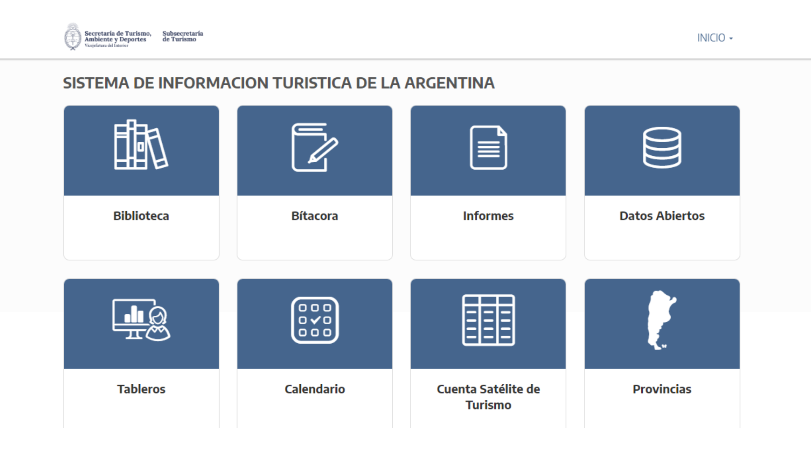
```

---

[https://www.yvera.tur.ar/sinta/informe](https://www.yvera.tur.ar/sinta/informe)

```{r}
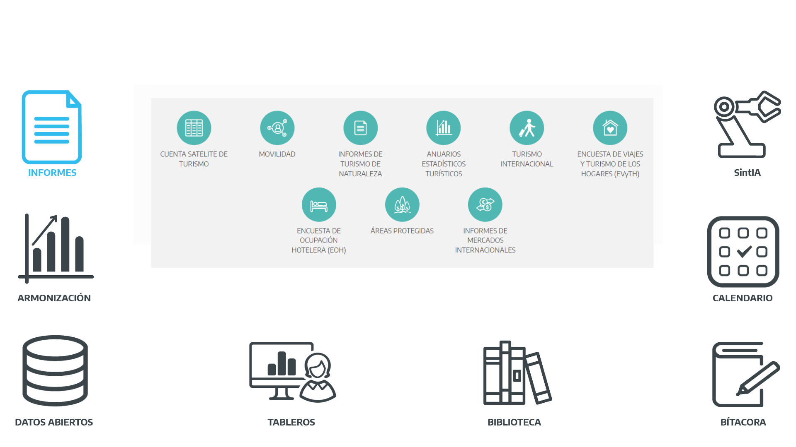
```

---

[https://armonizacion.yvera.tur.ar/](https://armonizacion.yvera.tur.ar/)

```{r}
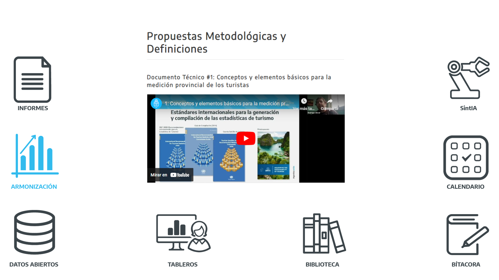
```

---

[http://datos.yvera.gob.ar/](http://datos.yvera.gob.ar/)

```{r}
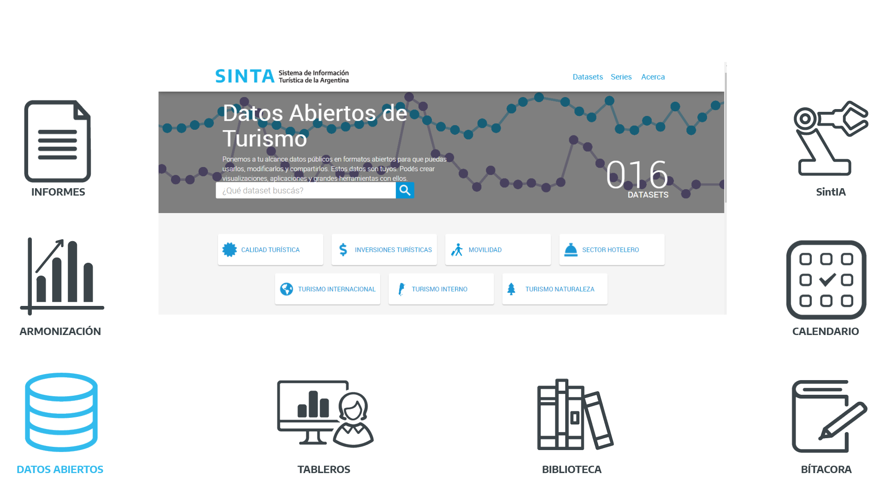
```

---

[https://tableros.yvera.tur.ar/](https://tableros.yvera.tur.ar/)

```{r}
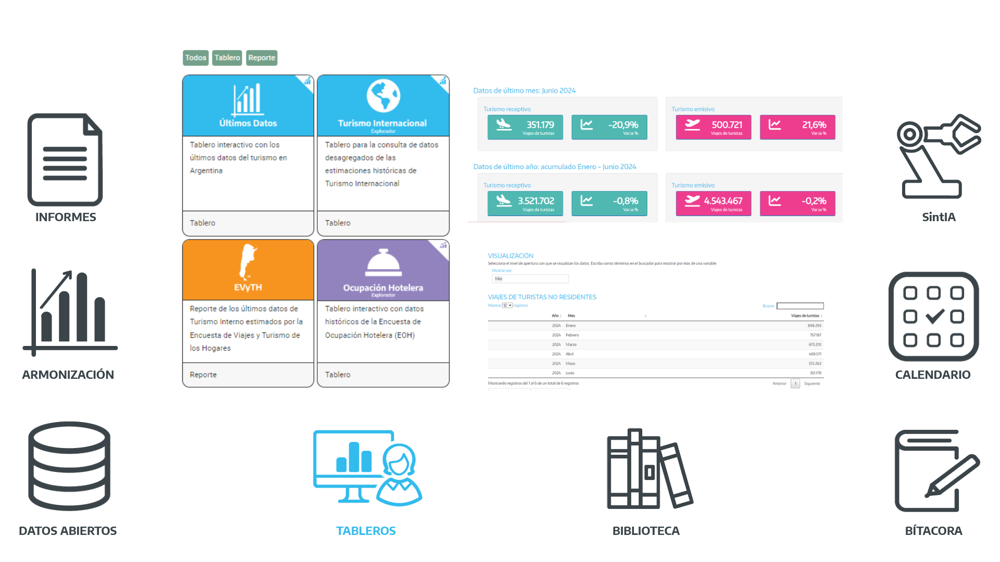
```

---

[https://biblioteca.yvera.tur.ar/](https://biblioteca.yvera.tur.ar/)

```{r}
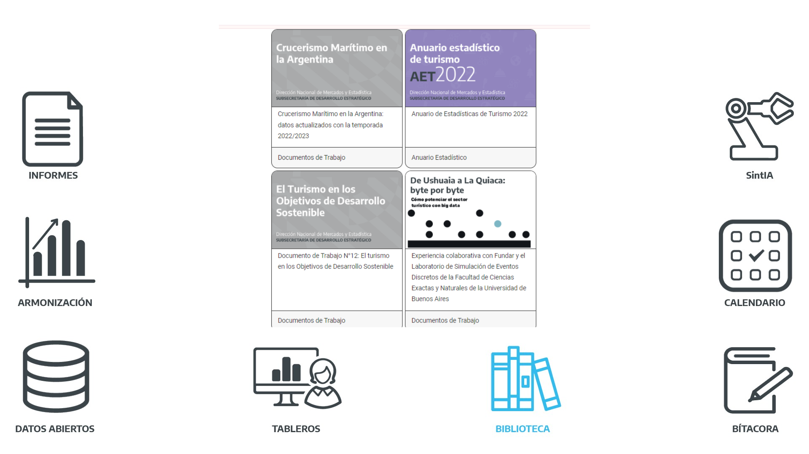
```

---

[https://bitacora.yvera.tur.ar/](https://bitacora.yvera.tur.ar/)

```{r}
knitr::include_graphics("imgs/mesa_tecnica/sinta_bitacora.png")
```

---

[calendario.yvera.tur.ar](calendario.yvera.tur.ar)

```{r}
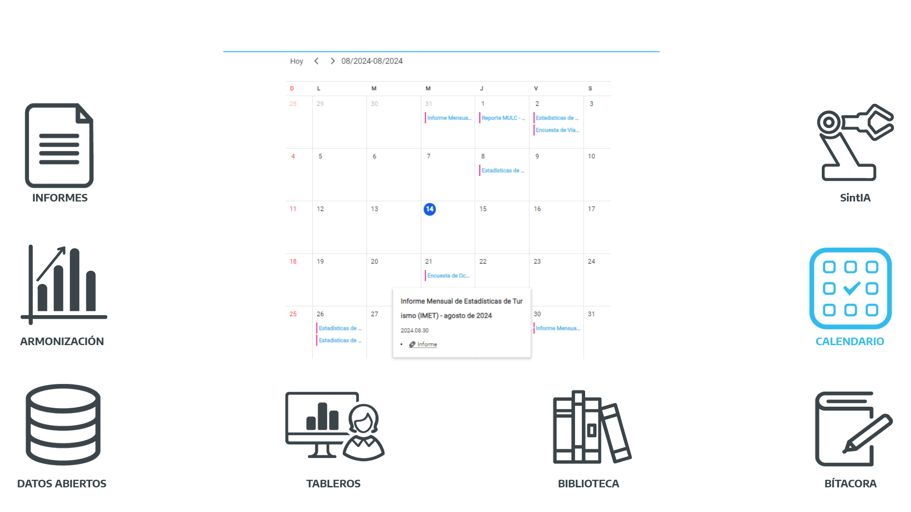
```

---
 
<br>
 
```{r}
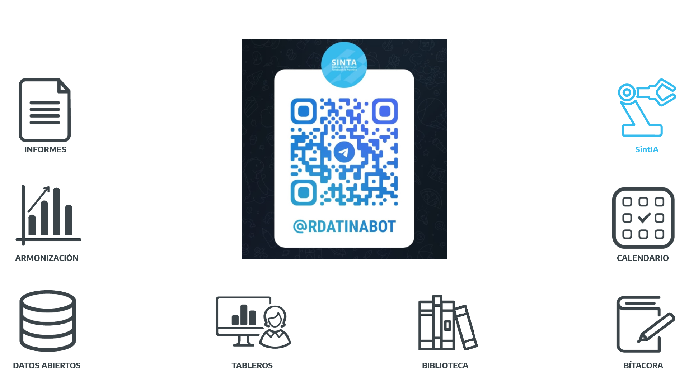
```

---

class: inverse center middle

# Novedades

---

# Monitor Provincial de Turismo

*En progreso*

Nuevo tablero para la visualización de los principales indicadores turísticos con un enfoque provincial en base a fuentes de datos nacionales:


#### Turismo interno (EVyTH)

#### Turismo Internacional (ETI + DNM)

#### Alojamiento (PUNA)

#### Visitas a áreas protegidas (APN)

#### Conectividad aérea y terrestre (ANAC + CNRT)

#### Empleo (CEP XXI)

--

*Posibilidad de sumar fuentes provinciales y redirigir a sus sitios*

---

```{r out.width="120%"}
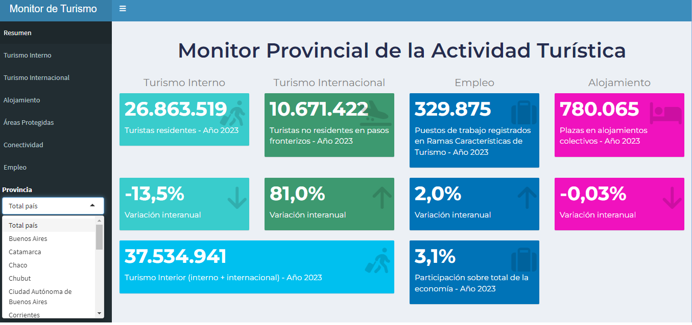
```

---

```{r}
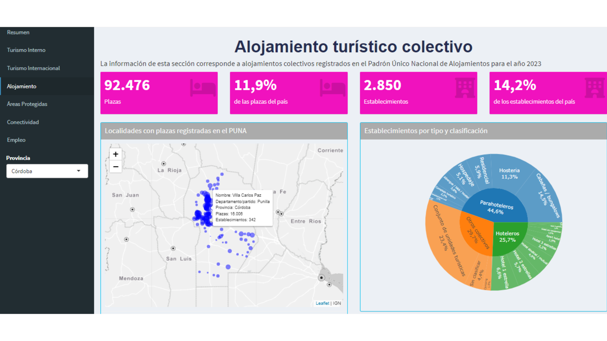
```

---

```{r}
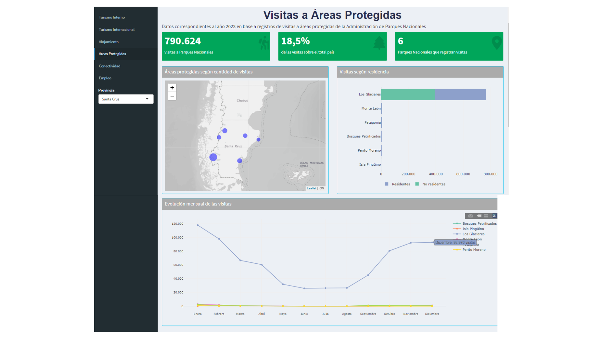
```

---

```{r}
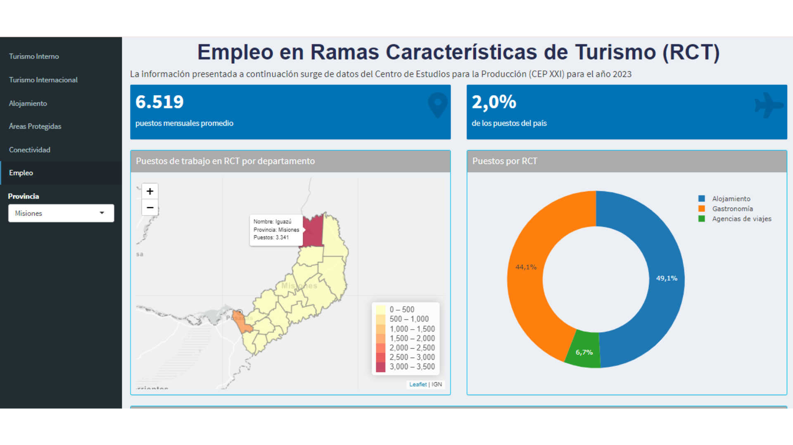
```

---

```{r}
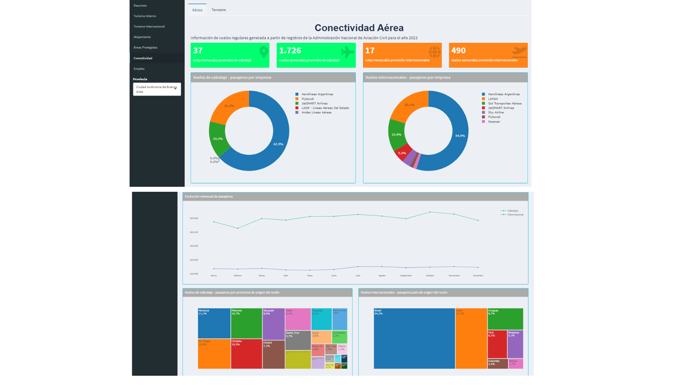
```

---

```{r}
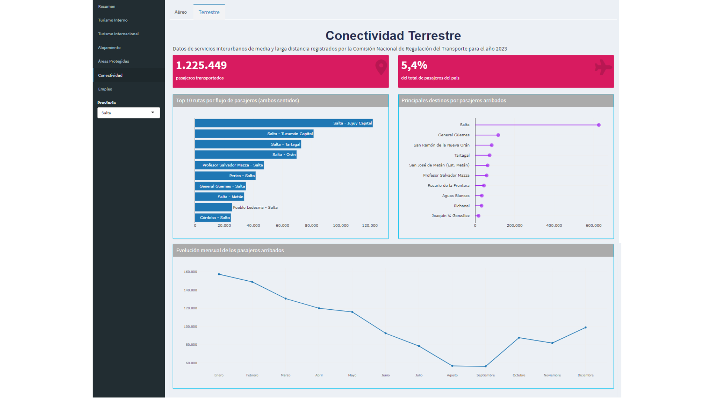
```

---

### Conectividad terrestre

Los datos de conectividad terrestre refieren a servicios interurbanos de ómnibus de media y larga distancia registrados por la Comisión Nacional de Regulación del Transporte (CNRT).

```{r out.width="80%"}
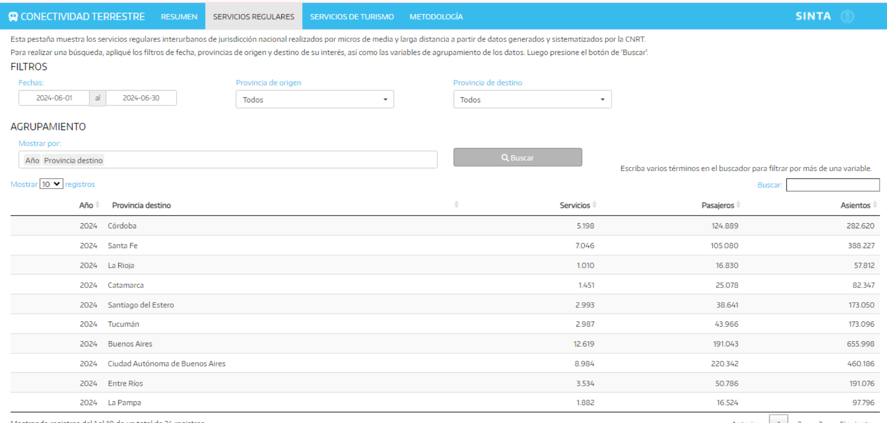
```

---

<br>

En el tablero se pueden consultar los datos de manera desagregada, incluyendo servicios de turismo. Por ejemplo, podemos ver cuántos pasajeros arribaron a la provincia de Mendoza durante el fin de semana largo del 20 de junio por localidad.


<br>

```{r out.width="90%"}
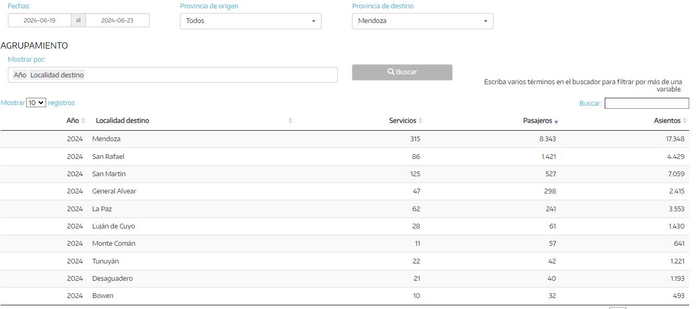
```

---

### Conectividad aérea
 
Además, podemos consultar esta misma información para el sector aerocomercial en el tablero de conectividad aérea (en base a datos de ANAC).

<br>

```{r out.width="90%"}
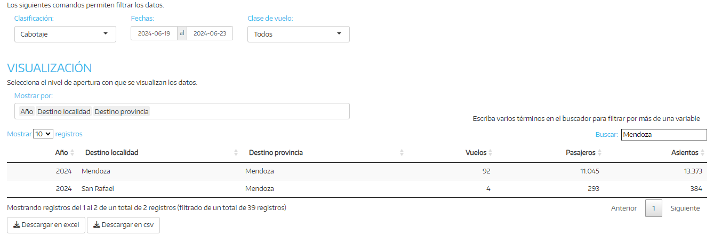
```
