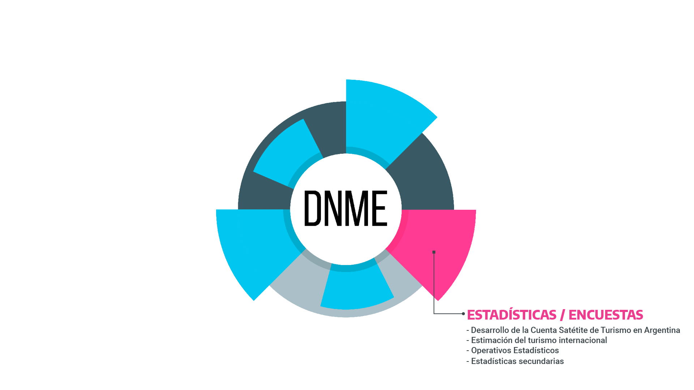

class:inverse, middle

background-image: url(imgs/white.png)
background-position: 95% 95%
background-size: 15%

####  Servicios de datos - #OpenDataWeek, 6 de marzo de 2024
<br>
<br>
<br>
<br>
<br>

## Estadísticas públicas y datos abiertos sobre el Turismo en Argentina

<br>
<br>
<br>
<br>

#### Dirección Nacional de Mercados y Estadística<br>Subsecretaría de Turismo


```{r, echo=FALSE,warning=F,message=F}
library(xaringanExtra)
# LOGO COLOR EN PAGs INTERNAS
# xaringanExtra::use_logo(image_url = "https://tableros.yvera.tur.ar/recursos/logos_institucionales/sinta_a_color.png", 
#                         position = css_position(top = "1em", right = "1em"), 
#                         height = "20%", width = "20%")
# BARRA DE PROGRESO DE PRESENTACION
xaringanExtra::use_progress_bar(color = comunicacion::dnmye_colores("cian"))
# LAPIZ 
xaringanExtra::use_scribble()
# EXPLORADOR DE SLIDES
xaringanExtra::use_tile_view()
# HABILITAR WEBCAM
xaringanExtra::use_webcam()
```


```{r dnmye_theme, include=FALSE, warning=FALSE, eval=TRUE}
library(xaringanthemer) #EVAL FALSE
library(comunicacion)
library(herramientas)
library(tidyverse)
library(sf)
library(leaflet)
style_mono_light(outfile = "dnmye_theme.css", # CSS FILE
                 # FONTS
                  header_font_google = google_font('Encode Sans'),
                  text_font_google   = google_font('Roboto'),
                  code_font_google   = google_font('IBM Plex Mono'),
                 # COLORES 
                 base_color = dnmye_colores("cian"),
                 code_inline_color = dnmye_colores("rosa"), 
                 inverse_link_color = "#3B4449",
                 background_color = "#FFFFFF",
                 title_slide_background_image = "imgs/white.png", 
                 title_slide_background_position = "95% 5%", 
                 title_slide_background_size = "200px", footnote_color = "#3B4449", link_color = "3B4449",text_slide_number_font_size = "16px"
                  
                 )
```


```{r setup, include=FALSE}
options(htmltools.dir.version = FALSE)
knitr::opts_chunk$set(
  fig.width=9, fig.height=3.5, fig.retina=3,
  out.width = "100%",
  cache = FALSE,
  echo = TRUE,
  message = FALSE, 
  warning = FALSE,
  fig.show = TRUE,
  hiline = TRUE
)
```


---
layout: true

<div class="my-footer"><span>DIRECCIÓN NACIONAL DE MERCADOS Y ESTADÍSTICA <a href="https://yvera.tur.ar/sinta"> - <b>www.yvera.tur.ar/sinta</a></b></span></div> 

---

##  ¿Qué es la DNMyE?

---


---


---


---


---


---


---

## Ejes de trabajo
<br>

- Código abierto

<br>

- Reproducibilidad

<br>

- Apertura (datos y procesos)

<br>

- Trabajo colaborativo

---

### Ejes de trabajo

.pull-left.w30[

<br><br>
<br><br>
<br><br>

### **Github**

]

.w65.pull-right[

```{r echo=FALSE}
knitr::include_graphics("imgs/github_dnmye.png")
```


]

---

### Ejes de trabajo

.pull-left.w30[

<br><br>
<br><br>
<br><br>

### [**Manual de Procedimientos**](https://tableros.yvera.tur.ar/dnmye/manual/)

]

.w65.pull-right[

```{r echo=FALSE}
knitr::include_graphics("imgs/manual_procesos.png")
```


]

---

### Ejes de trabajo

.pull-left.w30[

<br><br>
<br><br>
<br><br>

### **Capacitaciones internas** *"Encuentro de los Jueves"*

]

.w65.pull-right[

```{r echo=FALSE, out.width='70%'}
knitr::include_graphics("imgs/dnmye_capacitacion.png")
```


]


---

### Ejes de trabajo

.pull-left.w30[

<br><br>
<br><br>
<br><br>

### **RStudio Server:** *Infraestructura común*

]

.w65.pull-right[

```{r echo=FALSE, out.width='90%'}
knitr::include_graphics("imgs/server.png")
```


]


---
class: inverse center middle


```{r , echo = FALSE, out.width='40%'}
knitr::include_graphics("https://tableros.yvera.tur.ar//recursos/logos_institucionales/sinta_blanco.png")
```

---


---


---


---


---

---


---

---
{width: 80%}

---
.pull-left[

]
.pull-right[

]

---


---


---

---


---

### Portal de Datos Abiertos - DNMyE


```{r echo=FALSE, out.width='90%'}
knitr::include_graphics("imgs/portal_datos_abiertos.png")
```

---

### Portal de Datos Abiertos - DNMyE


#### https://datos.yvera.gob.ar/


- 16 datasets

- 151 recursos

- Más de 1400 series de tiempo

- Recursos de datos en formato *csv* con diferentes niveles de desagregación

- Fichas metodológicas

- `Turismo interno, turismo internacional, sector hotelero, transporte aéreo, transporte terrestre, crucerismo marítimo, turismo de naturaleza...`

 -   `Operativos estadísticos`
 -   `Registros administrativos`
---

class:inverse center middle

## ¡Muchas gracias! 

https://www.yvera.tur.ar/sinta/

https://github.com/dnme-minturdep

estadisticas@turismo.gob.ar

esoutullo@turismo.gob.ar