class:inverse, middle

background-image: url(imgs/escudo_mintur_blanco.png)
background-position: 95% 95%
background-size: 30%

.pull-left[

### 25 de noviembre de 2022

```{r echo=FALSE}

  knitr::include_graphics("https://github.com/renbaires/documentos/raw/master/logos/renbaires/logo_claro_400x400.png")

```


]
<br>
<br>
<br>
<br>
<br>


### El TuRismo en Argentina. El SINTA en RenBaires


#### Dirección Nacional de Mercados y Estadística<br>Subsecretaría de Desarrollo Estratégico


```{r echo=FALSE, message=FALSE, warning=FALSE, paged.print=FALSE}
library(xaringanExtra)

# LOGO COLOR EN PAGs INTERNAS
xaringanExtra::use_logo(image_url = "imgs/escudo_mintur_color.png", 
                        position = css_position(top = "1em", right = "1em"), 
                        height = "20%", width = "20%")

# BARRA DE PROGRESO DE PRESENTACION
xaringanExtra::use_progress_bar(color = comunicacion::dnmye_colores("cian"))

# LAPIZ 
xaringanExtra::use_scribble()

# EXPLORADOR DE SLIDES
xaringanExtra::use_tile_view()

# HABILITAR WEBCAM
xaringanExtra::use_webcam()


```

```{r dnmye_theme, eval=FALSE, warning=FALSE, include=FALSE}

library(xaringanthemer)
library(comunicacion)


style_mono_light(outfile = "dnmye_theme.css", # CSS FILE
                 # FONTS
                  header_font_google = google_font('Encode Sans'),
                  text_font_google   = google_font('Roboto'),
                  code_font_google   = google_font('IBM Plex Mono'),
                 # COLORES 
                 base_color = dnmye_colores("cian"),
                 code_inline_color = dnmye_colores("rosa"), 
                 inverse_link_color = "#3B4449",
                 background_color = "#FFFFFF",
                 title_slide_background_image = "imgs/escudo_mintur_blanco.png", 
                 title_slide_background_position = "95% 5%", 
                 title_slide_background_size = "200px", footnote_color = "#3B4449", link_color = "3B4449",text_slide_number_font_size = "16px"
                  
                 )
```

```{r setup, include=FALSE}
options(htmltools.dir.version = FALSE)
knitr::opts_chunk$set(
  fig.width=9, fig.height=3.5, fig.retina=3,
  out.width = "100%",
  cache = FALSE,
  echo = TRUE,
  message = FALSE, 
  warning = FALSE,
  fig.show = TRUE,
  hiline = TRUE
)
```

---
layout: true

<div class="my-footer"><span>DIRECCIÓN NACIONAL DE MERCADOS Y ESTADÍSTICA <a href="https://yvera.tur.ar/sinta"> - <b>www.yvera.tur.ar/sinta</a></b></span></div> 

---

<br>
<br>
**JUAN PABLO RUIZ NICOLINI**

También conocido como el _TuQmano._ Soy politólogo $^2$ por la Universidad Torcuato Di Tella. Trabajo con datos y visualizaciones. Me gustan las elecciones. *Cientista de Datos* en progreso (*DS*). Como politólogo **[mis temas de investigación](https://www.researchgate.net/profile/Juan-Ruiz-Nicolini)** se concentraron en estudios electorales, partidos y reforma política. En particular, he trabajado en la evaluación del impacto político del cambio en la tecnología con la que se emiten los votos.


Como *DS* vengo trabajando en el desarrollo de paquetes de `r icons::fontawesome("r-project")` para **[facilitar herramientas y el acceso a datos políticos de Argentina](https://github.com/politicaargentina/)**.

[`r icons::fontawesome("globe")`](https://www.tuqmano.com/) [tuqmano.ar](https://www.tuqmano.com/) | [`r icons::fontawesome("twitter")`](https://twitter.com/TuQmano) [TuQmano](https://twitter.com/TuQmano) | [`r icons::fontawesome("github")`](https://github.com/tuqmano) [/tuqmano](https://github.com/tuqmano)

------------------------------------------------------------------------

**PABLO TISCORNIA**


Sociólogo (UBA), especialista en metodología, producción y procesamiento de datos, principalmente en el ámbito público. Últimamente me encuentro enfocado en la mejora de flujos y procesos de trabajo vinculados al tratamiento de datos.

He participado en la organización y difusión de la comunidad de **[R en Buenos Aires](https://renbaires.github.io/)** y en el desarrollo del **[paquetes eph](https://holatam.github.io/eph/)**, cuyo principal objetivo es facilitar herramientas y el acceso a datos de la Encuesta Permanente de Hogares - INDEC, mediante el lenguaje de programación `r icons::fontawesome("r-project")`.

[`r icons::fontawesome("globe")`](https://estacion-r.netlify.app/) [Estación-R](https://estacion-r.netlify.app/) | [`r icons::fontawesome("twitter")`](https://twitter.com/pabblo_h) [pabblo_h](https://twitter.com/pabblo_h) | [`r icons::fontawesome("github")`](https://github.com/pablotis) [/pablotis](https://github.com/pablotis)


---

# Hoja de Ruta

<br>

- ¿Qué es la **DNMyE**?

<br>

- **Un Proyecto de trabajo (con R bajo el brazo)**: reproducibilidad, apertura (datos y procesos) y trabajo colaborativo

<br>

- **SINTA**: recolectar, procesar, analizar y **comunicar** información estadística


---
class:inverse, middle

background-image: url(imgs/escudo_mintur_blanco.png)
background-position: 95% 80%
background-size: 25%

##  ¿Qué es la DNMyE?

---

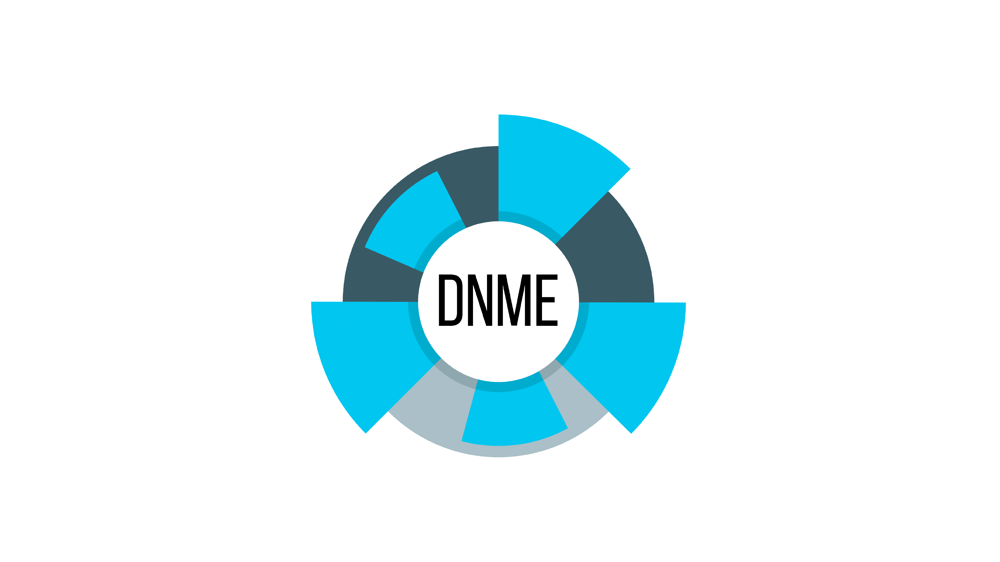

---

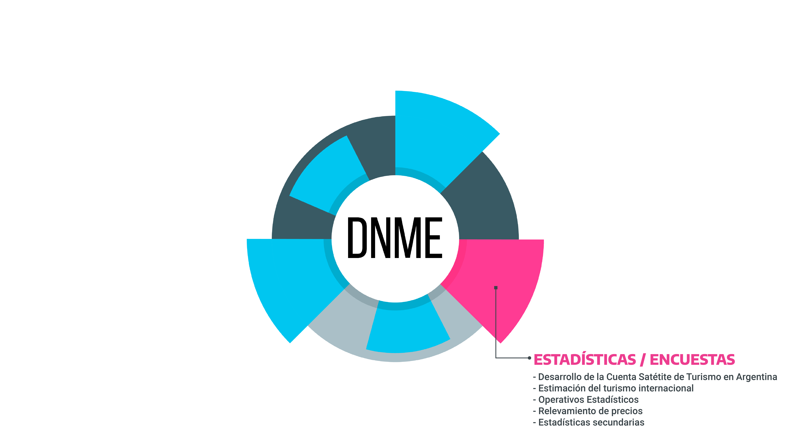
---

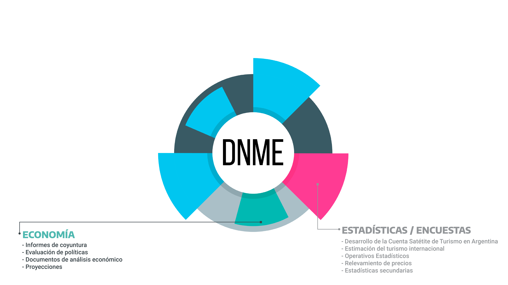
---

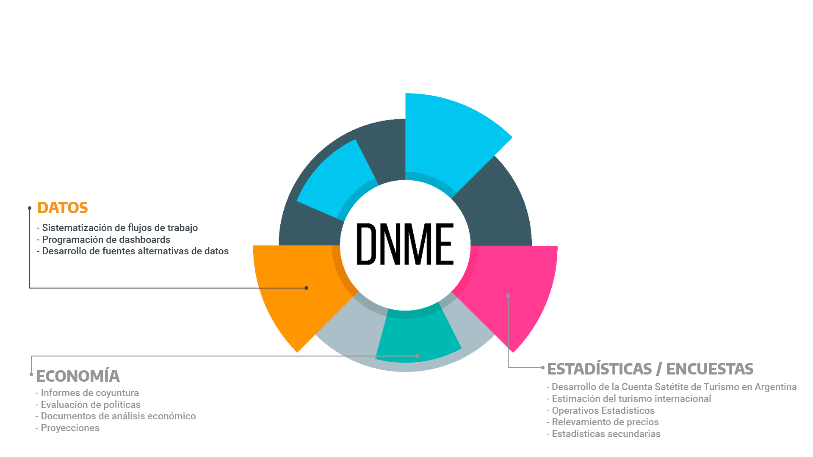

---

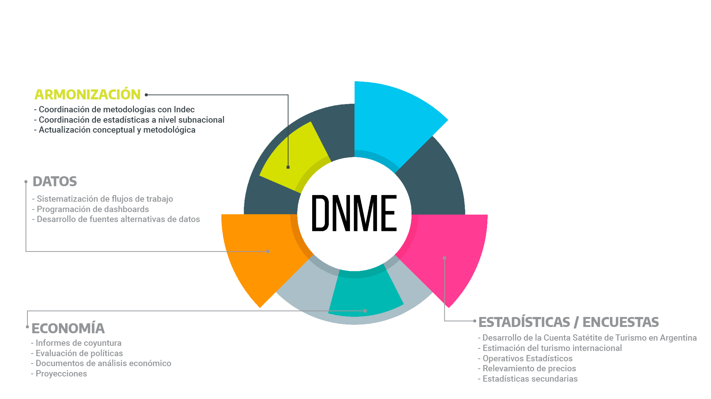
---

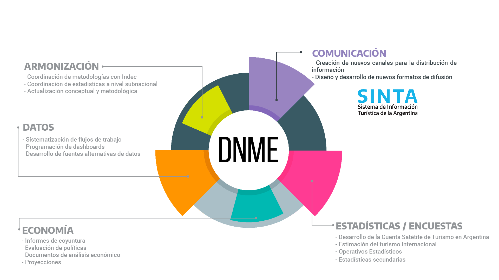

---
class:inverse, middle

background-image: url(imgs/escudo_mintur_blanco.png)
background-position: 95% 80%
background-size: 25%

##  Un proyecto de trabajo (con R bajo el brazo):
<br>
--
- Reproducibilidad
<br>
--
- Apertura (datos y procesos)
<br>
--
- Trabajo colaborativo

---

### Reproducibilidad, apertura, trabajo colaborativo

.pull-left.w30[

<br><br>
<br><br>
<br><br>

### **Github**

]

.w65.pull-right[

```{r echo=FALSE}

```


]

---

### Reproducibilidad, apertura, trabajo colaborativo

.pull-left.w30[

<br><br>
<br><br>
<br><br>

### **Rmarkdown**

]

.w65.pull-right[

```{r echo=FALSE}
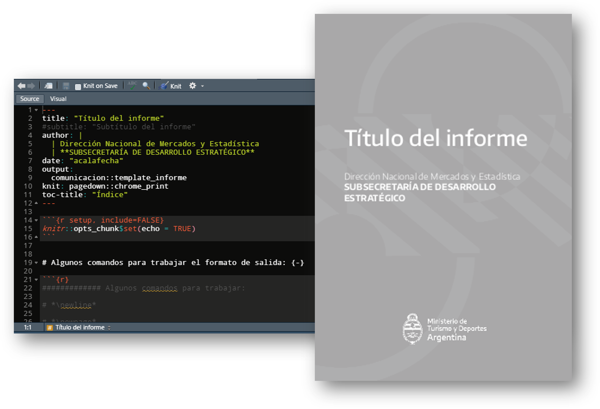
```


]


---

### Reproducibilidad, apertura, trabajo colaborativo

.pull-left.w30[

<br><br>
<br><br>
<br><br>

### **Capacitación:** *"Encuentro de  los Jueves"*

]

.w65.pull-right[

```{r echo=FALSE, out.width='70%'}
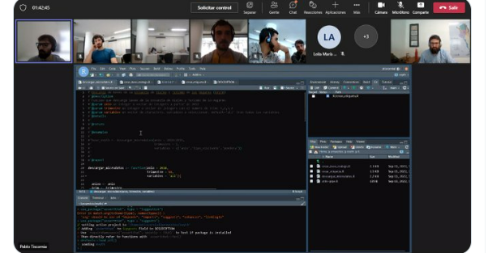
```


]


---
class: inverse center middle


```{r , echo = FALSE, out.width='40%'}
knitr::include_graphics("https://tableros.yvera.tur.ar//recursos/logos_institucionales/sinta_blanco.png")
```

---
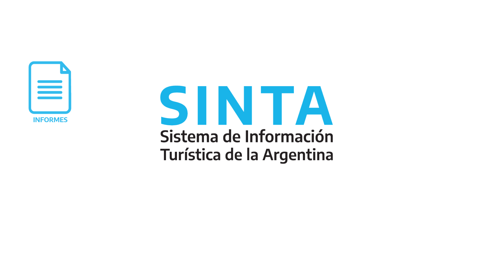

---


---
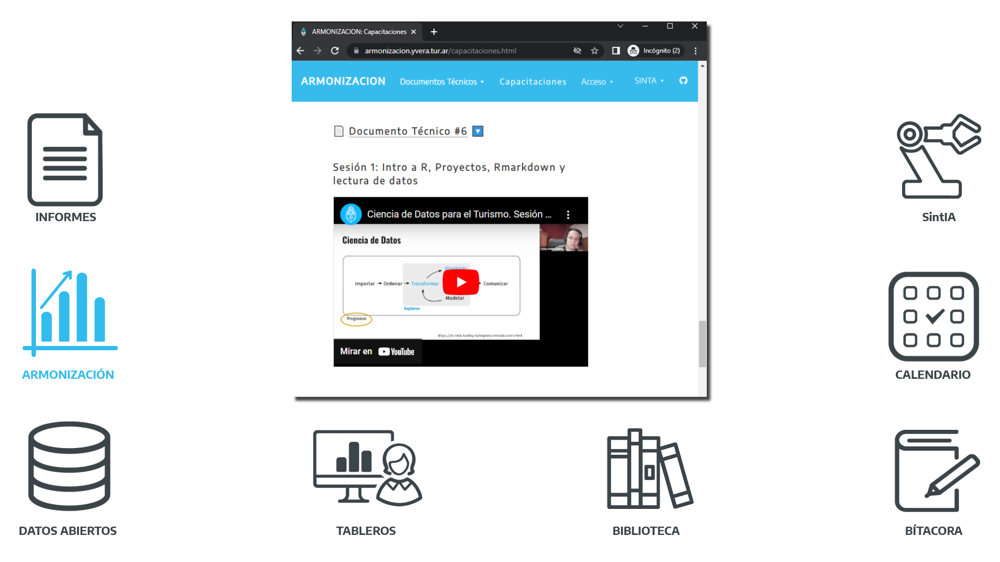

---
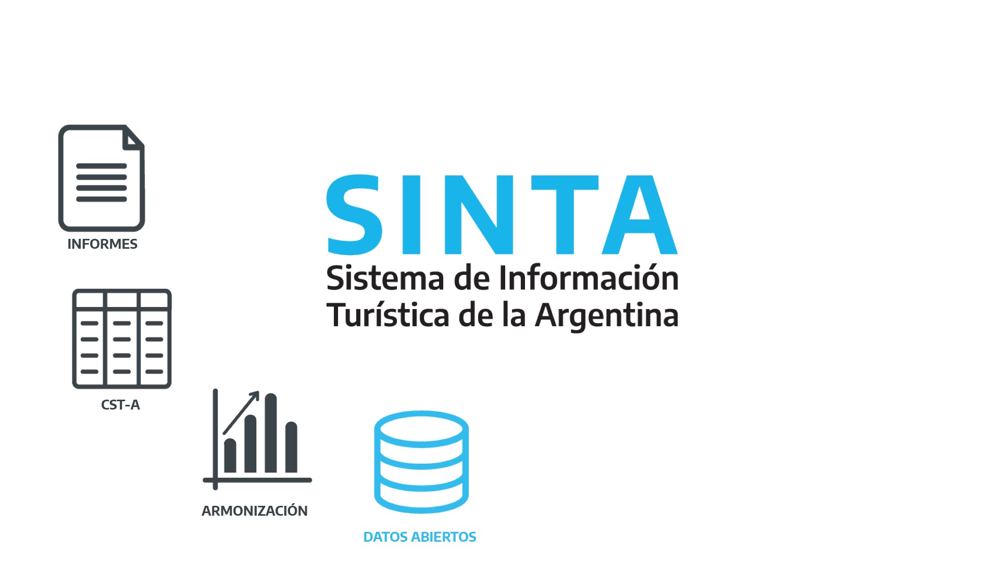

---
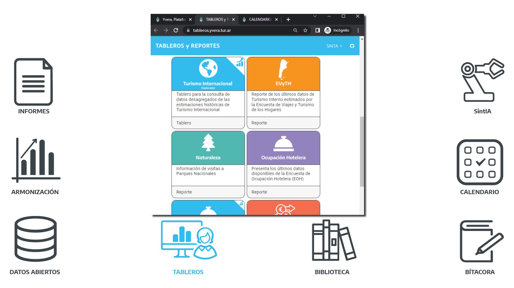

---
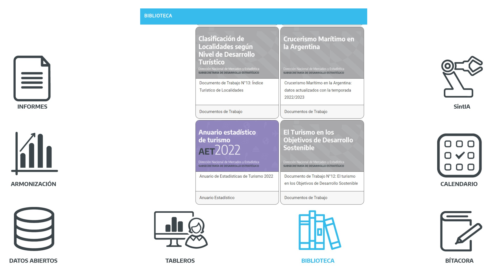

---
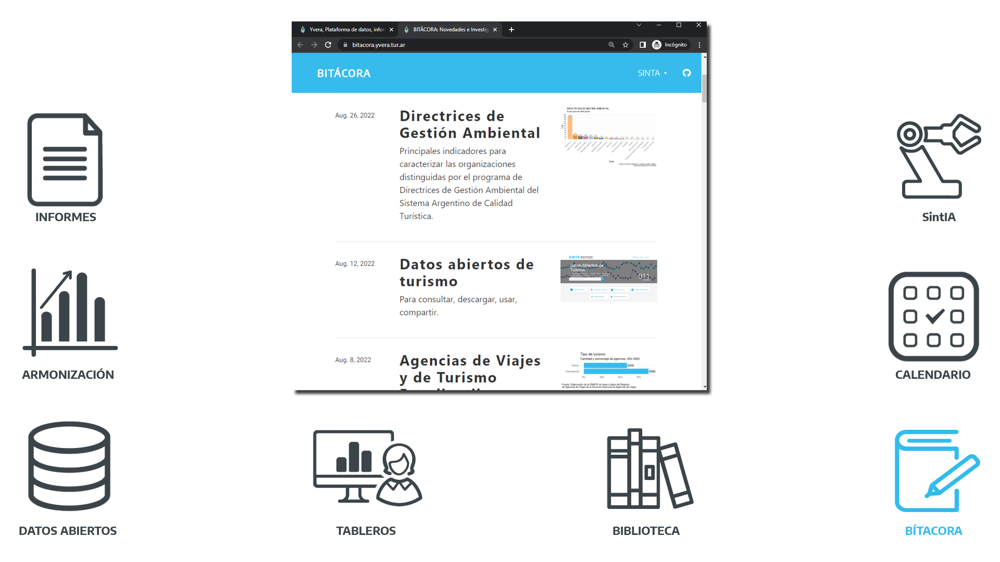

---
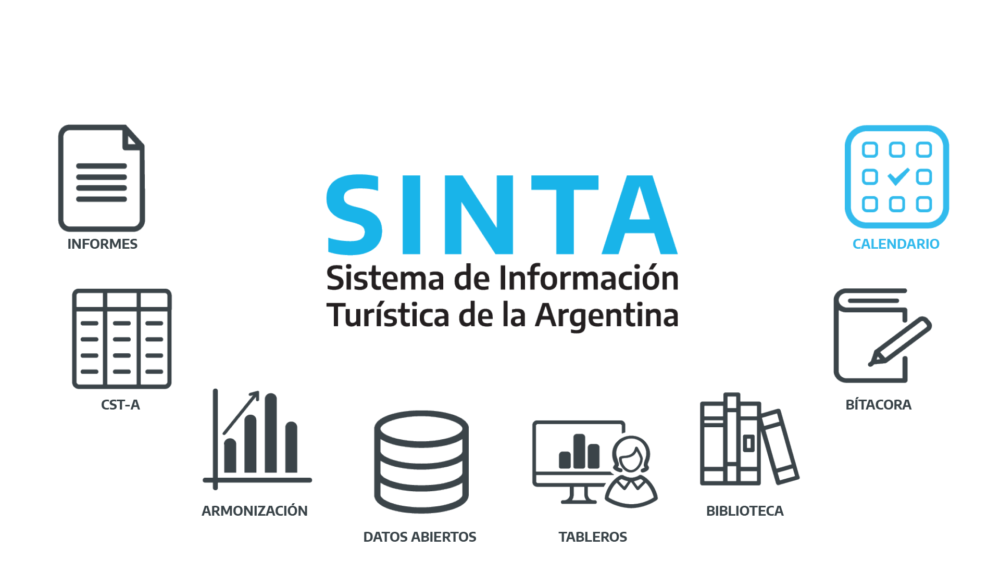
---
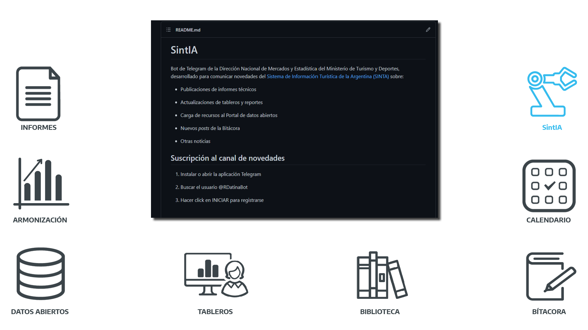

---
class:inverse, middle

background-image: url(imgs/escudo_mintur_blanco.png)
background-position: 95% 80%
background-size: 30%

##  r-universe

---
### r-universe

```{r echo=FALSE}
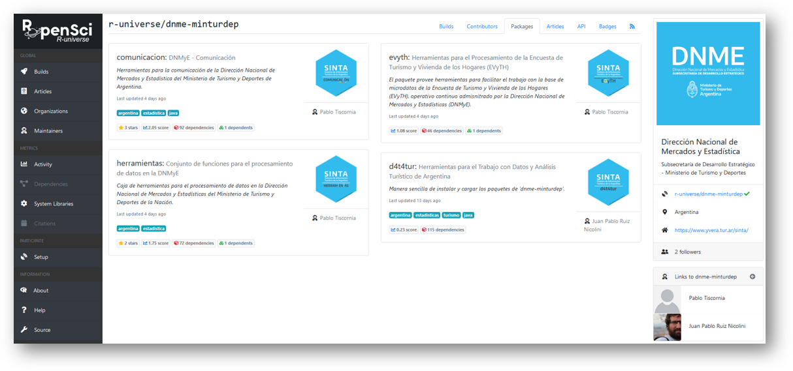
```

---

### Paquetes que permitieron el desarrollo de la DNMyE


```{r , echo = FALSE, out.width='90%'}
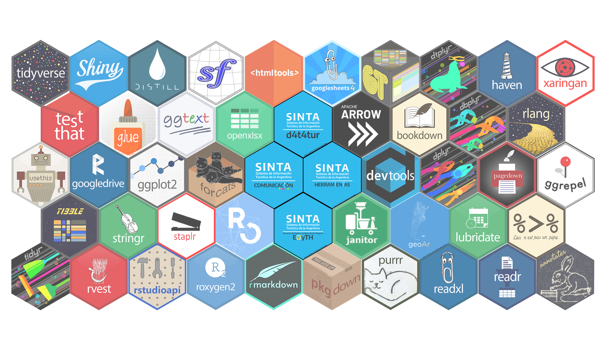
```


---
class:inverse, middle

background-image: url(imgs/escudo_mintur_blanco.png)
background-position: 95% 80%
background-size: 25%

## Gracias! 

https://www.yvera.tur.ar/sinta/

https://github.com/dnme-minturdep

