class:inverse, middle

background-image: url(https://tableros.yvera.tur.ar/recursos/logos_institucionales/escudo_mdtyd_blanco.png)
background-position: 95% 95%
background-size: 30%

# Concentración del turismo

## Una mirada de Argentina

<br>
<br>
<br>
<br>
<br>
<br>
<br>
<br>
<br>

### Dirección Nacional de Mercados y Estadística<br>Subsecretaría de Desarrollo Estratégico


```{r, echo=FALSE}
library(xaringanExtra)
# LOGO COLOR EN PAGs INTERNAS
xaringanExtra::use_logo(image_url = "https://tableros.yvera.tur.ar/recursos/logos_institucionales/escudo_mdtyd_color.png", 
                        position = css_position(top = "1em", right = "1em"), 
                        height = "20%", width = "20%")
# BARRA DE PROGRESO DE PRESENTACION
xaringanExtra::use_progress_bar(color = comunicacion::dnmye_colores("cian"))
# LAPIZ 
xaringanExtra::use_scribble()
# EXPLORADOR DE SLIDES
xaringanExtra::use_tile_view()
# HABILITAR WEBCAM
xaringanExtra::use_webcam()
```


```{r dnmye_theme, include=FALSE, warning=FALSE, eval=TRUE}
library(xaringanthemer) #EVAL FALSE
library(comunicacion)
style_mono_light(outfile = "dnmye_theme.css", # CSS FILE
                 # FONTS
                  header_font_google = google_font('Encode Sans'),
                  text_font_google   = google_font('Roboto'),
                  code_font_google   = google_font('IBM Plex Mono'),
                 # COLORES 
                 base_color = dnmye_colores("cian"),
                 code_inline_color = dnmye_colores("rosa"), 
                 inverse_link_color = "#3B4449",
                 background_color = "#FFFFFF",
                 title_slide_background_image = "escudo_mintur_blanco.png", 
                 title_slide_background_position = "95% 5%", 
                 title_slide_background_size = "200px", footnote_color = "#3B4449", link_color = "3B4449",text_slide_number_font_size = "16px"
                  
                 )
```


```{r setup, include=FALSE}
options(htmltools.dir.version = FALSE)
knitr::opts_chunk$set(
  fig.width=9, fig.height=3.5, fig.retina=3,
  out.width = "100%",
  cache = FALSE,
  echo = FALSE,
  message = FALSE, 
  warning = FALSE,
  fig.show = TRUE,
  hiline = TRUE
)
```


```{css, echo=FALSE}
div.my-footer {
    background-color: white;
    position: absolute;
    bottom: 0px;
    left: 0px;
    height: 40px;
    width: 100%;
}
div.my-footer span {
    font-size: 16px;
    color: #3B4449;
    position: absolute;
    left: 15px;
    bottom: 6px;
}

```


---

layout: true

<div class="my-footer"><span>DIRECCIÓN NACIONAL DE MERCADOS Y ESTADÍSTICA <a href="https://yvera.tur.ar/sinta"> - <b>www.yvera.tur.ar/sinta</a></b></span></div> 

---

class: inverse center middle

# DNMyE
---


---


---


---

# CONTRIBUCIÓN ECONÓMICA 

```{r, echo = FALSE, out.width='80%', fig.align='center'}
knitr::include_graphics("imgs/clases_unlp/ind_arg.png")
```

---

```{r, echo = FALSE, out.width='65%', fig.align='center'}
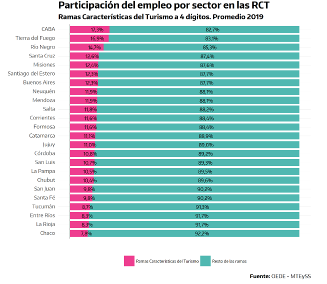
```

---

class: inverse center middle

# ¿CÓMO SE DISTRIBUYE LA ACTIVIDAD TURÍSTICA EN EL PAÍS?

---

# Distribución geográfica


---

# FUENTES

.pull-left[

### CONECTIVIDAD

```{r out.width='65%'}
knitr::include_graphics("imgs/utdt/logo_conectividad.png")
```

]

.pull-right[

### PUNA

```{r out.width='65%'}

```


]
---

# Conectividad aérea

- **Fuente**: Administración Nacional de Aviación Civil (ANAC) & Dirección Nacional de Migraciones.

- **Resumen**: Registros de movimientos aéreos en aeropuertos de todo el país a nivel diario & Ingresos y egresos de personas al país por pasos internacionales.

- **Indicadores**: Vuelos, asientos, pasajeros, clasificación del vuelo, rutas, empresas.

- **Disponible**: Documento de trabajo, datos abiertos, reporte y tablero.

---

class: inverse center middle

# CABOTAJE

---

# RUTAS DE CABOTAJE

```{r out.width='72%', fig.align='center'}
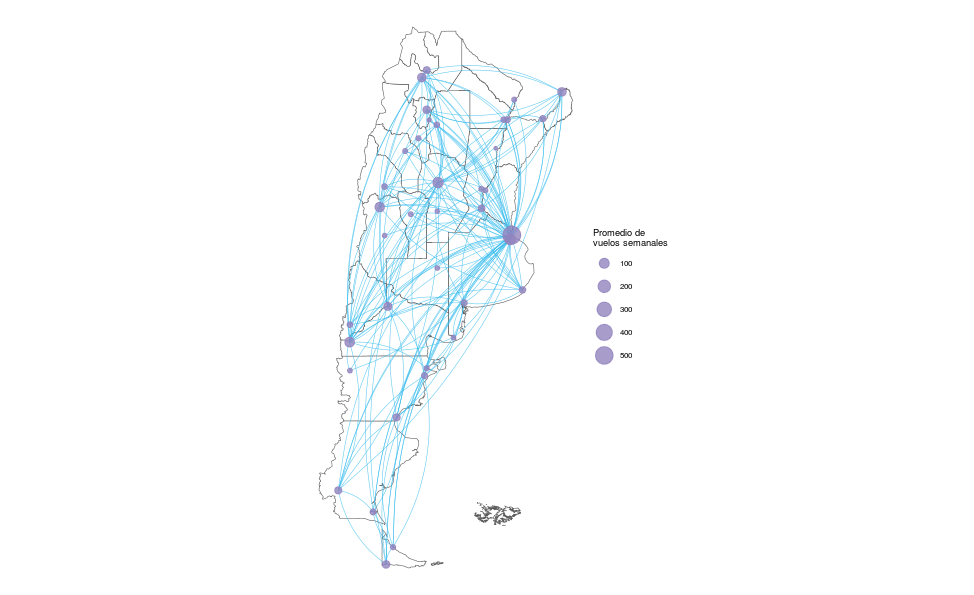
```

---

```{r out.width='65%', fig.align='center'}
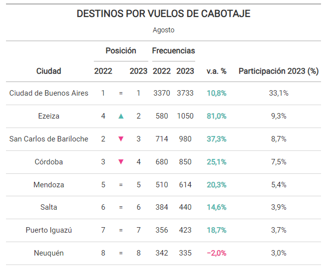
```

---

<br>

```{r out.width='75%', fig.align='center'}
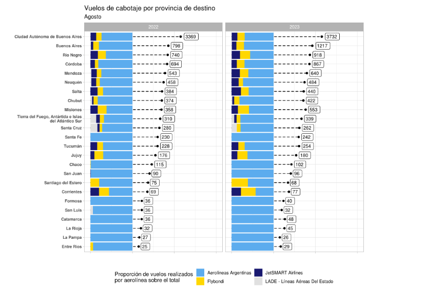
```

---

```{r out.width='38%', fig.align='center'}
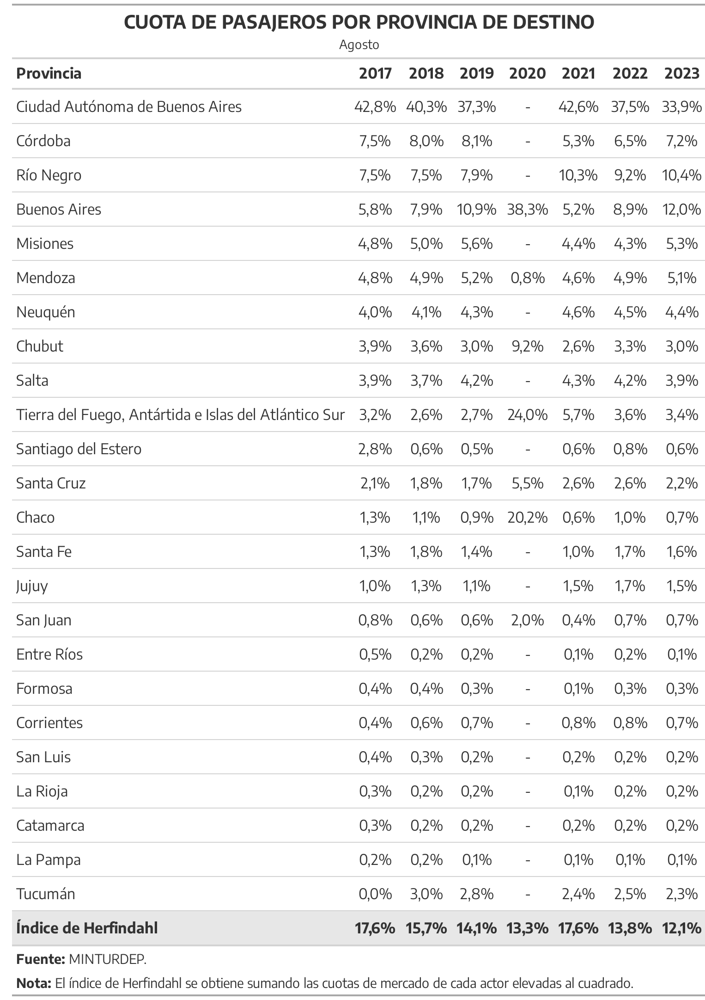
```

---

<br>

```{r out.width='55%', fig.align='center'}
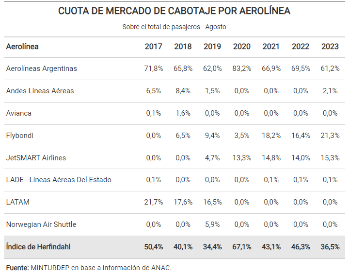
```

---

class: inverse center middle

# INTERNACIONAL


---

```{r out.width='65%', fig.align='center'}
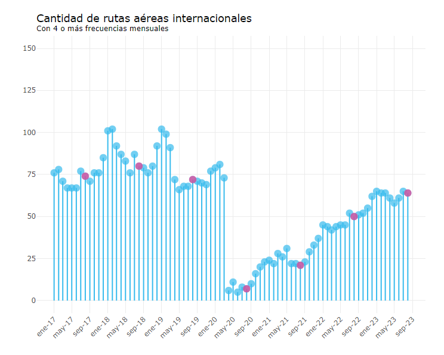
```

---

<br>

```{r out.width='50%', fig.align='center'}
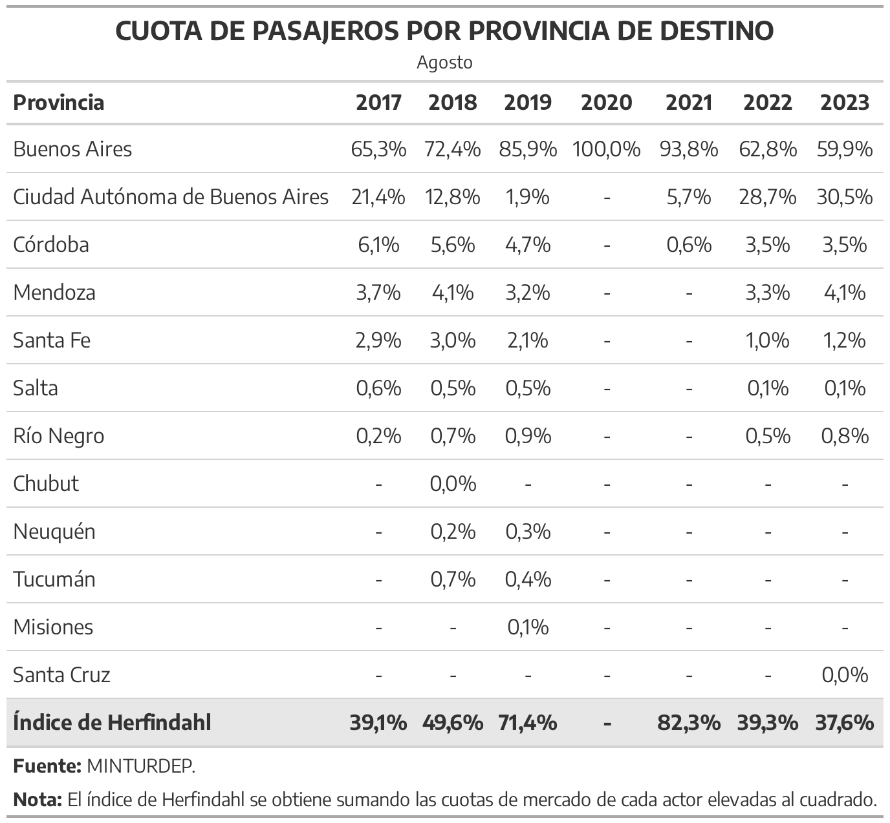
```

---

```{r out.width='65%', fig.align='center'}
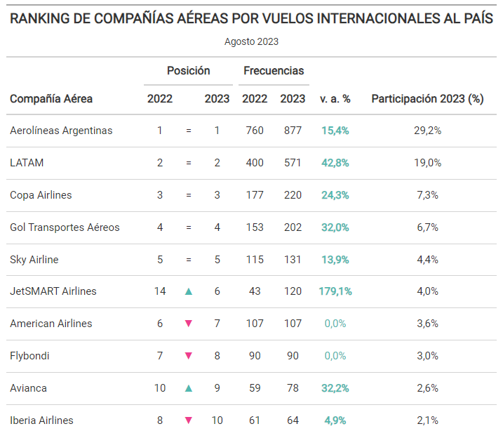
```

---

class: inverse center middle

# PUNA

---

### PUNA

- **Fuente**: Padrón Único Nacional de Alojamiento (PUNA).

- **Resumen**: Alojamientos turísticos registrados en todo el país (hoteleros, parahoteleros y otros colectivos).

- **Indicadores**: Establecimientos, plazas, unidades y habitaciones, ubicación, cadena hotelera, categoría, clasificación y tipo.

- **Disponible**: Documento de trabajo, datos abiertos y tablero.

```{r fig.align='center'}
# knitr::include_graphics("")
```

---

<br>

```{r out.width='80%', fig.align='center'}
knitr::include_graphics("unlp_conectividad/unlp_files/puna_plazas_mapa.PNG")
```

---

```{r out.width='47%', fig.align='center'}
knitr::include_graphics("imgs/clases_unlp/tabla_puna_loc.png")
```

---

```{r}
# library(herramientas)
# library(tidyverse)
# library(gt)
# ccc <- read_file_srv("/srv/DataDNMYE/puna/serie_puna.csv")
# 
# socoso1 <- internacional %>%
#   filter(mes_local == 8) %>%
#   filter(destino_pais_etiqueta == "Argentina") %>%
#   filter(anio_local >= 2017) %>%
#   group_by(anio_local, destino_provincia_etiqueta) %>%
#   summarise(pasajeros = sum(pax_ad, na.rm = T)) %>%
#   ungroup() %>%
#   group_by(anio_local) %>%
#   mutate(cuota = pasajeros/sum(pasajeros, na.rm = T)) %>%
#   ungroup() %>%
#   select(anio_local, destino_provincia_etiqueta, cuota)
# 
# socoso2 <- socoso1 %>%
#   group_by(anio_local) %>%
#   summarise(herfindahl =  (sum(cuota^2, na.rm = T) - 1/n())/(1 - 1/n())) %>%
#   mutate(destino_provincia_etiqueta = "Índice de Herfindahl") %>%
#   pivot_wider(names_from = anio_local, values_from =  herfindahl, names_prefix = "cuota_")
# 
# socoso_total <- socoso1 %>%
#   pivot_wider(names_from = anio_local, values_from =  cuota, names_prefix = "cuota_") %>%
#   arrange(-cuota_2017) %>%
#   bind_rows(socoso2)
# 
# ccc <- socoso_total %>%
#   gt() %>%
#   tab_header(
#     title = md("__CUOTA DE PASAJEROS POR PROVINCIA DE DESTINO__"),
#     subtitle = "Agosto") %>%
#   tab_source_note(
#     source_note = md("**Fuente:** MINTURDEP.")) %>%
#   tab_source_note(
#     source_note = md("**Nota:** El índice de Herfindahl se obtiene sumando las cuotas de mercado de cada actor elevadas al cuadrado.")) %>%
#   cols_label(
#     destino_provincia_etiqueta = md("**Provincia**"),
#     cuota_2017 = md("**2017**"),
#     cuota_2018 = md("**2018**"),
#     cuota_2019 = md("**2019**"),
#     cuota_2020 = md("**2020**"),
#     cuota_2021 = md("**2021**"),
#     cuota_2022 = md("**2022**"),
#     cuota_2023 = md("**2023**"),
#     ) %>%
#   cols_align(
#     align = "center",
#     columns = c(2:8)) %>%
#   opt_table_font(
#     font = list(
#       google_font(name = "Encode Sans"))) %>%
#   fmt_percent(columns = c(2:8), decimals = 1, dec_mark = ",", sep_mark = ".") %>%
#   tab_style(
#     style = list(
#       cell_fill(color = dnmye_colores("gris claro"))),
#     locations = cells_body(
#       rows = destino_provincia_etiqueta == "Índice de Herfindahl")) %>%
#   tab_style(
#     style = list(
#       cell_text(weight = "bold")),
#     locations = cells_body(
#       rows = destino_provincia_etiqueta == "Índice de Herfindahl")) %>%
#   fmt_missing(
#     columns = everything(),
#     rows = everything(),
#     missing_text = "-")
# 
# gtsave(ccc,
#        "unlp_conectividad/unlp_files/herfindahl_prov_conectividad_int.png")

```


```{r out.width='35%', fig.align='center'}
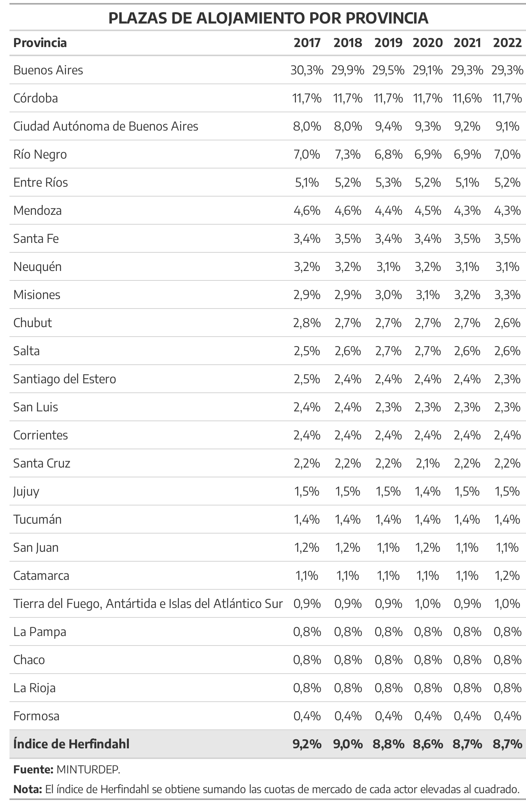
```


```{r}
#concentracion
# cabotaje %>% 
#   group_by(anio_local, mes_local) %>% 
#   summarise(pasajeros = sum(pax_ad, na.rm = T)) %>% 
#   group_by(anio_local) %>% 
#   mutate(pasajeros_anual = sum(pasajeros),
#          pct = pasajeros/pasajeros_anual) %>% 
#   #ungroup() %>% 
#   slice_max(pasajeros, n = 3) %>% 
#   group_by(anio_local) %>% 
#   summarise(concentracion = round(sum(pct)*100, 0))
# 
# internacional %>% 
#   filter(destino_pais_etiqueta == "Argentina") %>% 
#   group_by(anio_local, mes_local) %>% 
#   summarise(pasajeros = sum(pax_ad, na.rm = T)) %>% 
#   group_by(anio_local) %>% 
#   mutate(pasajeros_anual = sum(pasajeros),
#          pct = pasajeros/pasajeros_anual) %>% 
#   #ungroup() %>% 
#   slice_max(pasajeros, n = 3) %>% 
#   group_by(anio_local) %>% 
#   summarise(concentracion = round(sum(pct)*100, 0))
```


---

# CONCLUSIONES

## Demanda

+ El flujo de viajeros ha tendido a distribuirse de manera más dispersa.

+ Sin embargo, existen divergencias según el tipo de vuelo.

+ Ciudad de Buenos Aires como el principal destino.

## Oferta

+ La oferta de plazas apenas varió en el último lustro y se encuentra apenas concentrada.

+ La PBA es el distrito de mayor n° de plazas disponibles.

+ La Ciudad de Buenos Aires es la localidad con más plazas del país.

---

# PREGUNTAS

+ ¿Coinciden oferta y demanda?

+ ¿El flujo de los turistas se mantiene igual a lo largo del año? ¿Cambia el sentido?

+ ¿Cómo podemos lograr un desarrollo más federal?

---

<br>
<br>

```{r out.width='75%', fig.align='center'}
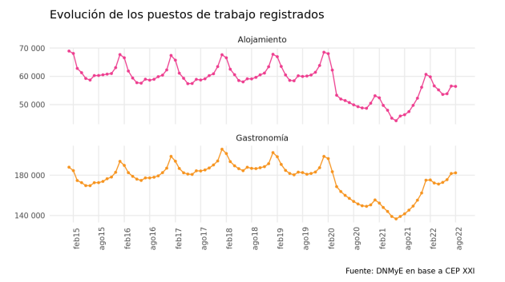
```

---

class: inverse center middle

## Muchas gracias
## DNMyE

## estadisticas@turismo.gob.ar