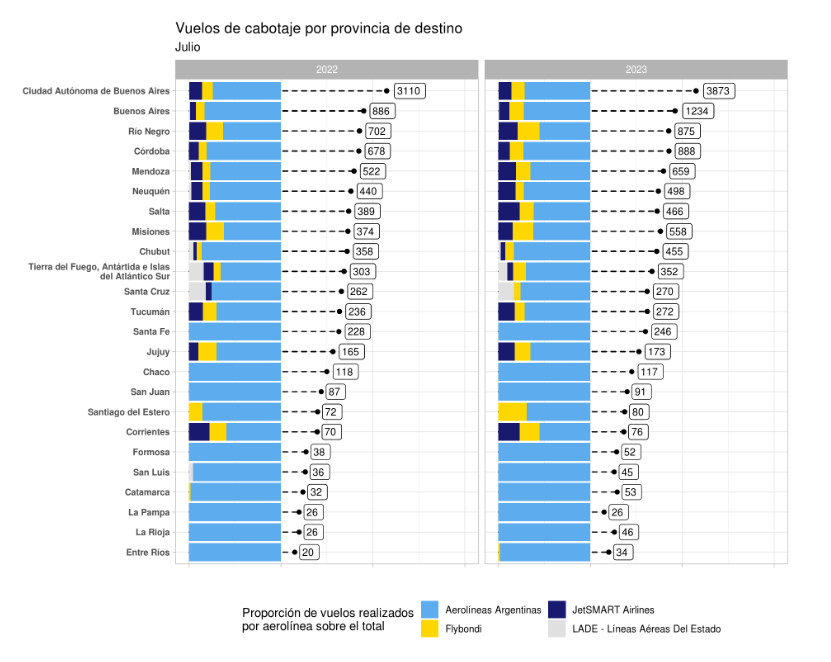
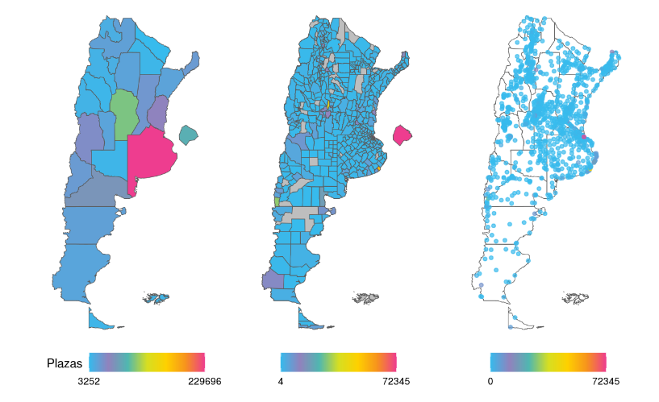

class:inverse, middle

background-image: url(https://tableros.yvera.tur.ar/recursos/logos_institucionales/escudo_mdtyd_blanco.png)
background-position: 95% 95%
background-size: 30%

# Datos aplicados al turismo

## Temas
### DNMYE / Sinta
### conectividad:
+ explicacion fuente
+ indicadores de concentracion
    + Internacional
    + Cabotaje
### Puna
+ Explicacion fuente
+ Indicadores de concentracion

## Concentración

<br>
<br>
<br>
<br>
<br>
<br>
<br>
<br>
<br>

### Dirección Nacional de Mercados y Estadística<br>Subsecretaría de Desarrollo Estratégico


```{r, echo=FALSE}
library(xaringanExtra)
# LOGO COLOR EN PAGs INTERNAS
xaringanExtra::use_logo(image_url = "https://tableros.yvera.tur.ar/recursos/logos_institucionales/escudo_mdtyd_color.png", 
                        position = css_position(top = "1em", right = "1em"), 
                        height = "20%", width = "20%")
# BARRA DE PROGRESO DE PRESENTACION
xaringanExtra::use_progress_bar(color = comunicacion::dnmye_colores("cian"))
# LAPIZ 
xaringanExtra::use_scribble()
# EXPLORADOR DE SLIDES
xaringanExtra::use_tile_view()
# HABILITAR WEBCAM
xaringanExtra::use_webcam()
```


```{r dnmye_theme, include=FALSE, warning=FALSE, eval=TRUE}
library(xaringanthemer) #EVAL FALSE
library(comunicacion)
style_mono_light(outfile = "dnmye_theme.css", # CSS FILE
                 # FONTS
                  header_font_google = google_font('Encode Sans'),
                  text_font_google   = google_font('Roboto'),
                  code_font_google   = google_font('IBM Plex Mono'),
                 # COLORES 
                 base_color = dnmye_colores("cian"),
                 code_inline_color = dnmye_colores("rosa"), 
                 inverse_link_color = "#3B4449",
                 background_color = "#FFFFFF",
                 title_slide_background_image = "escudo_mintur_blanco.png", 
                 title_slide_background_position = "95% 5%", 
                 title_slide_background_size = "200px", footnote_color = "#3B4449", link_color = "3B4449",text_slide_number_font_size = "16px"
                  
                 )
```


```{r setup, include=FALSE}
options(htmltools.dir.version = FALSE)
knitr::opts_chunk$set(
  fig.width=9, fig.height=3.5, fig.retina=3,
  out.width = "100%",
  cache = FALSE,
  echo = FALSE,
  message = FALSE, 
  warning = FALSE,
  fig.show = TRUE,
  hiline = TRUE
)
```


```{css, echo=FALSE}
div.my-footer {
    background-color: white;
    position: absolute;
    bottom: 0px;
    left: 0px;
    height: 40px;
    width: 100%;
}
div.my-footer span {
    font-size: 16px;
    color: #3B4449;
    position: absolute;
    left: 15px;
    bottom: 6px;
}


```


---

layout: true

<div class="my-footer"><span>DIRECCIÓN NACIONAL DE MERCADOS Y ESTADÍSTICA <a href="https://yvera.tur.ar/sinta"> - <b>www.yvera.tur.ar/sinta</a></b></span></div> 

---

class: inverse center middle

# DNMyE
---


---


---


---

# CONTRIBUCIÓN ECONÓMICA DEL TURISMO

```{r, echo = FALSE, out.width='100%'}
knitr::include_graphics("../imgs/clases_unlp/ind_arg.png")
```

---

class: inverse center middle

# ¿CÓMO SE DISTRIBUYE LA ACTIVIDAD TURÍSTICA EN EL PAÍS?

---

# FUENTES

+ CONECTIVIDAD

+ PUNA

---

# Conectividad aérea

- **Fuente**: Administración Nacional de Aviación Civil (ANAC) & Dirección Nacional de Migraciones.

- **Resumen**: Registros de movimientos aéreos en aeropuertos de todo el país a nivel diario & Ingresos y egresos de personas al país por pasos internacionales.

- **Indicadores**: Vuelos, asientos, pasajeros, clasificación del vuelo, rutas, empresas.

- **Disponible**: Documento de trabajo, datos abiertos, reporte y tablero.

```{r out.width='55%', fig.align='center'}
knitr::include_graphics("../imgs/utdt/logo_conectividad.png")
```

---

MAPA DE RUTAS - Internacional vs cabotaje

---

```{r out.width='45%', fig.align='center'}
knitr::include_graphics("../imgs/utdt/destinos.png")
```

---

```{r out.width='55%', fig.align='center'}

```

---

class: inverse center middle

# CABOTAJE

---

HERFINDAHL PROVINCIAS - CONCENTRACION PROVINCIAS

---

HERFINDAL AEROLINEAS - CONCENTRACION AEROLINEAS

---

class: inverse center middle

# INTERNACIONAL

---

HERFINDAHL PROVINCIAS - CONCENTRACION PROVINCIAS

---

HERFINDAL AEROLINEAS - CONCENTRACION AEROLINEAS

---

class: inverse center middle

# PUNA

---

### PUNA

- **Fuente**: Padrón Único Nacional de Alojamiento (PUNA).

- **Resumen**: alojamientos turísticos registrados en todo el país (hoteleros, parahoteleros y otros colectivos).

- **Indicadores**: establecimientos, plazas, unidades y habitaciones, ubicación, cadena hotelera, categoría, clasificación y tipo.

- **Disponible**: datos abiertos y tablero.

```{r fig.align='center'}
knitr::include_graphics("")
```

---

```{r fig.align='center'}

```

---

### PUNA

```{r out.width='40%', fig.align='center'}
knitr::include_graphics("imgs/clases_unlp/tabla_puna_loc.png")
```

---

### PUNA

```{r out.width='65%', fig.align='center'}
knitr::include_graphics("imgs/clases_unlp/tabla_gt_puna.png")
```

[Documento de trabajo PUNA](https://tableros.yvera.tur.ar/recursos/biblioteca/dt10_puna.pdf)


---

HERFINDAL PROVINCIAS

HERFINDAL LOCALIDAD

---

# Distribución geográfica


---
class: inverse center middle

## Muchas gracias
## DNMyE

## estadisticas@turismo.gob.ar