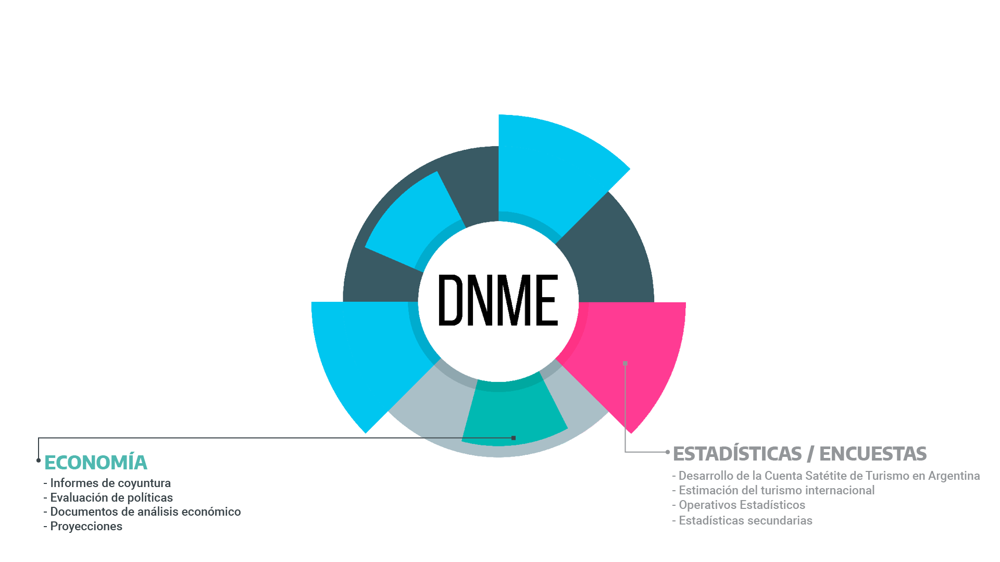

class:inverse, middle

background-image: url(https://tableros.yvera.tur.ar/recursos/logos_institucionales/sec_turismo_blanco.png)
background-position: 95% 95%
background-size: 30%

# ¿Qué dicen los datos del turismo?

## Análisis de la conectividad aérea en Argentina <br> para la toma de decisiones

<br>
<br>
<br>
<br>
<br>
<br>
<br>
<br>
<br>

### Dirección Nacional de Mercados y Estadística <br> Subsecretaría de Turismo de la Nación


```{r, echo=FALSE}
library(xaringanExtra)
# LOGO COLOR EN PAGs INTERNAS
xaringanExtra::use_logo(image_url = "https://tableros.yvera.tur.ar/recursos/logos_institucionales/sec_turismo_azul.png", 
                        position = css_position(top = "1em", right = "1em"), 
                        height = "15%", width = "15%")
# BARRA DE PROGRESO DE PRESENTACION
xaringanExtra::use_progress_bar(color = "#252C4F")
# LAPIZ 
xaringanExtra::use_scribble()
# EXPLORADOR DE SLIDES
xaringanExtra::use_tile_view()
# HABILITAR WEBCAM
xaringanExtra::use_webcam()
```


```{r dnmye_theme, include=FALSE, warning=FALSE, eval=TRUE}
library(xaringanthemer) #EVAL FALSE
library(comunicacion)
style_mono_light(outfile = "dnmye_theme.css", # CSS FILE
                 # FONTS
                  header_font_google = google_font('Lora'),
                  text_font_google   = google_font('Montserrat'),
                  code_font_google   = google_font('IBM Plex Mono'),
                 # COLORES 
                 base_color = "#252C4F",
                 code_inline_color = dnmye_colores("rosa"), 
                 inverse_link_color = "#3B4449",
                 background_color = "#FFFFFF",
                 title_slide_background_image = "sec_turismo_blanco.png", 
                 title_slide_background_position = "95% 5%", 
                 title_slide_background_size = "200px", footnote_color = "#3B4449", link_color = "3B4449",text_slide_number_font_size = "16px"
                  
                 )
```


```{r setup, include=FALSE}
options(htmltools.dir.version = FALSE)
knitr::opts_chunk$set(
  fig.width=9, fig.height=3.5, fig.retina=3,
  out.width = "100%",
  cache = FALSE,
  echo = FALSE,
  message = FALSE, 
  warning = FALSE,
  fig.show = TRUE,
  hiline = TRUE
)
```


```{css, echo=FALSE}
div.my-footer {
    background-color: white;
    position: absolute;
    bottom: 0px;
    left: 0px;
    height: 40px;
    width: 100%;
}
div.my-footer span {
    font-size: 16px;
    color: #3B4449;
    position: absolute;
    left: 15px;
    bottom: 6px;
}


```


---

layout: true

<div class="my-footer"><span>DIRECCIÓN NACIONAL DE MERCADOS Y ESTADÍSTICA <a href="https://yvera.tur.ar/sinta"> - <b>www.yvera.tur.ar/sinta</a></b></span></div> 

---


# ¿Por qué analizar al sector turístico?

.pull-left[

### Cuenta satélite de turismo (2022)

- PIB directo turístico: 1,7%.

- VAB industrias turísticas: 4,4%.

- Puestos de trabajo: 1,2 M (5,5% de los puestos de trabajo totales).

- 7% de la exportaciones totales (6° sector exportador).

- 45.845 empresas (99% pymes).

- 1° Destino en Sudamérica.

]

.pull-right[

<br>
<br>

```{r fig.align='center'}

```

]


---

# Distribución geográfica


---

class: inverse center middle

# ¿Qué hacemos en la DNMyE?

---


---


---


---


---


---


---

<!--  -->
<!-- --- -->


---

```{r out.width='50%', fig.align='center'}
knitr::include_graphics("imgs/sintia2.png")
```

---

class: inverse center middle

# MOVILIDAD
---

<br>
<br>
### + CONECTIVIDAD AÉREA
<br>
### + CRUCERISMO
<br>
### + CONECTIVIDAD TERRESTRE 
<br>
### + PEAJES - *PROXIMAMENTE* -

---

# Conectividad aérea

- **Fuentes**: Administración Nacional de Aviación Civil (ANAC) & Dirección Nacional de Migraciones.

- **Unidad**: Registros administrativos de movimientos aéreos diarios & Ingreso y egreso de personas.

- **Indicadores**: Vuelos, asientos, pasajeros, rutas y aerolíneas.

- **Producto**: Documento de trabajo, reportes de actividad, tablero interactivo y datos abiertos.

```{r out.width='65%', fig.align='center'}
knitr::include_graphics("imgs/utdt/logo_conectividad.png")
```

---

# Fuentes

- Aterrizajes y despegues registrados en todos los aeropuertos del país a nivel diario.

- **Responsable**: ANAC.

- Registros de ingresos y egresos de personas por pasos internacionales. 

- **Responsable**: Migraciones.

```{r out.width= "85%", fig.align='center'}

```

---

# Procesamiento

.pull-left[

### Tareas

- Chequeo de inconsistencias.

- Recodificación de casos erróneos.

- Recorte de universo de análisis.

- Agrupamiento de variables.

- Unión de tablas con información complementaria.

- Generación de nuevos datos.

]

.pull-right[

<br>
<br>

```{r fig.align='center'}

```

]

---

# Resultados - Análisis de tendencias

```{r out.width='55%', fig.align='center'}

```

---

# Resultados - Análisis de tendencias

```{r out.width='45%', fig.align='center'}

```

---

# Resultados - Análisis de tendencias

```{r out.width='65%', fig.align='center'}

```

---

# Resultados - Apertura de datos

<br>

```{r out.width='85%', fig.align='center'}
knitr::include_graphics("imgs/utdt/conectividad_recursos.png")
```

---

# Resultados - Apertura de datos

<br>

```{r out.width='75%', fig.align='center'}
knitr::include_graphics("imgs/utdt/reporte.png")
```

---

# Resultados - Apertura de datos

```{r out.width='85%', fig.align='center'}
knitr::include_graphics("imgs/utdt/tablero.png")
```

---

# Resultados - Apertura de datos

```{r out.width='40%', fig.align='center'}

```

---

# Resultados - Aporte al debate 

<br>

```{r out.width='75%', fig.align='center'}

```

---

# Resultados - Aporte al debate

```{r out.width='45%', fig.align='center'}
knitr::include_graphics("imgs/utdt/dt.png")
```

---

# Resultados - Nuevas herramientas

```{r out.width='45%', fig.align='center'}
knitr::include_graphics("imgs/utdt/juanga.png")
```

---

# Resultados - Políticas públicas

```{r out.width='65%', fig.align='center'}
knitr::include_graphics("imgs/utdt/aviones.avif")
```

---

### ¿Por qué usar datos en la gestión pública?

.pull-left[

<br>

- Dar contexto a problemáticas

- Mejorar procesos internos

- Identificar nuevas oportunidades y tendencias

- Tomar decisiones informadas

- Diseñar y evaluar políticas públicas

- Difundir conocimientos y expandir la información

]

.pull-right[

```{r out.width='75%'}
knitr::include_graphics("imgs/utdt/argentina.png")
```

]

---
class: inverse center middle

## ¡Muchas gracias!
## DNMyE

## estadisticas@turismo.gob.ar